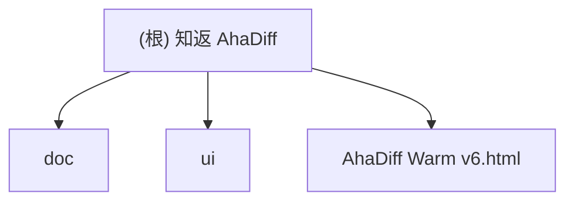

# 知返 AhaDiff

> AI 写完，Diff 教回。 / Ship with AI. Learn it back.

## 项目愿景

知返 AhaDiff 是一个 **local-first 的 verified diff learning layer**。它把 Claude / Codex / Cursor 等 AI 工具写出的 git diff，变成带代码证据链的学习笔记、概念图谱、主动回忆测验、SRS 复习卡和质量棘轮记录。

核心差异定位：Code Wiki 解释仓库，知返解释这次改动；而且每句话都能回到代码证据。

注：下文状态段按时间追加，最新改动面验证以 2026-05-17 viewer follow-up 为准；最近后端改动面验证仍来自 2026-05-16 Run Detail / Judge / safety findings follow-up，最近完整 hardening gate 仍来自 2026-05-15 Learn Mode / Diff aggregation hardening，完整 Playwright 仍来自 2026-05-14/15 spec alignment gate，live semantic alignment smoke 仍来自 2026-05-14，远端 GitHub Actions 仍因 billing / spending limit 未启动。

**当前阶段**：v0.2 Gate 0-6 的主链能力仍然是当前仓库底座，v1.0 后端增量也已落到当前代码里。本轮 v1.1 review-fix 跨后端 Python、`viewer/` 前端、测试、benchmark 和文档：后端收口 watch 自触发 learn 的工作区 diff 模式、provider model discovery 的 SSRF 加固且保留本地 provider discovery、URL embedded secret 的 OAuth query/fragment 覆盖、GraphProvenance 强校验，以及 concepts JSONL 导出的 symlink / reparse guard；前端收口 Dashboard LLM Calls / Weak Concepts、ConceptGraph 500+/1000+ 大图提示与 1000+ 二次确认、a11y heading / tab panel / nested-interactive 修复、accent contrast token、GraphifyCard V6 fidelity 和 Skills 焦点恢复；本次收尾又把 Dashboard KPI E2E 契约同步到 5 张卡，给 Diff claim 选中 E2E 加了真实点击重试，并新增前端 CI workflow。2026-05-09 follow-up 又把 path-scoped learn 做成端到端能力：CLI `--changed-path`、watch changed paths、serve `changed_paths`、Learn Mode Dialog 路径范围和 capture literal pathspec 已接通；前端任务进度改为 SSE 优先、polling fallback；PWA manifest 补同源 `id`/`scope` 与 192/512 PNG 图标。同日第二轮集成页 follow-up 又把工具集成从展示页补成受保护的 WebUI 写闭环：`GET /api/install/targets` 返回 write/remove command、manifest preview 和 `manifest_hash`；新增 `POST /api/install/{target}/preview`、`POST /api/install/{target}`、`POST /api/install/{target}/uninstall`；写操作只允许当前 serve repo，必须带 `confirmed_manifest_hash` 和 `X-AhaDiff-Token`，继续走 Origin/Referer 写保护、localhost-only 和 repo 写锁；通用 install 写入层补 no-follow/regular-file/reparse/symlink parent guard；Guide 只展示命令和入口，Settings AI 工具指引支持 preview/write/remove、pending/success/error、写后重新 detect；Settings/Concepts/Review 深链消费已补。第三轮 P1 read-only follow-up 补齐 Concepts Ledger、Run Detail judge artifact browser 和 Ratchet Improve Preview，并收口 preflight finalized marker、session JSON symlink/reparse/hardlink/大小 guard、untracked prompt dirty 检测、hash 同步、run-filter race、Zod strict、窄屏换行和 accent 对比度。2026-05-10 review follow-up 补上受写 token 保护的 graph refresh / DB check、run-local Concepts、Concepts Graph refresh、Onboarding DB check 和相关 a11y/CSS fallback；同日 frontend review-fix 又补齐 CSS 暗色/forced-colors/container query fallback、Dashboard stable concepts/last run KPI、Run Detail metadata/degraded flags、Settings audit load-more + per-model usage、SearchOverlay table filter chips + 键盘切换，并把前端 CI 改为 Chromium desktop 全 11 specs + Firefox / WebKit smoke/a11y。compatibility follow-up 补集中格式化工具、locale-aware byte/token 展示、旧 Intl compact fallback、`ResizeObserver` 缺失时的初始宽度测量、`color-mix()` fallback、平台化 `⌘K`/`Ctrl+K`、clipboard API 守卫、Backend PR CI `tests/eval` 和 review/signals/tasks/db/search route 覆盖。2026-05-12 较早的 adversarial review fix 又补上 full lesson `walkthrough_tldr`、WebUI APKG 下载、read-only MCP server、`FEATURE_UNAVAILABLE`、SSE 指数退避重连、SearchOverlay 双栏预览、ErrorBoundary 诊断脱敏/复制 fallback、ConceptGraph 暗色 canvas、motion/elevation CSS 和 Vitest coverage config，并通过后端 unit `2150 passed`、viewer Vitest `310 passed` 和 SearchOverlay/ErrorBoundary 目标 Playwright `10 passed`。2026-05-12 Phase 2 follow-up 又补上 review.sqlite schema v10、deterministic concept health lint、local static preview export、MCP `ask_lesson`、默认关闭的 Challenge loop、APKG packaged CSS，以及 Challenge / Export / HealthBadge 前端入口；APKG stable namespace GUID 仍未落地。本轮 adversarial review 又收口 Challenge rebuild/review 原子性、manifest 有限数校验、export preview noindex / 注入重扫 / stale cleanup TOCTOU、MCP `ask_lesson` 输出契约和只读路径 guard、concept lint JSONL 读取与路径归一化、review 评分非有限数拒绝。上一轮完整 gate（2026-05-08，v1.1 review-fix）：后端 unit `2055 passed`、integration `11 passed`、eval `9 passed`；`ruff check`、`ruff format --check`、`pyright`、wheel build 通过；前端 Vitest `227 passed`，typecheck/build 通过；完整 Playwright `2000 passed, 10 skipped`；GPT-5.5 live judge smoke `1 passed`；Graphify 10k benchmark gate OK（parse avg `172.399ms`，peak `42.435MiB`）。2026-05-14 Warm v6 / Blueprint follow-up 已补上 Diff Unified / Split 分侧证据视图、同 file:line 的 old/new claim 跳转、Dashboard finalized `score.json` 口径的 spec alignment KPI、`/api/graph/concepts?focus=` limit 外聚焦节点、Concepts Ledger 真实 `graphify_node_id` 链接、quiz kind 收窄为 `guided` / `recall` / `transfer`，以及 learn 后 review cards 导入 `review.sqlite`。Warm v6 / Blueprint follow-up 当时 gate：后端 unit `2434 passed`、integration `11 passed`、eval `9 passed`、ruff/format/pyright、wheel、viewer typecheck/build、Vitest `344 passed`、完整 Playwright `2735 passed, 10 skipped`、i18n `1392/1392` 和 diff-check 通过；live judge 和远端 GitHub Actions 未在本轮重跑。

2026-05-14 spec alignment / Notebook follow-up 已把 `learn --open`、`--against-spec`、显式 opt-in 的 semantic spec review、Notebook cell-aware diff、Graphify signoff artifact、run 级 spec/signoff artifact route、Dashboard semantic spec alignment 计数和 serve read-route benchmark gate 接到当前代码。当时完整 gate 为：后端 unit `2477 passed`、integration `11 passed`、eval `9 passed`、ruff/format/pyright、wheel、viewer typecheck/build、Vitest `345 passed`、完整 Playwright `2855 passed, 10 skipped`、i18n `1439/1439` 和 `git diff --check HEAD` 通过；加载 `.env.local` 后 live semantic alignment smoke `1 passed`；远端 GitHub Actions 已触发并监控，但 GitHub 在 job 启动前因 account billing / spending limit 拒绝运行，未产生 runner 日志，不计为代码验证通过。

2026-05-15 review/test follow-up 收口当前未提交改动：review rate / signals SRS 在 active card 缺失时会从 `.ahadiff/runs/*/quiz/cards.jsonl` lazy import 后重试；learn Step 10 先尝试外部 `graphify update <repo>`，成功后强制导入新的 `.ahadiff/graphify/graph.json`；找不到 Graphify CLI 但已有 `graphify-out/graph.json` 时仍沿用旧的可选导入，CLI 存在但 update 失败时才降级且不把旧图冒充刷新；Graphify source import 统一使用 parser 的 50 MiB 上限；`/api/graph/refresh` 只对精确路径使用 600s timeout；`git --since` 纯日期输入归一到 UTC 午夜；Concepts 页补内容 wrapper，Sidebar footer 改为读取真实 config 并本地化 provider/privacy/error 状态，Graphify freshness 文案统一为 “Needs Update”。后续 review 修复又补上低 learnability skip 的最小 run 发布：非 dry-run 会写 result event、`score.json` 和 `finalized.json`，让 `/api/run/{run_id}` 可读；若 score/finalized 发布失败，会回滚刚写入的 result event。Quiz 生成新增 `quiz.quiz_question_count`，默认 3、范围 1-10，CLI、prompt、serve config API 和 Settings Preferences 都已接通。前端补 Review open-answer 未 peek、Diff 文件摘要 Prev/Next、统一/分栏 `+`/`-` 行标记、claim auto-scroll、窄屏/forced-colors 样式，以及 Lesson run detail 404 和 artifact skipped 的语义区分。本轮真实验证：后端 unit `2502 passed`、integration `11 passed`、eval `9 passed`；`ruff check`、`ruff format --check`、`pyright`、wheel build、viewer typecheck、Vitest `34 files, 350 tests passed`、viewer build、完整 Playwright `2855 passed, 10 skipped`、i18n scalar keys `1447/1447` 和 `git diff --check HEAD` 通过。live judge 和远端 GitHub Actions 未在本轮重跑。

同日后续 frontend polish 只改 `viewer/` 的 Diff 和 Welcome 学习入口：Diff claim 选中不再使用 accent ring，改为柔和蓝灰行级色带；Unified / Split 里的 add/del 选中底色、claim dot hover/focus、dot legend 和 selected-lines hint 已同步。Welcome 的 lesson demo 会按 H2 折叠，保留 H2 前导内容；没有 H2 时回到普通 prose；demo 面板有高度上限；有最新 finalized run 时会链接到对应 Lesson。新增 `renderMarkdownCollapsible` 单测覆盖 H2 分组、preamble、无 H2 fallback 和 H3 留在当前 section。本轮真实验证：viewer typecheck 通过；Vitest `35 files, 353 tests passed`；viewer build 通过；后端 unit `2502 passed`；i18n `1449/1449`；`git diff --check HEAD` 通过。integration、eval、ruff/format/pyright、wheel、完整 Playwright、live judge 和远端 GitHub Actions 未在这次 frontend polish 中重跑。

随后 Learn Mode / Diff aggregation hardening 收口当前未提交改动的安全/a11y/UX 真值：capture 层和 serve submit/estimate 层都会拒绝 `since` / `author` 的 leading dash 与控制字符；`against_spec` 继续只接受当前 workspace 内本地文件路径。Learn Mode Dialog 的 path scope 拒绝 `..`、绝对路径、Windows drive/UNC、控制字符和超过 500 条，`patch_url` 只接受无内嵌凭证的 http/https，revision 拒绝过长、leading dash 和控制字符；关闭 dialog 会 abort estimate / pending learn，pending payload 会脱敏 patch body / patch URL，dialog 保留 `aria-busy`、live region 和 print hide。Diff Viewer 把同一行多个 claim 聚合成一个最高严重度圆点，需要时显示数量角标，默认打开与圆点颜色一致的最高严重度 claim。本轮真实验证：后端目标 `199 passed`，后端 unit `2513 passed`，integration+eval `20 passed`，`ruff check`、`ruff format --check`、`pyright`、wheel、viewer typecheck、Vitest `35 files, 360 tests passed`、viewer build、i18n `1454/1454` 和 `git diff --check HEAD` 通过；完整 Playwright、live judge 和远端 GitHub Actions 未在本轮重跑。

2026-05-16 Run Detail / Judge / safety findings follow-up 收口当前未提交改动的评估、安全和展示真值：capture 只在 redaction / injection findings 存在时写 `safety_findings.json`，且只保存 severity、rule、位置和 hash；evaluator 会读取 `safety_findings.json` / `.jsonl`，坏 artifact 按 Critical safety finding 失败关闭，并接入 `critical_safety_findings` hard gate；LLM judge 对 `max_score=0` 的维度按 N/A 处理，最终 PASS/FAIL 仍由 deterministic score 与 required gates 共同决定。Run Detail 新增 Overview 摘要卡、Score 维度卡片与 failed gates 优先、Judge 维度本地化和分数、Artifacts 分组；Lesson score explainer 会说明高分但 hard gate 失败、LLM judge advisory 与 Score/Judge 入口；Run Detail 不加入 sidebar，因为它依赖具体 `run_id`。本轮真实验证：后端安全/评估目标测试 `1 passed, 145 deselected` 和 `53 passed`、目标 ruff/format/pyright、viewer typecheck、完整 Vitest `35 files, 362 tests passed`、viewer build、Run Detail + walkthrough Chromium E2E `57 passed`、i18n parity `1 passed` 且 scalar keys `1485/1485`、`git diff --check HEAD` 通过；后端完整 unit、integration、eval、wheel、完整 Playwright、live judge 和远端 GitHub Actions 未在本轮重跑。

2026-05-17 viewer follow-up 继续只改 `viewer/` 的 Diff / ClaimInspector 和 Welcome 学习入口：Diff 选中 claim 的 source hunk 预览现在直接显示在右侧选中卡片内，并保留 jump-to-code 按钮，页面底部的 `.diff-page__selected-hunk` 面板已移除；Welcome CTA 提交 learn 后显示 LearnTaskBanner，完成后优先展示刚完成 run 的真实 diff 和第一个可用 lesson（full → hint → compact），lesson 缺失或读取失败时显示 run 级空态并链接 Run Detail，不再混入 sample lesson。真实验证：viewer typecheck 通过；Vitest `35 files, 362 tests passed`；viewer build 通过；Diff walkthrough Chromium E2E `1 passed`；Welcome learn-task Chromium E2E `4 passed`；i18n `1490/1490`。一次并行 Playwright 尝试因两个 Vite webServer 抢 `5173` 失败，随后 Welcome 组用 `AHADIFF_VIEWER_E2E_PORT=5174` 重跑通过；端口冲突不计为产品失败。后端、integration、eval、ruff/format/pyright、wheel、完整 Playwright、live judge 和远端 GitHub Actions 未在本轮重跑。

2026-05-12 随后的 Phase 2 follow-up 曾是当时完整 gate：版本仍为后端 `1.1.0a0`、前端 `1.1.0-alpha.0`；在 security / cross-platform 收口基础上，补齐 schema v10 concept health lint、local static preview export、MCP `ask_lesson`、默认关闭的 Challenge loop、APKG packaged CSS、Challenge / Export / HealthBadge 前端入口、Ratchet locale-aware 分数/日期和前端 API error best-effort 脱敏。本轮 adversarial review 又补上 Challenge rebuild/review 原子性、manifest 有限数校验、export preview noindex / 注入重扫 / stale cleanup TOCTOU、MCP `ask_lesson` 输出契约和只读路径 guard、concept lint JSONL 读取与路径归一化、review 评分非有限数拒绝。真实验证：后端 unit `2409 passed`；integration `11 passed`；eval `9 passed`；`ruff check`、`ruff format --check`、`pyright` 通过；viewer typecheck、Vitest `326 passed`、build 通过；i18n `1262/1262`；`git diff --check HEAD` 通过。live judge/wheel/完整 Playwright/远端 GitHub Actions 未在这轮重跑。

2026-05-13 review-fix 只改当轮涉及的后端契约和前端学习面：`RunDetail` 增加可选 `learnability`，投影只接受有限数值、真实 boolean 和 `list[str]` reasons；`lesson` / `claims` / `quiz` artifact 缺失返回 404；SearchOverlay 保留 backend `primary_key`，用纯文本 `focusText` 聚焦 Concepts Ledger，安全 `#/` href 优先，同 hash 时才手动派发 `hashchange`，并修复 WebKit 关闭后的焦点恢复；ConceptLedger 补 graph link、focus highlight、reduced-motion 和程序化 focus；ConceptGraph 保留 Canvas renderer，补 forced-colors 可见性、id/name/ledger key 聚焦和大图 Graph 切回焦点保持；Lesson 页区分 run detail 404 和 artifact skipped，并在 claims 404 时清空旧 claims。真实验证只覆盖改动面：后端目标 pytest `199 passed`，目标 pyright 0 errors，目标 ruff check / format check 通过；viewer typecheck 通过，Vitest `336 passed`，SearchOverlay Playwright `60 passed`，i18n `1271/1271`，`git diff --check HEAD` 通过。integration/eval/live judge/wheel/viewer build/完整 Playwright/远端 GitHub Actions 未在本轮重跑。

2026-05-14 Ratchet transparency follow-up 补上本轮 Ratchet / Phase 2.5 / Benchmark transparency 真实接线：`GET /api/ratchet/transparency` 要求 `X-AhaDiff-Token`，直接读 `review.sqlite/result_events`，再从 `benchmarks/manifest.json` 和 `.ahadiff/benchmarks/local-report.json` 投影 benchmark 摘要；缺 review DB、空 events、坏 benchmark JSON、symlink/reparse/hardlink/超限文件都返回空数据或 warning，不使用 mock。前端 `RatchetPage` 通过 Zod schema + `apiFetch` 调用该 route，results tab 优先渲染 inline `results.tsv` 表，失败才回退到 paged history；Benchmark tab 展示 suite、digest、entry counts、language/group、comparable/degraded、mean score、claim rate 和 sample entries。Phase 2.5 当前不写独立 `phase25_rewrite` event，最终仍写 `targeted_verify` 或 `discard`，并用 `note_json.phase25` 标记。本轮真实验证：Ratchet transparency 目标后端 `5 passed`；后端 Ratchet/Phase2.5/benchmark 目标组 `153 passed`；`ruff check`、`ruff format --check`、`pyright` 通过；viewer typecheck、Vitest `336 passed`、build 通过；Ratchet walkthrough Playwright `30 passed`；ratchet benchmark media Playwright `15 passed`；i18n `1338/1338`；真实 serve/browser 无 mock 验证通过；GPT-5.5 live judge smoke `1 passed`，合成 eval_judge smoke 写出 8 维 `judge.json`。完整 Playwright、wheel、远端 GitHub Actions 未在本轮重跑。

2026-05-10 error / locale / i18n hardening follow-up 又补上稳定 27 个 `ErrorCode`、统一 `{error_code,error,status,details?}` API payload、per-request locale、`PUT /api/locale` 持久化、claim extraction `output_lang` 透传、git executable 检测、hooks timeout / 路径空格保护、verify workflow Windows smoke，以及前端 `errors.*` / `Format.*` 本地化。真实验证：目标后端回归 `455 passed`，完整后端 unit `2136 passed`，ruff/format/pyright 通过，viewer typecheck 通过，前端 Vitest `253 passed`，viewer build 通过，i18n scalar keys `1011/1011`，`errors.* 27/27`，`Format.* 6/6`，`git diff --check` 通过；integration/eval/live judge/coverage/wheel/Playwright/GitHub Actions 远端 workflow 未在这轮重跑。

本次 Skills → Guide follow-up 把旧 Skills 页替换成 Guide 页：`/#/guide` 展示日常学习工作流、核心命令、设置命令、进阶/维护命令和 13 个支持的集成目标；`/#/skills` 会 replace 到 `/#/guide`。Guide 不导入 install API，也不执行 install/uninstall；真实 preview/write/remove 仍在 Settings → AI 工具指引。Onboarding 与 Guide 共享 `CommandBlock` 复制组件，复制 fallback 会清理临时 textarea；Onboarding 示例按 POSIX / PowerShell 分开，并只使用占位符 API key。真实验证：Guide 目标 Playwright `7 passed`，前端 Vitest `253 passed`，viewer typecheck/build 通过，i18n scalar keys `1050/1050`，Guide keys 全部被使用，旧 Skills 残留只剩 `/skills` redirect 测试，Guide/Onboarding/CommandBlock 未发现真实 key、endpoint 或本机绝对路径示例，`git diff --check` 通过；后端、integration/eval/live judge/coverage/wheel/完整 Playwright/GitHub Actions 远端 workflow 未在这轮重跑。

2026-05-11 viewer review-fix 只改前端学习面和测试：Learn Mode Dialog 输出语言默认跟随当前 viewer locale；Review 恢复 Again / Hard / Good / Easy 四档评分和 `1`-`4` 快捷键，并展示高风险概念、遗忘曲线说明和 mastery warning / danger 色阶；Quiz 增加 Prev / Mark wrong / Next、mode chips、progress table 和 mark-wrong idempotency，Quiz SRSCard 仍保留 Good / Hard / Wrong 与 peek guard。真实验证：viewer typecheck 通过，前端 Vitest `269 passed`，viewer build 通过，完整 Playwright `2630 passed, 10 skipped`，i18n `1101/1101`，`git diff --check` 通过；后端/integration/eval/live judge/coverage/wheel/GitHub Actions 远端 workflow 未在这轮重跑。

本次 ConceptGraph Canvas 迁移和 graph hardening follow-up 只改图谱链路：后端 `ConceptGraphEdge` 增加 `confidence`，`/api/graph/concepts` 只透传 allowlist 内的 `EXTRACTED` / `INFERRED` / `AMBIGUOUS`，节点 `metadata` 继续透传；Graphify parser 读取 imported graph 时补 no-follow regular-file、reparse、大小和 UTF-8 guard。前端 ConceptGraph 从 SVG + d3-force 改成 `react-force-graph-2d` Canvas renderer，保留 Graph / List、大图默认 List、Full graph、节点详情和跨页搜索跳转，并补 community fill、legend/filter、Canvas 可访问列表 fallback、forced-colors 样式和 Windows 路径 basename 处理。SearchOverlay / AppShell 通过同一个 open-search event 做跨视图搜索，Concepts graph refresh 遇到 `409 LOCK_CONFLICT` 会做一次延迟重试，Vite 把 graph renderer 依赖放到 `vendor-graph` 并从初始 modulepreload 中排除。真实验证：viewer typecheck 通过，前端 Vitest `270 passed`，viewer build 通过，目标 Playwright `62 passed`，graph route/parser 后端目标 `117 passed`，目标 ruff/pyright 通过，i18n `1131/1131`，`git diff --check` 通过；integration/eval/live judge/coverage/wheel/完整 Playwright/GitHub Actions 远端 workflow 未在这轮重跑。

本次 AI 工具指引 / Ratchet export / Audit follow-up 把 Settings 的可见页签改成“AI 工具指引”（深链仍是 `?tab=integrations`），并明确这里只写当前 repo 的 Claude / Codex / Aider 等项目级指引，不会再次安装 AhaDiff CLI，也不会写全局用户目录。每个 target 改成卡片式范围说明、写入/移除命令、复制按钮、inline manifest preview、manifest hash 和动作列表；Guide 补上 CLI 安装与项目级 Agent 指引的区别。Ratchet 新增 JSON 下载，复用 token-header blob 请求 `/api/export/results?format=json`；`GET /api/audit` 改为最新记录优先，分页和字段过滤都作用在倒序结果上。真实验证：后端目标回归 `116 passed`；`ruff check`、`pyright`、改动 Python 文件 format check 通过；viewer typecheck、前端 Vitest `270 passed`、viewer build 通过；目标 Playwright `59 passed`；i18n `1176/1176`；全量 `ruff format --check` 仍发现未触及的 `src/ahadiff/graphify/parser.py` 会被 formatter 重排，所以未计入通过项；integration/eval/live judge/coverage/wheel/完整 Playwright/GitHub Actions 远端 workflow 未在本轮重跑。

## 架构总览

本仓库当前仍以**设计文档和 HTML 原型**为历史底座，但可执行代码已经覆盖 Stage 0-6、i18n-0、v1.0 后端增量和当前 Phase 2 本地学习面：`src/ahadiff/contracts/`、`core/`、`safety/`、`llm/`、`git/`、`claims/`、`lesson/`、`quiz/`、`wiki/`、`graphify/`、`eval/`、`review/`、`serve/`、`install/`、`i18n/`、`mcp/`、`improve/`、`challenge/`、`export/`，以及 `benchmarks/`、`tests/unit/`、`tests/eval/`、`tests/integration/` 和 `tests/live/`。当前已具备可执行的 CLI scaffold、安全层、provider runtime、diff capture、`safety_findings.json`、Notebook cell-aware diff、claim 提取/验证、lesson、可配置题量 quiz、cards、concepts、concept health lint、8 维 evaluator、spec alignment artifact、可选 LLM judge、`critical_safety_findings` hard gate、result_events / results.tsv / JSON / APKG / static preview export、低 learnability skipped-run 最小发布、review.sqlite v10 / FSRS-6、read-only MCP server + `ask_lesson`、serve API、install targets、benchmark suite、serve read-route benchmark、improve loop、targeted verification、Phase 2.5 runtime、opt-in Challenge loop 与 i18n resolver；前端 `viewer/` React SPA 当前是 14 个生产页面 TSX、52 个非测试 TSX 文件、47 个 CSS 文件、1490/1490 i18n scalar key parity，ConceptGraph 当前是 Canvas renderer + 可访问列表 fallback + forced-colors/focus hardening，Settings 的项目级 AI 工具指引仍沿用 `?tab=integrations` 深链，Preferences 已包含 quiz 数量配置，Learn Mode Dialog 已补 path scope / patch URL / revision 校验、abort、pending payload 脱敏和 print/a11y 收口，Run Detail 已补 Overview 摘要卡、Score 维度卡片、Judge advisory 和 Artifacts 分组，Diff claim 已补聚合圆点、count badge、sticky ClaimInspector、柔和选中色带、圆点说明和卡片内 source hunk 预览，Welcome lesson demo 已补 H2 折叠、最新 Lesson 链接、LearnTaskBanner 反馈和真实 run artifact 预览。当前最新改动面验证：viewer typecheck、Vitest `362 passed`、viewer build、Diff walkthrough Chromium E2E `1 passed`、Welcome learn-task Chromium E2E `4 passed` 和 i18n `1490/1490` 通过；最近后端改动面验证仍为后端安全/评估目标 `1 passed, 145 deselected` 和 `53 passed`、目标 ruff/format/pyright、Run Detail + walkthrough Chromium E2E `57 passed`、`git diff --check HEAD`；最近完整 hardening gate 仍为后端完整 unit `2513 passed`、integration+eval `20 passed`、ruff/format/pyright/wheel；最近完整 Playwright 仍为 `2855 passed, 10 skipped`；live semantic alignment smoke `1 passed` 仍来自 2026-05-14；GitHub Actions 远端 workflow 已触发但被 GitHub billing / spending limit 阻止启动，未产生 runner 日志。

当前最新改动面验证以 2026-05-17 viewer follow-up 为准：viewer typecheck、前端 Vitest `362 passed`、viewer build、Diff walkthrough Chromium E2E `1 passed`、Welcome learn-task Chromium E2E `4 passed`、i18n `1490/1490` 通过。完整后端 unit、integration、eval、wheel、完整 Playwright 和 live judge 没有在本轮重跑；最近后端改动面验证仍为 2026-05-16 Run Detail / Judge / safety findings follow-up，最近完整 hardening gate 仍为 2026-05-15，完整 Playwright `2855 passed, 10 skipped` 仍来自同日上一轮完整 gate；live semantic alignment smoke `1 passed` 仍来自 2026-05-14；远端 GitHub Actions 已触发但被 GitHub billing / spending limit 阻止启动，未产生 runner 日志。

### 计划技术栈

- **后端 CLI**：Python 3.11+, typer, rich, pydantic, httpx, pyyaml, fsrs (FSRS-6 间隔重复调度)
- **前端 Viewer**：React 19 + Vite + vanilla CSS（以 `AhaDiff Warm v6.html` 为设计参考模板）。`ahadiff serve` 启动本地 dev server（Starlette + Uvicorn API + Vite dev/build），CLI 运行完成后自动调用 `webbrowser.open()` 打开 WebUI（可通过 `--no-browser` 禁用）。不使用 Next.js 等 SSR 框架
- **评估系统**：LLM-as-judge + 8 维自研 rubric（accuracy/evidence/diff_coverage/learnability/quiz_transfer/spec_alignment/conciseness/safety_privacy = 100 分）+ git ratchet 棘轮
- **LLM Provider**：支持 8 种 API 格式（OpenAI Chat / OpenAI Responses / Gemini / Anthropic / Azure OpenAI / New API / LM Studio / Ollama）。BYOK 流程：用户提供 model_name + base_url + api_key → 自动探测能力、TPM/RPM 限制、上下文长度，并可通过 `thinking_level` 映射到各 provider 原生推理参数。所有 LLM 调用必须确保不超过探测到的 max_context_length
- **不使用**：LiteLLM（供应链风险）、LangChain、Jinja2 模板渲染前端、Next.js 等 SSR 框架。注：Vite 属于前端构建工具（非传统 Node 后端构建链），仅用于 viewer/ 目录

### 八层架构（计划）

```
0. Schema & Contract     -- 核心契约冻结（ClaimStatus/RunSource/EvalBundle/EventLog）
1. Diff Capture Layer    -- git diff (last/since/staged/unstaged/show/range) / patch file/stdin / --compare
2. Context Layer
   2a. Context Assembly  -- repo files, graphify enrichment, specs
   2b. Safety Gate       -- secret scan → redact → 才能 log/cache/model/render
   2c. Budget & Degrade  -- token budget, large diff skip/clip/summarize, capability_level
3. Lesson Generation     -- prompts/*.md, claim extraction
4. Verification Layer    -- claims.jsonl, deterministic + LLM judge
5. Ratchet Layer         -- evaluation bundle (immutable), review.sqlite (唯一真相源), Graphify freshness query
6. Learning Layer        -- quiz, SRS review, section helpfulness, concepts.jsonl
7. Wiki + UI Layer       -- React SPA via `ahadiff serve`（Starlette API + Vite dev/build）
```

编排 contract 冻结在 `contracts/orchestrator.py`；当前运行时已经把 **learn** 主链抽到 `core/orchestrator.py` 并供 serve 复用，`improve/verify` 仍主要由 `cli.py` 和各模块 helper 组合完成。results.tsv 降级为 review.sqlite 的人类可读导出视图。

### 数据范围架构

> 核心原则：**per-repo truth + global derived governance**

CLI 全局安装（`pip install ahadiff`），per-repo 运用（每个 repo 独立 `.ahadiff/`）。

```
global_config_dir()                   ← Global（派生/索引/偏好，非真相源）
  Linux:   ~/.config/ahadiff/
  macOS:   ~/Library/Application Support/ahadiff/
  Windows: %APPDATA%/ahadiff/
├── config.toml                       — 全局偏好/provider env alias
├── registry.json                     — repo 发现索引 (v0.2, opt-in; strict_local 下默认关闭)
├── usage.sqlite                      — LLM 花费汇总账本 (v0.2)
└── security/allowlist.yaml           — 全局 secret scan 规则 (v0.2)

<repo>/.ahadiff/                      ← Per-repo（唯一真相源）
├── config.toml                       — repo 级配置覆盖
├── review.sqlite                     — SRS/results/signals 唯一真相源
├── concepts.jsonl                    — branch-aware 概念累积
├── runs/<run_id>/                    — lesson/quiz/claims/score/patch
├── graphify/                         — repo-level code map cache
├── audit.jsonl                       — LLM 调用审计（schema_version + rotation）
├── audit.private.jsonl               — strict_local 本机专用审计（gitignored）
└── ahadiff.lock                      — portalocker 文件锁

<repo>/.ahadiffignore                 ← repo 根路径过滤规则
```

**Config 优先级链**（高到低）：`ENV(AHADIFF_*) → CLI flag → per-repo config.toml → global config.toml → defaults`。凭证类：`env secret → per-repo env_var_name → global env_var_name → none`。

**不可全局化的真相源**：review.sqlite / audit.jsonl / concepts.jsonl / prompts/ / VCR cassettes / Graphify cache。任何 global 数据不参与 ratchet 判定。

## 模块结构图



## 模块索引

| 模块 | 路径 | 语言 | 职责 |
|------|------|------|------|
| doc | `doc/` | Markdown | 产品设计文档：架构方案、改名方案、前端视觉手册、评估报告 |
| contracts | `src/ahadiff/contracts/` | Python | Stage 0 最小 contracts skeleton：枚举、DTO、契约 helper、28 个稳定错误类型 |
| core | `src/ahadiff/core/` | Python | Stage 1 / Task 1 工程骨架：CLI 配置、路径、ID、错误类型 |
| safety | `src/ahadiff/safety/` | Python | Stage 1 / Task 2 安全层基础实现：ignore / redaction / injection / gates / audit |
| llm | `src/ahadiff/llm/` | Python | Layer 1.5 / Task 7：provider、probe、cache、cost、schemas、adapters |
| git | `src/ahadiff/git/` | Python | diff capture、parser、line map、symbols、hunk hash、`git` 可执行文件检测、repo write lock、`since` / `author` leading dash 与控制字符拒绝、`safety_findings.json` 安全发现 artifact |
| claims | `src/ahadiff/claims/` | Python | Stage 2 / Task 8：claim candidate 解析、claim runtime、negative scan、deterministic verifier、claims.jsonl 写盘 |
| lesson | `src/ahadiff/lesson/` | Python | Stage 3 / Task 8.5 + 9：learnability gate、lesson schema、三档 lesson 生成、full lesson `walkthrough_tldr`、撤架辅助与 lesson 目录发布 |
| quiz | `src/ahadiff/quiz/` | Python | Stage 3 / Task 10：quiz.jsonl、cards.jsonl 生成与 `ahadiff quiz` CLI；`quiz.quiz_question_count` 默认 3、范围 1-10，并进入 prompt fingerprint |
| wiki | `src/ahadiff/wiki/` | Python | Stage 3 / Task 10：`concepts.jsonl` / `concepts_local.jsonl` 累积与可见性过滤 |
| graphify | `src/ahadiff/graphify/` | Python | Graphify parser/matcher/linker/search/freshness 与 optional `graphify update <repo>` CLI bridge |
| eval | `src/ahadiff/eval/` | Python | Stage 3 / Task 11-12：8 维评分、hard gates（含 `critical_safety_findings`）、spec alignment deterministic artifact + opt-in semantic review、ratchet、result_events、results.tsv 导出、score/finalized 发布与可选 LLM judge（`judge.json`，`max_score=0` 维度按 N/A 处理） |
| review | `src/ahadiff/review/` | Python | Stage 4 / Task 15：review.sqlite schema / migration、FSRS-6 调度、review queue、learning signals、run-card lazy import、lossy import、APKG active-card export 与 review CLI 后端 |
| serve | `src/ahadiff/serve/` | Python | Task 14.5 + 当前分支后端：localhost-only serve API、finalized run 读取门禁、token + Origin/Referer 写保护、`/api/auth/token` 同源 bootstrap gate（GET 兼容 + POST bootstrap）、`POST /api/learn` 10 req/min 写限流且支持 `changed_paths` / `against_spec` / `spec_semantic_review`，提交前会预检 repo 写锁，并校验 workspace path 和 `since` / `author` leading dash / 控制字符；`POST /api/learn/estimate` preflight 同步复用 workspace path 与 git filter 校验；`/api/search`、`/api/concepts` DB/JSONL cursor 分页、`/api/spec/alignment` 聚合 spec requirements / degraded / semantic review 计数、`/api/run/{id}/spec-alignment`、`/api/run/{id}/graphify-signoff`、`/api/ratchet/transparency` 真实 result_events + benchmark manifest/report 投影、`/api/graph/status`、`/api/graph/concepts`、`/api/graph/refresh`（精确路径 600s timeout）、`/api/db/check`、`/api/export/apkg`、`/api/watch/status`、`/api/install/targets` write/remove command、manifest preview 与 `manifest_hash`，以及受保护的 `POST /api/install/{target}/preview` / install / uninstall 写闭环；`RunDetail.learnability` 是可选投影；低 learnability skip 会发布最小 score/finalized run；`lesson` / `claims` / `quiz` / `spec_alignment` / `graphify_signoff` artifact 缺失返回 404；review/signals 缺 active card 时会 lazy import run cards 后重试；`GET/PUT /api/config` 暴露 `quiz_question_count`；低层 `/api/tasks*` 状态 / 进度 / 取消接口；`GET /api/tasks/{id}/progress` 输出 `TaskProgressEvent` SSE；`TaskInfoResponse` 稳定暴露 `result_summary`、`TaskErrorCode` 和 `recovery_hint`；当前 serve 面是 `72` 个 concrete `/api/*` routes + 1 个 catchall，另含 `/healthz` |
| install | `src/ahadiff/install/` | Python | Task 19/20：Claude / Codex / Gemini / OpenCode / hooks / GitHub Action 安装目标与模板 |
| i18n | `src/ahadiff/i18n/` | Python | i18n-0：locale resolver、`AHADIFF_LANG`、Accept-Language / cookie / config / LANG fallback、prompt output-language helper |
| mcp | `src/ahadiff/mcp/` | Python | read-only stdio MCP server：runs、run summary、due cards、search、concepts、stats、ask_lesson |
| improve | `src/ahadiff/improve/` | Python | Stage 5 / Task 16/17：improve session、immutable improve_program、worktree replay、prompt 白名单、targeted verification、Phase 2.5、cherry-pick 与 pending worktree guard |
| benchmarks | `benchmarks/` | Markdown/JSON/Patch | Task 18：local benchmark fixtures、manifest、expected concepts、ground_truth consistency checks 与 serve read-route p95 gate |
| tests | `tests/unit/` / `tests/eval/` / `tests/integration/` / `tests/live/` | Python | Stage 0-6 与 i18n-0 测试：contracts、CLI/config/paths、安全层、provider、diff capture、claims、lesson、quiz、concepts、evaluator、ratchet、review、serve、install、benchmark、improve、targeted verification、Phase 2.5、真实 LLM judge smoke；当前最新改动面验证为 viewer typecheck/Vitest `362 passed`/build、Diff walkthrough Chromium E2E `1 passed`、Welcome learn-task Chromium E2E `4 passed`、i18n `1490/1490`；最近后端改动面验证为后端安全/评估目标 `1 passed, 145 deselected` + `53 passed`、目标 ruff/format/pyright、Run Detail + walkthrough Chromium E2E `57 passed` 和 diffcheck；最近完整 hardening gate 仍为 unit `2513 passed`、integration+eval `20 passed`、ruff/format/pyright/wheel |
| ui | `ui/` | HTML/CSS/JS | UI 原型：Warm 风格 v1-v6 迭代版本 |
| team-plan | `.claude/team-plan/` | Markdown | 团队计划：v0.1 kickoff + 修订方案 + CLI 接入扩展 |
| 根级原型 | `AhaDiff Warm v6.html` | HTML | 最新 UI 参考模板（相对 `ui/` 目录内 v6 快照继续演进，便于快速预览） |

## 运行与开发

### 查看 UI 原型

```bash
# 用浏览器打开最新原型
open "AhaDiff Warm v6.html"

# 或使用本地服务器
python3 -m http.server 8765
```

### 当前已落地的验证

```bash
uv run pytest tests/unit
uv run ruff check src tests
uv run ruff format --check src tests
uv run pyright
uv build --wheel
uv run python -m ahadiff --version
uv run ahadiff init
uv run ahadiff doctor
uv run ahadiff config show --resolved
uv run python -m ahadiff claims --help
uv run python -m ahadiff learn --help
uv run python -m ahadiff quiz --help
uv run python -m ahadiff review --help
uv run python -m ahadiff improve --help
uv run python -m ahadiff db check --help
uv run python -m ahadiff install github-action --help
```

真实 LLM judge smoke 需要显式开启，默认模型顺序是 `gpt-5.3-codex-spark,gpt-5.4-mini`，每个模型都会先试 OpenAI Responses，再试 Chat Completions fallback：

```bash
AHADIFF_LIVE_LLM_JUDGE=1 \
AHADIFF_LIVE_LLM_API_KEY="$AHADIFF_LIVE_LLM_API_KEY" \
AHADIFF_LIVE_LLM_BASE_URL="$AHADIFF_LIVE_LLM_BASE_URL" \
AHADIFF_LIVE_LLM_MODELS="gpt-5.3-codex-spark,gpt-5.4-mini" \
pytest tests/live/test_llm_judge_live.py -q
```

上一轮完整 gate（2026-05-08，本 session）：`UV_CACHE_DIR=/tmp/ahadiff-uv-cache uv run --frozen --no-sync pytest tests/unit -x -q` = `2055 passed`；`UV_CACHE_DIR=/tmp/ahadiff-uv-cache uv run --frozen --no-sync pytest tests/integration -q` = `11 passed`；`UV_CACHE_DIR=/tmp/ahadiff-uv-cache uv run --frozen --no-sync pytest tests/eval -q` = `9 passed`；`UV_CACHE_DIR=/tmp/ahadiff-uv-cache uv run --frozen --no-sync ruff check src tests` 通过；`UV_CACHE_DIR=/tmp/ahadiff-uv-cache uv run --frozen --no-sync ruff format --check src tests` 通过；`UV_CACHE_DIR=/tmp/ahadiff-uv-cache uv run --frozen --no-sync pyright` = `0 errors`；`UV_CACHE_DIR=/tmp/ahadiff-uv-cache uv build --wheel` 通过；`cd viewer && pnpm typecheck` 通过；`cd viewer && pnpm vitest run` = `21 files, 227 tests passed`；`cd viewer && pnpm build` 通过；`cd viewer && pnpm exec playwright test --reporter=line` = `2000 passed, 10 skipped`；`AHADIFF_LIVE_LLM_MODELS=gpt-5.5 ... pytest tests/live/test_llm_judge_live.py -q` = `1 passed`；Graphify 10k benchmark gate OK（parse avg `172.399ms`、peak `42.435MiB`）。coverage 本轮未重跑。

本次 follow-up（2026-05-09）只重跑改动面：后端 path-scope 目标回归 `6 passed`；前端 Learn Mode Dialog / manifest / learn-store 目标 Vitest `87 passed`；`pnpm typecheck`、`pnpm build` 通过；real-serve Playwright 合同测试 `1 passed`。第二轮集成页 follow-up 又重跑：`test_routes_install.py = 19 passed`；`test_install.py = 37 passed`；`ruff check src tests`、`ruff format --check src tests`、`pyright` 通过；前端全量 Vitest `236 passed`，`pnpm typecheck`、`pnpm build` 通过；Skills / Settings integrations / Deep links 目标 Playwright `75 passed`。第三轮 P1 read-only follow-up 重跑目标后端 route 测试 `18 passed`、完整后端 unit `2088 passed`、ruff/format/pyright、前端全量 Vitest `245 passed`、typecheck/build、P1 三组 E2E 全项目矩阵 `390 passed`、指定移动项目 `52 passed`、Concepts/Ratchet axe-core 目标审计 `2 passed`。2026-05-10 frontend review-fix 重跑 viewer typecheck、前端全量 Vitest `245 passed`、viewer build、Chromium desktop 全 E2E `166 passed`、WebKit desktop smoke/a11y `38 passed`、Chromium mobile 全 E2E `166 passed`、后端 unit `2090 passed`、ruff/format/pyright、i18n `969/969` 和 `git diff --check`。本次 compatibility follow-up 重跑后端 unit `2130 passed`、ruff/format/pyright、viewer typecheck、前端 Vitest `250 passed`、viewer build、i18n `969/969`、Chromium desktop smoke `21 passed`、Chromium desktop a11y `17 passed`、10 个真实浏览器场景和 `git diff --check`。integration、eval、live judge、coverage、wheel 和 GitHub Actions 远端 workflow 未在本轮重跑；没有执行真实 improve 写入。

本轮 error / locale / i18n hardening follow-up 重跑目标后端 `455 passed`、完整后端 unit `2136 passed`、ruff/format/pyright、viewer typecheck、前端 Vitest `253 passed`、viewer build、i18n scalar keys `1011/1011`、`errors.* 27/27`、`Format.* 6/6` 和 `git diff --check`；integration、eval、live judge、coverage、wheel、Playwright 和 GitHub Actions 远端 workflow 未在这轮重跑。

本次 Skills → Guide follow-up 重跑 Guide 目标 Playwright `7 passed`、前端 Vitest `253 passed`、viewer typecheck、viewer build、Guide/i18n/secret 静态检查和 `git diff --check`；integration、eval、live judge、coverage、wheel、完整 Playwright 和 GitHub Actions 远端 workflow 未在这轮重跑。

### 仓库当前依赖状态

仓库根当前已落地 `pyproject.toml` 与 `uv.lock`，并通过 `uv sync` 建立本地 Python toolchain。当前依赖管理已覆盖后端 CLI scaffold、provider runtime 与对应测试依赖；前端 `viewer/` 也已有独立 `package.json` / `pnpm` 工具链（React 19、Vite、Vitest、Playwright）。

## 测试策略

当前已存在一组自动化测试：`tests/unit/`、`tests/eval/`、`tests/integration/`，以及 opt-in 的 `tests/live/test_llm_judge_live.py`，覆盖 Stage 0、Stage 1、Layer 1.5、Stage 2、Stage 3、Stage 4、Stage 5、Stage 6 与 i18n-0 当前已落地链路。UI 原型仍通过 Playwright MCP 进行浏览器预览验证（见 `.playwright-mcp/` 缓存）。

计划测试策略（工程阶段）：
- 单元测试：pytest + VCR.py（录制 LLM 调用）
- 集成测试：10 份 pinned diff 端到端验证（frozen fixture 层）
- Eval 测试：20 份 pinned eval diff（10 份 benchmark + 10 份 judge-stability/edge regression）+ LLM-as-judge 稳定性验证
- 真实仓库 smoke：基于一个外部参考私有仓库做 live smoke，只做真实 diff / provider / 主链路冒烟，不进入 `suite_digest` 可比基线
- 覆盖率目标：核心路径 >= 85%
- VCR 双层版本：run 级用 `prompt_version`（AhaDiff 自带 prompt 资源的 tree hash）判断整体是否变更；cassette 级用 `prompt_fingerprint + model_id + api_family_version + eval_bundle_version + output_lang` 五元组 hash 精确匹配单个 LLM 调用
- CI 分档：PR 触发 unit + pinned integration（无 LLM 或全 mock/VCR），nightly 触发 eval tests（有 LLM）
- Benchmark 分层：Python 主套件（7份）+ Non-Python 降级套件（3份），独立出 recall/precision

## 编码规范

### 设计文档规范
- 中文为主，技术术语保留英文
- Markdown 格式，代码块使用语法高亮
- 品牌写法统一为「知返 AhaDiff」，CLI 名 `ahadiff`

### 计划工程规范（未来开发阶段）
- Python：ruff + pyright strict + pre-commit
- 线宽 100，ruff 规则 `F,E,W,I,UP,B,C4,SIM,RET,PTH,TC,FA`
- 所有 LLM 调用走 `llm/provider.py`，禁止直接 import anthropic/openai
- prompt 写成独立 `.md` 文件，禁止 f-string 拼接长 prompt

## AI 使用指引

### 硬性要求
- **所有文档更新必须基于真实代码 + 真实测试结果 + 当前文档状态**。如文档间存在漂移，以代码和测试为准，修正文档使其一致。**严禁虚构函数、虚构测试结果、虚构库名或编造不存在的设计决策。**
- 中英文对照文档（如 README.md / README.en.md）修改时必须同步更新，保持口径一致。
- committed docs / 命令示例 / manifest 示例只允许使用占位符、环境变量名或相对表述；不得写入本地 provider endpoint、真实 API key 或带用户名的绝对路径。

### 关键设计决策（读取文档前必知）
1. **N-文件契约**（受 autoresearch 三文件启发的变体）：`program.md`（自然语言状态机）+ **evaluation bundle**（`evaluator.py` + `rubric.py` + `rubric.yaml` + `gates.py` + `deterministic.py` 共 5 文件，统一位于 `src/ahadiff/eval/` 命名空间，整体 immutable，任一变更都会生成新的 `eval_bundle_version` 并触发 VCR cassette 失效；`rubric_version` 仅保留为派生显示字段）+ prompt 集合。**可写 prompt 白名单** 仅限 `lesson_generate.md`、`lesson_hint.md`、`lesson_compact.md`、`quiz_generate.md`、`claim_extract.md`；`eval_judge.md` 是 packaged prompt resource，不属于 improve loop 可写集合；`prompts/improve_program.md` 是 human-written immutable state machine，不在 improve loop 可写集合内。原版 autoresearch 三文件：`program.md`（约束）+ `prepare.py`（不可改评估基座）+ `train.py`（唯一可改文件）。AhaDiff 核心创新：(1) 可变面从单一 Python 文件扩展为受白名单约束的 prompt 目录；(2) agent 只改 Markdown prompt，不改用户代码；(3) immutable 边界从单文件扩展到 evaluation bundle
2. **Claim Verifier 是核心护城河**：每句解释必须绑定 file:line 证据，claim 有五种状态（verified / weak / not_proven / contradicted / rejected），其中 rejected 表示 claim 引用了 patch 外的文件或不存在的证据（附 reason_code），与 contradicted（证据直接反驳）语义不同
3. **棘轮机制**：improve loop 和 Phase 2.5 均在 `git worktree` 临时工作区执行，不触碰用户主分支。改进则 cherry-pick 回主分支，退步则删除 worktree。连续 2 个优化目标在首轮即无增益时触发 Phase 2.5 探索性重写（darwin-skill 原文："连续2个skill都在round1就break"，AhaDiff 沿用此阈值。autoresearch 无此机制）。Phase 2.5 最多触发 1 次/session，防止无限重写循环；当前实现不写独立 `phase25_rewrite` 事件，最终仍写 `targeted_verify` 或 `discard`，并在 `note_json.phase25` 中标记
4. **跨模型评估**：生产环境要求生成与评估使用不同模型（生成用 gpt-5.4/Sonnet，评估用 gpt-5.4-mini），防止自评偏差。**开发测试阶段**：为节省成本，生成和评估统一使用 gpt-5.4-mini（1M 上下文），此时跨模型约束暂时放松；`gpt-5.4` 等更大模型和其他候选模型只作为后续对比或生产切换选项，不作为默认开发基线
5. **SQLite 即唯一真相源**：`review.sqlite` 的 `result_events` 表是所有评估数据的唯一真相源。`results.tsv` 降级为人类可读的导出视图（先写 SQLite 有事务保护，成功后 append TSV；TSV 写入失败仅 warn 不阻塞；`ahadiff export-results` 可从 SQLite 重建 TSV）。前端只是 viewer，删除前端不丢功能
6. **安全脱敏顺序**：raw input → secret scan → redact → 才能 log/cache/model/render。任何 artifact 在完成 redaction 之前不得写入日志、进缓存或发送到模型
7. **隐私三档**（统一 snake_case）：`strict_local`（仅本地模型，默认）/ `redacted_remote`（脱敏后发远端）/ `explicit_remote`（用户显式授权发原文）。CLI 参数、config.toml、audit 日志和 CI 行为必须使用统一的 snake_case 命名
8. **i18n 全链路国际化**：手动切换（cookie `ahadiff_lang`）→ Accept-Language → AHADIFF_LANG → CLI `--lang` → `config.toml` → 系统 `LANG` → 降级 `en`。支持 `en` 和 `zh-CN`。Layer 3 Prompt 用单 prompt + `OUTPUT_LANGUAGE` 指令前缀（不分语言文件）。React 前端用 i18n JSON catalog（`messages/en.json` + `messages/zh-CN.json`）动态切换。SRS 卡片保留创建时语言不重翻译。概念图谱用英文规范术语 + `display_name` 本地化。审计日志始终英文。VCR cassette key 包含 `output_lang`
9. **UNTRUSTED_DIFF 扩展边界**：不可信输入面不仅包括 diff 正文，还包括文件名、commit message、branch/tag 名称、Graphify label、模型输出、VCR cassette 内容。所有外部文本和路径元数据均视为 untrusted，统一经 `redaction_pipeline()` 处理
10. **SQLite 运行时版本门禁**：启动时检查 SQLite 版本，不低于修复 WAL-reset bug 的最低版本。统一连接初始化：WAL + busy_timeout + trusted_schema=OFF + quick_check（非 integrity_check）
11. **架构权威源**：`contract-freeze.md` 是唯一架构权威源，所有契约定义以该文件为准，其他文档引用时不得与之冲突
12. **Graphify v0.1 是可选增强，不是主链前置**：`ahadiff learn` 阶段自动检测 `graphify-out/graph.json`，存在则导入 repo-level context，不存在则静默降级。导入的 `graph.json` 与 Graphify label 同样视为 untrusted，必须先过 sanitization，再进入 context / viewer；新鲜度查询沿用内部 7 态、对外 4 值投影。CLI 至少提供 `ahadiff graph status` / `ahadiff graph refresh` / `ahadiff graph import`，并支持 `--use-graphify` / `--no-graphify`；Viewer 至少支持 full / learning_only / empty 三态。当前 v0.1 权威路径是 `ahadiff serve` + React Viewer，旧静态 viewer / `file://` 设想不再作为 v0.1 权威路径

### 灵感项目
- Karpathy/autoresearch：三文件契约（AhaDiff 扩展为 N-文件变体：可变面从单一 train.py 扩展为 prompts/ 目录） + 单指标 val_bpb + git ratchet + 简洁性准则。**无 Phase 2.5 或 stuck 检测**，keep/discard 全在自然语言中
- SKILL0 (ZJU-REAL)：学习撤架 + skill file-level helpfulness（非 section 级，AhaDiff 自行扩展到 section 粒度）。budget 为线性递减公式 M(s)=ceil(N*(N_S-s)/(N_S-1))，N_S=3 时实际表现为 [6,3,0] 阶段跳变
- darwin-skill：8 维 rubric（结构 60 + 效果 40 = 100 分） + Phase 2.5 重写（连续 2 个 skill 在 round 1 就 break 时触发） + 子 agent 对照评测。**核心逻辑全在 SKILL.md 自然语言指令中**（scripts/ 仅有一个辅助截图脚本 `screenshot.mjs`，另有 `templates/*.html` 成果卡片模板和 `docs/` 说明页面）
- SkillCompass (Evol-ai)：PASS/CAUTION/FAIL + weakest-dimension-first（原版 6 维且评估 skill 文件质量，AhaDiff 自研 8 维体系评估学习笔记质量，阈值从 70/50 调高为 80/60）
- Graphify：repo-level map（AhaDiff 做 commit-level learning overlay）。cache.py 使用 SHA256 内容寻址（二态 fresh/stale）。AhaDiff 自研扩展为 7 态新鲜度状态机 + 4 值对外投影（受 Graphify 二态缓存启发，非 Graphify 原有设计）
- Karpathy LLM Wiki gist：persistent compounding wiki 思想，AhaDiff 落地为 `index.md`（diff-aware merge）+ 当前 snapshot-style `concepts.jsonl` 概念累积；append-only marker/event-log 仍是 RFC 设计项，不能当成当前代码事实。它与 Graphify 互补（Graphify = repo map，LLM Wiki = diff learning overlay）

## 多模型协作策略（全局方案）

本项目采用多模型协作开发模式，各模型职责明确分工：

### 角色分配

| 模型 | 角色 | 职责范围 |
|------|------|---------|
| **Claude** | 编排者 + 前端实现者 | 任务编排、前端代码实现、文档维护、集成协调 |
| **Codex** | 后端实现者 | Python CLI 代码实现、测试编写、包发布；通过 `codex-plugin-cc` 调用 |
| **Gemini** | 前端评审者 | UI/UX 设计评审、交互改进方案、视觉规范把关（**不写代码**）；通过 `codeagent-wrapper` 调用 |

### 工作流规则

1. **前端工作流**：
   - Gemini 通过 `$HOME/.claude/bin/codeagent-wrapper --backend gemini --gemini-model gemini-3.1-pro-preview` 负责设计评审和改进方案 → Claude 负责代码实现
   - 完成后由 Claude + Codex + Gemini 交叉 review 测试
   - **Gemini 429 时用 Claude 兜底**，不降级模型，并在产物/提交说明中记录 `gemini-429-fallback=claude`

2. **后端工作流**：
   - Claude 负责编排和任务拆分 → Codex 负责代码实现
   - 完成后由 Claude + Codex 交叉 review 测试
   - Codex 必须通过 Claude Code 已安装的 `codex-plugin-cc` 调用：实现/修复/调查用 `/codex:rescue`，常规 review 用 `/codex:review --background`，对抗式 review 用 `/codex:adversarial-review --background`，状态/结果用 `/codex:status` / `/codex:result`

3. **模型约束**：
   - Gemini 只能使用 `gemini-3.1-pro-preview`，禁止降级模型
   - Codex 使用 plugin 默认模型，不附带 `--model` / `--effort`，不要通过 `Skill(codex:review)` 调用
   - Claude 是默认编排者和前端实现者
   - LLM Provider 支持 8 种 API 格式（OpenAI Chat / OpenAI Responses / Gemini / Anthropic / Azure OpenAI / New API / LM Studio / Ollama）

### 文件所有权

| 文件范围 | 写入权限 | 审查权限 |
|---------|---------|---------|
| `src/ahadiff/**/*.py` | Codex 实现 | Claude + Codex review |
| `prompts/*.md` | Claude 编写 | Claude + Codex review |
| `viewer/src/**/*.tsx` | Claude 实现 | Claude + Gemini review |
| `viewer/src/**/*.css` | Claude 实现 | Gemini review |
| `tests/**` | Codex 实现 | Claude + Codex review |
| `doc/**` | Claude 维护 | 无需 review |
| `CLAUDE.md` | Claude 维护 | 无需 review |

### 阶段门禁：跨模型交叉审查（Stage Gate）

**硬性要求**：每完成一个 Stage/Phase 后，**必须**通过跨模型交叉审查门禁才能进入下一阶段。未通过门禁的代码不得合并到主分支。

#### 审查流程

```
Stage N 完成 → 三模型并行审查 → 汇总问题 → 修复 → 验证 → 进入 Stage N+1
```

#### 三模型职责

| 模型 | 审查重点 | 工具 | 参与 Stage |
|------|---------|------|-----------|
| **Codex via `codex-plugin-cc`** | 代码正确性、边界条件、测试覆盖、类型安全 | `/codex:adversarial-review --background` + `/codex:review --background` | 全部 |
| **Claude** | 架构一致性、文档同步、集成点验证、安全审计 | Claude Code CLI | 全部 |
| **Gemini via `codeagent-wrapper`** | 前端/UX 评审、视觉一致性、交互合理性 | `$HOME/.claude/bin/codeagent-wrapper --backend gemini --gemini-model gemini-3.1-pro-preview`（429 时 Claude 兜底） | 含前端的 Stage（1/4/7） |

#### 门禁通过标准

- **GO**：0 Critical + 0 High findings → 直接进入下一 Stage
- **CONDITIONAL GO**：0 Critical + ≤3 High → 修复后重新验证，无需全量审查
- **NO GO**：≥1 Critical 或 >3 High → 全量修复 + 全量重新审查

#### 审查清单（每个 Stage 必检）

1. **功能正确性**：所有新增功能的 happy path + edge case 通过测试
2. **Corner case 覆盖**：对照 CC 列表验证相关 CC 已闭合
3. **文档同步**：CLAUDE.md、kickoff.md、stages-4-9.md 与代码一致
4. **类型安全**：`pyright --strict` 零错误
5. **代码规范**：`ruff check` + `ruff format --check` 通过
6. **安全扫描**：无 hardcoded secrets、无 SQL injection、无 path traversal
7. **跨平台兼容**：pathlib 使用、portalocker 调用、编码处理
8. **集成点验证**：上下游 Task 接口契约匹配

#### Stage 划分对应表

| Stage | 包含 Task | 门禁重点 | 审查模型 |
|-------|----------|---------|---------|
| Stage 0 | Task 0 (Schema Freeze) | 契约可 import + 序列化正确 | Codex + Claude |
| Stage 1 | Task 1-4 (Infra + CLI + Safety + UI Fix) | CLI 骨架 + 安全脱敏 + 响应式修复 | Codex + Claude + Gemini（Task 4 前端） |
| Stage 2 | Task 5-8 (Capture + Parse + Provider + Claim) | diff 捕获 + Graphify 导入/降级 + 结构化 + LLM 接入 + Claim 验证 | Codex + Claude |
| Stage 3 | Task 8.5 + 9-12 (Learnability Gate + Lesson + Quiz + Eval + Ratchet) | 前置判定 + 生成 + SRS + 评估 + 棘轮 | Codex + Claude |
| Stage 4 | Task 13 + 14 + 15 (React Viewer + Review DB) | React 前端基础 + 核心页面 + review.sqlite schema + Graphify/ConceptGraph 三态降级 | Codex + Claude + Gemini |
| Stage 5 | Task 14.5 + 16-17 (Serve + Improve) | Serve API（依赖 Task 15 DB schema）→ 改进循环 | Codex + Claude |
| Stage 6 | Task 18-20 (Bench + Deploy) | 基准测试 + CI + 发布 | Codex + Claude |
| Stage 7 | i18n Signoff（汇总 i18n-0~6 跨阶段产物） | 全链路双语 + locale 降级 + parity audit | Codex + Claude + Gemini |

注：`i18n-0~6` 是跨 Stage 3-6 的 overlay tasks，可与对应业务 Task 并行落地；Stage 7 只承担最终 parity/signoff gate，不要求把 i18n 当成独立串行开发流。

补充说明：
- `ahadiff-v01-kickoff.md` 中的 `Layer 0-3` 只是前半段实现拆分，对外 gate 仍以这里的 `Stage 0-7` 为准
- `ahadiff-v01-stages-4-9.md` 中的“第四段～第九段”和 `Layer 6a/6b` 只是后半段任务拆分；执行和 signoff 仍统一折叠回这里的 `Stage 3-7`

#### Corner Case 回归

每个 Stage 门禁期间，必须验证以下 CC 类别：
- **本 Stage 新增的 CC**：确认已实现闭合方案
- **跨 Stage CC**：确认未因本 Stage 修改而回归
- **CC-GAP 系列**：确认高风险项（GAP-2 网络中断、GAP-3 SQLite 损坏、GAP-10 Unicode 路径）已覆盖

## 变更记录 (Changelog)

| 时间 | 变更 |
|------|------|
| 2026-04-19 21:26:58 | 初始化 AGENTS.md 文档体系，完成全仓扫描 |
| 2026-04-19 ~23:00 | 修正 3 处灵感项目引用不准确：Phase 2.5 阈值(2非3)、SkillCompass 维度(6非8)、SKILL0 helpfulness 粒度(file级非section级) |
| 2026-04-19 ~23:00 | 添加多模型协作策略：Claude 编排+前端实现、Codex 后端实现、Gemini 前端评审(gemini-3.1-pro-preview) |
| 2026-04-19 ~23:00 | 技术栈修正：首版用 Jinja2 静态 HTML 而非 Next.js/React，不用 LiteLLM |
| 2026-04-19 ~24:00 | 基于源码实测应用 12 项修订（3 P0 + 5 P1 + 4 P2），修正 Phase 2.5 触发条件/归因、三文件契约描述、SkillCompass 维度归因等 |
| 2026-04-19 ~24:00 | CLI 接入扩展：新增 Gemini CLI (GEMINI.md) / OpenCode (AGENTS.md+.opencode/agents/) / Git hooks / GitHub Action 支持 |
| 2026-04-19 ~24:00 | results.tsv 自定义 11 列方案（含 base_sha），status 枚举化，查询走 review.sqlite |
| 2026-04-20 ~22:00 | 三模型交叉审查修订：Claim 5态枚举冻结、rubric 权重统一、Task 5/6 并行修正、Viewer 只读边界、results.tsv 11列+base_sha、improve 分支隔离 |
| 2026-04-20 ~13:30 | 第二轮三模型+Explorer 审查修订(5模型)：N-文件契约改述、evaluation bundle 整体锁定、SQLite 唯一真相源、Layer 2 拆分为 2a/2b/2c、安全脱敏顺序工程化、隐私三档、Schema Freeze Gate 前置、统一错误类型、并发 PID lockfile、large diff 前移 capture stage、UNTRUSTED_DIFF 边界协议、secret detection 扩展覆盖 |
| 2026-04-20 ~14:00 | 第二轮修复后交叉验证：修复术语漂移（head_sha→source_ref、隐私模式统一 snake_case、git reset→worktree、三文件→N-文件）、补 non_ratcheted 到 RunStatus 枚举、event_type/status 区分明确化、evaluation bundle 5 文件（含 rubric.py）、Phase 2.5 最多 1 次/session、PID lockfile 含 liveness check、migration 事务包裹、degraded run ratchet 标记 |
| 2026-04-20 ~15:00 | 4 个 corner case 解决（Claude+Codex+网上研究）：(1) Quiz staleness 惰性检测（Anki 无此能力，AhaDiff 创新点）；(2) concepts.jsonl branch-aware 方案提前到 v0.1（repo 级 append-only + git ancestry 过滤）；(3) VCR cassette 双层版本（run 级 tree hash + cassette 级 per-prompt fingerprint）；(4) TSV 降级为导出视图，取消无损 repair 承诺，改用 SQLite backup API 作为恢复路径 |
| 2026-04-20 ~21:00 | 三轮三模型全面评估（Claude+Codex+Gemini）：取消静态 viewer 冻结，v0.1 引入 `ahadiff serve`（Starlette+Uvicorn）；Layer 7 拆分为 7a Static + 7b Serve 双适配器；三层锁模型（repo_write/db_write/serve_write）；Graphify 7 态新鲜度状态机 + 4 值对外投影；四 Lane 历史模型（L3_git_ratchet/L3_degraded/L2/L1）；serve 安全模型（write token + Origin 校验 + read-only 默认）；note 字段改为 note_json；Layer 5/6/7 显式服务契约 + query DTO 冻结 |
| 2026-04-20 ~21:30 | 四轮三模型评估+改进（Claude+Codex+Gemini+3 Web Agent）：(1) i18n 全链路设计（浏览器检测→手动切换→CLI→config→系统→en 降级，Layer 3 单 prompt+OUTPUT_LANGUAGE 前缀，Jinja2 _()函数+JSON catalog，VCR key 加 output_lang，10 个 i18n corner case 全闭合）；(2) 灵感项目 6 个源码 web 验证（31 条归因 28✅4⚠️0❌）修正 SKILL0 budget 为线性递减公式、darwin-skill 补 templates/、Graphify 7 态标注自研；(3) UNTRUSTED_DIFF 边界扩展到全外部文本；(4) Task 13/14 补 Task 12 显式依赖 |
| 2026-04-21 ~00:00 | 五轮改进（Claude+Codex，Gemini 429 Claude 兜底）：(1) 11 个新 CC 全部闭合（Codex 8 + Claude 3）：locale BCP47 归一化、混合语言检测+重试、evidence anchor file_id 分离、idempotency_key 幂等、概念 term_key 去重、archive bomb 限制、SSR/API cookie 同步、static 按钮降级、超长路径 CSS、窄屏 Unified 回退、z-index 层级表；(2) 文档不一致修复 5 处：知返设计坐标.md 标 archived、前端设计手册标注 v0.1=Jinja2/v1.0=React、revision.md 术语统一 source_ref/base_ref/note_json；(3) 前端字体栈补充中文回退（PingFang/Noto/YaHei/Sarasa）|
| 2026-04-21 ~02:00 | 六轮深度修订（Claude+Codex+Gemini 三模型交叉 review+fact-check）：(1) Task 0 扩展至 13 步（新增 orchestrator 契约、serve_app 契约、三层锁矩阵 repo_write→db_write→serve_write）；(2) Task 5 degraded_flags 完整触发规则（4 种 flag 各有设置点/传播点/UI 行为）；(3) Task 10 ReviewCard anchor 统一为 file_id+display_path（废弃 path 字段）；(4) Task 12 non_ratcheted 第 9 态判定条件（has_git_ancestry==false）；(5) Task 13 新增 6 步（print CSS/ratchet 图表迁移/XSS bleach/static 按钮/焦点陷阱/i18n 过滤器）+验收标准 3 项（WCAG AA/打印/XSS）；(6) 新增 Task 14.5 Serve Backend 完整定义（7 步实施+3 项验收）；(7) DAG 并行分组重写修正依赖关系；(8) HTML Blueprint 6 项 fact-check 修复（RunStatus 9 态/serve 契约/锁描述/状态标签）；(9) HTML Competitors 3 项措辞中性化；(10) 3 份早期文档标 ARCHIVED；(11) 前端手册加技术栈分版说明 |
| 2026-04-21 | 第三轮开工就绪审查（Claude+Codex，Gemini 429 Claude 兜底）：(1) 跨平台 10 项全闭合（portalocker 替代 os.kill / pathlib 强制 / locale.getlocale 替代已弃用 getdefaultlocale / webbrowser.open / os.replace / 短路径策略 / WAL 网络盘 fail-fast / Rich auto-detect / CI 三平台矩阵）；(2) Python 3.11+ 最终确认；(3) Windows 支持 PowerShell 一等 + cmd.exe fallback；(4) Blueprint HTML 修正 portalocker + WAL+busy_timeout |
| 2026-04-21 | 数据范围架构设计（Claude+Codex 双模型全功能评估）：(1) 确立 per-repo truth + global derived governance 原则；(2) 9 功能逐一评估（A-I）4 项需 v0.1 调整（cost schema / allowlist / benchmark manifest / config precedence）5 项不动；(3) Config 5 层优先级链冻结；(4) Task 0/1/2/7/18 补充新契约（portalocker / allowlist policy / UsageEvent / audit rotation / manifest）；(5) Blueprint 新增数据范围+跨平台可视化卡片 |
| 2026-04-21 | 第四轮终审（Claude Opus 4.6 + 3 并行代理）：(1) 判定 CONDITIONAL GO→GO（C-1 路径冲突复核降级为 Info，C-2 concepts.jsonl 已归入 Task 10）；(2) 新增 13 个 CC-GAP corner case（高优 GAP-2 网络中断需 Task 7 处理）；(3) 8 项 Warning 各需在相应 Task 启动前修复；(4) 新增阶段门禁制度（Stage Gate：Claude+Codex+Gemini 三模型交叉审查，0 Critical+0 High 方可进入下一 Stage）；(5) karpathy-skills 可追溯性测试/验证计划结构/Before-After 范例模式采纳；(6) 4 项过度工程化简化建议（CC-NEW-6/7/8/3）；(7) 实际工期修正为 14-16 天 |
| 2026-04-21 | 第五轮全面深度审查（Claude+Codex+Gemini 三模型并行）：(1) 前端从 Jinja2 改为 React 19+Vite，以 v6.html 为设计参考，`ahadiff serve` 自动开浏览器；(2) LLM Provider 支持 8 种 API 格式（OpenAI/Responses/Gemini/Anthropic/Azure/NewAPI/CherryIN/Ollama）+ BYOK 自动探测（temperature/TPM/RPM/context length）；(3) Judge 从 Haiku 升级为 gpt-5.4-mini（1M 上下文）；(4) SQLite WAL-reset version gate + 统一连接初始化；(5) UNTRUSTED_DIFF 边界扩展至 branch/tag 名称；(6) 新增 9 个 CC-REVIEW corner cases；(7) contract-freeze.md 升格唯一权威；(8) 商业可行性暂不考虑 |
| 2026-04-21 | 第六轮交叉审查（Claude+Codex+Gemini 全维度）：(1) 修复 3 High：Blueprint judge 描述/ui/CLAUDE.md Jinja2 残留/Task 13-14.5 依赖图+Stage 归属矛盾；(2) v6.html 修复 provider 标签"Anthropic→OpenAI"和 commits/→runs/ 旧路径 4 处；(3) competitors-research HC-4/HC-5/RISK-4 同步更新；(4) 技术栈三方评分确认（React 19=7-9/SQLite WAL=7/Starlette=8）；(5) 新增 7 个 CC-R6 corner cases（含 Ctrl+C 恢复/VCR schema version/多进程 half-write）；(6) Gemini 建议采纳：Zustand+虚拟列表+CSS Modules；(7) 跨平台 6 项新增缓解措施 |
| 2026-04-21 | Diff 捕获场景扩展 + 交叉审查修复（Claude+Codex）：(1) v0.1 新增 `--unstaged` + `git show` + `--compare`（Task 5 补全）+ `--include-untracked`；(2) 修复 4 Critical：`--staged --unstaged` 改为 `git diff HEAD`（不拼 patch）、`--since` 改为连续 ancestry 窗口 diff、`--compare` 补入 Task 5 实现步骤、capture pipeline 改为 raw/redacted 双表示（parse 在 raw 上执行，持久化只用 redacted）；(3) 补全 corner case：bare repo/detached HEAD/unmerged index/shallow clone/unborn HEAD/TTY stdin/编码检测/BOM sniffing；(4) v0.2 规划 `--compare-dir` + `--patch-url`；v0.3 规划 .ipynb + `--url PR` |
| 2026-04-21 | Install target 分期：v0.1 只实现 4 个核心 CLI（Claude / Codex CLI / Gemini CLI / OpenCode），v0.2 扩展 7 个 IDE/复用 target（Cursor / Copilot / Windsurf / Cline / Amp / Jules / Aider） |
| 2026-04-21 | 第七轮开工前最终深度审查（Claude Opus 4.6 + Codex CLI + Gemini 3.1 Pro，三模型并行）：(1) 20 项 findings 全部修复；(2) eval bundle hash 算法冻结（字节级 SHA-256 伪代码）；(3) improve 状态机统一：keep=仅 learn 链路、targeted_verify→keep_final=仅 improve 链路；(4) Layer 6 拆为 6a(Task 14+15 并行)+6b(Task 14.5 等 Task 15)；(5) 前端架构约束：Zustand 原子 i18n store + DiffView React.memo 隔离 + @tanstack/react-virtual + 防 FOUC head JS + Bottom Mini-Panel 三段 Snap Points + 概念图谱单击聚类；(6) crash-atomicity：concepts.jsonl 和 audit.jsonl 均用 write-to-temp-then-rename；(7) token 估算 per-adapter（tiktoken/len÷4/×1.1）；(8) 撤架命名统一 full\|hint\|compact；(9) cherry-pick→status 写入顺序冻结；(10) Stage 4 纳入 Task 15，Stage 5 纳入 Task 14.5 |
| 2026-04-21 | FSRS-6 Codex 深度调研 + HTML 全量更新 + 交叉 review：(1) Codex CLI 212 events 深度调研（6 官方源取证），改进 FSRS 决策文档 6 处（stability 驱动撤架/opaque weights/三按钮 UI/500-1000 冷启动/双门槛重训/misconception 卡/UTC 强制/scheduler_presets+review_logs 表）；(2) Blueprint HTML 新增 FSRS-6 FAQ section（SM-2 vs FSRS 对比表+调度流程图+撤架状态机+行业实践表），全文 SM-2→FSRS-6；(3) Competitors HTML 新增 FSRS 对比 section + 竞品 SRS 速览表，RemNote 修正为 FSRS v6，Mochi 标注算法未公开；(4) Codex 审查修复 3 项：Anki 从"默认调度器"改为"需手动启用"、RemNote 改为手动 optimizer、14 天固定间隔改为 FSRS 动态计算；(5) 宣传页 docs/index.html 同步更新 FSRS 描述和 i18n；(6) 竞品分析 MD 同步 RemNote→FSRS v6；(7) Claude+Codex 交叉 review 全 PASS |
| 2026-04-21 | 第八轮终极全方案审查（Claude Opus 4.6 + Codex CLI + Gemini 3.1 Pro，17 维度 v0.1→v1.0 全路径）：(1) 三模型交叉验证 CONDITIONAL GO（Codex 7.8 / Gemini 8.6 / Claude 6.5）；(2) **8 项前置条件全部落实到 Task**：29 项修复 canonical checklist 全部下沉 + SQLite 版本写死≥3.51.3 + Run 目录二阶段发布协议 + strict_local transport boundary 检查 + Learnability Gate 设计冻结 + DiffView 虚拟列表 dynamic measuring + ProviderCapabilities 契约；(3) **SRS 算法从 SM-2 替换为 FSRS-6**（py-fsrs v6.3.1，desired_retention=0.9，减少 20-30% 复习量），详见 ahadiff-fsrs-decision.md；(4) 新增 Learnability Gate 前置判定（三因子评分：complexity/novelty/pattern，低于阈值跳过 lesson/quiz 生成）；(5) Codex 独有发现 7 项（现已全部下沉，包括 SQLITE_DBCONFIG_DEFENSIVE、run finalize、config merge semantics、audit.private.jsonl、ProviderCapabilities、Windows cancel token 等）；(6) Gemini 独有发现（虚拟列表动态行高 + Scroll Chaining 防穿透 + FSRS 替代 SM-2 + Learnability Gate + IDE 插件化紧迫性）；(7) 学习科学 Web 研究确认 SRS+scaffolding 有 2024-2025 科学依据；(8) HTML 浏览器验证 3 份文件内容一致性全部通过；(9) 新增 GitHub Pages 宣传页面（docs/index.html + .github/workflows/pages.yml）；(10) 新增 62→65+ Corner Cases（CC-ULT-1/2/3）；(11) 技术栈依赖新增 `fsrs` |
| 2026-04-21 | Warm v6.2 前端模板 polish：补 safe-area/meta、语义 token、统一 easing/duration、scrollbar-gutter 与 overscroll、focus-visible 强化、reduced-transparency / forced-colors 降级、触控 44px 目标与打印 URL 展示；相关前端手册和 Task 13 同步更新 |
| 2026-04-21 | 4 个 HTML 原型继续做前端视觉增强：`AhaDiff Warm v6.html` 进入 `editorial-terminal` overlay（扩展字体 weight ramp，append-only CSS overlay，不改 DOM/信息架构），`AhaDiff-Blueprint.html`、`AhaDiff-Competitors-Research.html`、`docs/index.html` 同步纸张纹理、pull quote、divider、focal card 等展示层语言；前端手册、UI 模块说明与 Task 13 参考口径同步更新 |
| 2026-04-21 | 第九轮终极审查（Claude Opus 4.6，10 维度 v0.1→v1.0 全路径）：8.2/10 GO。0 Critical + 2 High + 7 Medium + 5 Low。HTML 浏览器验证 3 份全 PASS |
| 2026-04-21 | 第十轮三模型交叉审查（Codex CLI + Gemini 3.1 Pro + Claude team-reviewer）：发现 Round 9 盲点 16 项（3C+5H+5M+3L）。修复：(1) RunStatus 移除 `rollback`（8 态）；(2) CardState 四态 `active\|stale\|archived\|suspended` + `peeked_this_session`；(3) result_events 列集冻结 + weakest_dim 统一；(4) Task 5→Task 2 隐性依赖补入；(5) cards DDL 补 anchor 列（hunk_id/hunk_hash/symbol/change_kind）+ FK + card_state；(6) `fsrs_card_json` 统一为 `fsrs_state`；(7) VCR cassette key `rubric_version` 改为 `eval_bundle_version`；(8) Learnability Gate 升格 Task 8.5；(9) 前端验收标准量化（FCP<500ms/render-count≤1/long-task<50ms）；(10) entropy_scan=soft_detect + UUID/hash/minified 豁免；(11) ConceptGraph Cluster `⋮` 菜单替代长按；(12) cache key 扩展为 10 元素。全部修复后 GO 确认。Blueprint/Competitors HTML 同步更新 |
| 2026-04-22 | Stage 0 contract 收口（本次真实代码修复）：(1) `peeked_this_session` 改为 session-local，仅运行时存在，不参与持久化 dump；(2) `ClaimRecord` 增加 `status/reason_code` 联动校验，补 `source_hunks` 最小 schema；(3) `ReviewCard.fsrs_state` 要求合法 JSON object 字符串，`change_kind` 收紧到当前文档已支撑的最小值域；(4) `Orchestrator` contract stub 改为显式 `NotImplementedError`；(5) `compute_eval_bundle_version()` 在缺少 eval bundle 文件时返回清晰 guard 错误；(6) 数值字段 strict 校验补入 contract tests；(7) Task 13 验收改为 build + mock/proxy，不再依赖 Stage 5 `ahadiff serve`；(8) `tests/unit/test_contracts.py` 当前实测 `19 passed` |
| 2026-04-22 | Stage 1 / Task 1 落地与 review 收口（本次真实代码与测试）：(1) 落地 `pyproject.toml`、`uv.lock`、`src/ahadiff/{__main__,cli}.py`、`src/ahadiff/core/{__init__,config,paths,ids,errors}.py` 与 `tests/unit/test_stage1_task1.py`；(2) `ahadiff doctor` 现在对 corrupt `review.sqlite` 输出友好错误，不再泄露 traceback；(3) SQLite gate 在不满足冻结门槛时改为非零退出；(4) `python -m ahadiff --version` 可直接到达；(5) TOML 字符串序列化补齐换行转义，`HOME=\"\"` 不再回退真实 home；(6) config CLI 补 `--browser/--no-browser` 成对覆盖；(7) `src/ahadiff/core/__init__.py` 已补齐，wheel 构建通过；(8) 当次实测 `uv run pytest tests/unit/test_stage1_task1.py tests/unit/test_contracts.py` 为 `35 passed`，并且 `ruff check`、`ruff format --check`、`pyright`、`uv build --wheel` 全通过 |
| 2026-04-22 | Stage 1 / Task 2 安全层基础落地（本次真实代码与测试）：(1) 落地 `src/ahadiff/safety/{__init__,_types,ignore,redact,injection,gates,audit}.py` 与 `tests/unit/{test_redact,test_injection,test_path_safety,test_allowlist}.py`；(2) `.ahadiffignore`、双层 secret scan、branch/tag 走 `redaction_pipeline()`、allowlist digest、`audit.jsonl` / `audit.private.jsonl` 基础 rotation helper 已落地；(3) prompt injection 边界补上 `untrusted_diff` 包裹转义、Unicode/confusable 归一化检测、benign `system prompt` 文本误报收窄；(4) base64 包装的 JWT/DB URL/Slack webhook 现在会进入 hard block；(5) `AllowlistPolicy` 改为独立 dataclass，`SourceKind` 收口到共享类型，`safety/` 目录补 `__init__.py`；(6) 运行时 `get_type_hints()` 对安全层类型注解可正常解析；(7) 当次实测 `uv run pytest tests/unit` 为 `61 passed`，其中 Task 2 目标测试为 `26 passed`，并且 `ruff check`、`ruff format --check`、`pyright`、`uv build --wheel` 全通过 |
| 2026-04-22 | Stage 2 / Task 5 diff capture 落地（本次真实代码与测试）：(1) 落地 `src/ahadiff/git/{__init__,repo,capture}.py` 与 `tests/unit/test_git_capture.py`；(2) `ahadiff learn --dry-run` 现已支持 commit range、`--last`、`--since`、`--staged`、`--unstaged`、单 commit（`git show <sha>` 语义）、`--patch file|-`、`--compare a b`，其中 `--patch` / `--compare` 在非 git 目录下也可运行；(3) capture 层已接入 `redaction_pipeline()`、repo write lock、`metadata.json`、`patch.diff`、`audit.jsonl` / `audit.private.jsonl` 基础落盘，以及 Graphify detect/import/status 的最小 CLI 面；(4) `src/ahadiff/core/config.py` 新增 `[capture]` 默认配置 `max_files` / `hard_limit` / `max_patch_bytes`，并补齐 Windows stdin fallback、`--patch -` 的 `30s` 超时与 pipe read error 边界、untracked segmentation、Graphify source path safety/size limit、shallow clone boundary guard、merge first-parent changed_paths、一致的 compare hard-limit clipping、artifact 原子写入、bare `\\r` 保留、`unlock --force` 的 lock-path hardening、non-dry-run `learn` 的 zero-side-effect gate、non-git workspace `unlock --force`，以及 `_resolve_git_files()` 的批量 `git cat-file --batch`；(5) 当次实测 `uv run pytest tests/unit/test_git_capture.py` 为 `26 passed`，`uv run pytest tests/unit` 为 `87 passed`，并且 `ruff check`、`ruff format --check`、`pyright` 全通过；(6) 本次还实测 `uv run ahadiff learn --unstaged --include-untracked --dry-run --repo-root <repo-root>`、非 git 目录下的 `uv run python -m ahadiff learn --patch sample.patch --dry-run --repo-root <tmpdir>`、非 git 目录下的 `uv run python -m ahadiff learn --compare old.py new.py --dry-run --repo-root <tmpdir>`、`uv run ahadiff graph status --repo-root <repo-root>` 与 non-git `uv run python -m ahadiff unlock --force --repo-root <tmpdir>` 可运行 |
| 2026-04-23 ~ 2026-04-24 | Stage 3 / Task 9/10/11/12 与随后 hardening（当轮真实代码与测试）：(1) 新增 `src/ahadiff/lesson/{generator,scaffolding,schemas}.py`、`src/ahadiff/quiz/{generator,schemas}.py`、`src/ahadiff/wiki/concepts.py`、`src/ahadiff/eval/{rubric,gates,deterministic,evaluator,results,ratchet}.py`、`prompts/quiz_generate.md` 与对应 wheel 内 prompt 资源，以及 `tests/unit/{test_lesson_generator,test_quiz_generator,test_concepts,test_evaluator,test_gates,test_results,test_ratchet}.py`；(2) `ahadiff learn` 现在可在显式 provider 下生成 `claims.raw.jsonl -> claims.jsonl`、三档 lesson、`quiz.jsonl`、`cards.jsonl`、`misconception.md`、`not_proven.md`，并在成功后写入 `event_type=learn` 的评分事件与 `score.json`；(3) `ahadiff quiz` 已落地，可按 run 内 quiz artifact 做最小交互式答题；(4) `prompt_version` 继续绑定 AhaDiff 自带 prompt 资源，不受目标工作区 `prompts/` 干扰；clean-room 安装态已验证 quiz prompt 资源可读取；(5) `ReviewCard` 现在会校验 `last_rating` 范围与 `card_state/stale_reason` 组合，deterministic scorer 与 evaluator 也补上了 quiz claim/evidence 回链校验，避免伪造 quiz 误拿 `PASS`；(6) lesson 失败清理现在会一并回滚 `quiz/` 与 `concepts_local.jsonl` 半成品；(7) 当轮最终实测 `source .venv/bin/activate && pytest tests/unit -q` 为 `335 passed`，`ruff check` / `ruff format --check` / `pyright` / `uv build --wheel` 全通过，并完成 clean-room wheel smoke。 |
| 2026-04-24 | Task 15 review.sqlite + FSRS-6 + Review CLI 当前真值同步（本次真实代码与测试）：(1) `src/ahadiff/review/{__init__,database,scheduler,schemas,signal}.py` 与 `tests/unit/{test_review,test_review_scheduler_extra}.py` 已落地，`ahadiff review`、`ahadiff mark`、`ahadiff db {backup,restore,check,import-results,finalize-targeted}` 进入当前 CLI；(2) review.sqlite 这轮补齐了 `stale_reason` 迁移、schema-invalid `cards.jsonl` warning 降级、同 run regenerate 的旧 active 卡 stale 化、`card_state` / anchor 字段 DB 约束、monotonic UUID v7、single-connection lossy TSV import、duplicate lossy identity fail-fast、`rollback_result_event` 单连接 delete+export rows、`regenerate --only quiz` 失败回滚与 `FAIL` 清理旧 cards，以及 `connect_review_db()` 不再因 typo 路径静默建目录；(3) README / README.en / 根 CLAUDE / doc/CLAUDE / Task 15 cross-review report 已统一到当前代码口径；(4) 本次最终实测 `source .venv/bin/activate && pytest tests/unit -q` 为 `383 passed`，`ruff check` / `ruff format --check` / `pyright` / `uv build --wheel` 全通过。 |
| 2026-04-24 | Task 16/17 improve loop、targeted verification、Phase 2.5 与 live judge smoke 同步（当轮真实代码与测试）：(1) `src/ahadiff/improve/{__init__,loop,program,targeted,rewrite}.py`、`prompts/improve_program.md`、`src/ahadiff/prompts/improve_program.md`、`tests/unit/test_improve_loop.py`、`tests/unit/test_targeted_verify.py`、`tests/unit/test_phase25.py` 与 `tests/live/test_llm_judge_live.py` 已落地；(2) improve loop 只改 5 个白名单 prompt，`prompts/improve_program.md` 保持 human-written immutable；候选必须让目标维度 + `accuracy` + `evidence` + `safety_privacy` 的合计分高于 baseline，且 hard gates 通过，才会记录 `targeted_verify`；`keep_final` 仍通过全 8 维 recheck 后的 `db finalize-targeted` 手动收口；(3) 同一 session 连续两次 `discard` 会触发一次 Phase 2.5 worktree rewrite；当前真实落库语义是最终写 `targeted_verify` 或 `discard`，并在 `note_json.phase25` 标记，不写独立 `phase25_rewrite` event；(4) provider test 已支持 OpenAI-compatible endpoint 归一化，当轮 live judge smoke 使用 `gpt-5.4-mini`，Responses 优先、Chat Completions fallback；(5) 当轮最终实测 targeted suite `56 passed`、live judge `1 passed`、`pytest tests/unit -q = 406 passed`、`pytest tests -q = 406 passed, 1 skipped`，`ruff check` / `ruff format --check` / `pyright` / `uv build --wheel` / `python -m ahadiff provider test --help` 全通过。 |
| 2026-04-24 | Stage 6 Task 14.5/18/19/20 + i18n-0 review 修复收口（本次真实代码与测试）：serve backend、benchmark、6 个 install target、GitHub Action 模板、locale resolver 与 prompt output language helper 已同步到当前文档；generate workflow 使用 `AHADIFF_PROVIDER_API_KEY`，verify workflow 改为 installed CLI 的 `ahadiff verify --ci` 路径；后续补齐 macOS+Ubuntu CI / workflow、Windows hooks 明确拒绝、static-only install template render、serve artifact SQL 查询，以及 `ServeState.with_locale()` 复用运行时字段；随后把 pinned integration cards fixture 改成生产 `generate_cards_for_run()` 路径并逐行校验 `ReviewCard` schema；live judge 默认模型顺序改为 `gpt-5.3-codex-spark,gpt-5.4-mini`；本次最终实测 unit `461 passed`、eval `7 passed`、pinned integration `10 passed`、quiz/review `38 passed`、全量 tests `478 passed, 1 skipped`、live judge `1 passed`，且 `gpt-5.3-codex-spark` 已单独确认可用。 |
| 2026-04-25 | LLM cache key 后端边界收口（本次真实代码与测试）：`CacheKeyInput`、`build_cache_key()` 与 provider dispatch 已纳入 `api_family_version`，同一 `api_family` 下不同 API version 不再共享 cache key；新增 `test_cache_key_separates_api_family_versions`；本次实测 `test_provider.py` 36 passed、全量 tests 479 passed + 1 skipped、ruff check / ruff format --check / pyright / wheel build 全通过。 |
| 2026-04-22 | Stage 2 / Task 6 diff 解析与结构化落地（本次真实代码与测试）：(1) 新增 `src/ahadiff/git/{parser,path_tokens,line_map,symbols,hunk_hash}.py`，补齐 unified diff parser、共享 diff path normalization helper、`section_header` 提取、`compute_hunk_hash()`、`build_line_map()`、三层 symbol extraction（`python_ast > regex > section_header`）和 case-insensitive path collision guard；(2) `src/ahadiff/git/__init__.py` 已导出新的 parser/line-map/symbol API；(3) `write_input_artifacts()` 现已写出带显式 `schema/schema_version` 的 `line_map.json` 与 `symbols.json`，新增 `artifact_set.json`，并把 run artifact 写盘升级成临时目录完成后原子发布；(4) non-git `--patch` / `--compare` 现已读取 workspace `.ahadiff/config.toml`，且全局 `[security]` 配置、workspace allowlist、non-git 子目录根解析和未 `resolve()` 的 `capture_patch()` 库 API 都已按当前实现收口；(5) rename 场景现已记录 old/new 双侧 symbol 名，quoted `diff --git` no-hunk 路径恢复、literal backslash/C-style escape 反转义，以及 regex / section_header fallback 的保守 `parent` scope 信息也已补齐；(6) manifest 现在会明确区分 `line_map_from` 和 `symbols_from`，不再把 symbol provenance 误写成只来自 persisted patch；(7) 新增/扩充 `tests/unit/{test_stage1_task1,test_allowlist,test_diff_parser,test_hunk_hash,test_line_map,test_symbol_extract,test_git_capture}.py`，补上 hostile input/property-style corpus、schema wrapper、manifest、global+workspace allowlist、non-git config/allowlist、子目录 `--repo-root`、目录级原子发布与库 API 边界回归；(8) 当前实测 `uv run pytest tests/unit` 为 `119 passed`，并且 `ruff check`、`ruff format --check`、`pyright` 全通过 |
| 2026-04-23 | 当前真值同步（本次真实代码、测试与实机验证）：(1) `.ahadiffignore` 已接入 git capture 主链，`--include-untracked` 也会过滤命中的 ignored 文件；(2) 安全层补上跨行 secret / prompt injection 检测、递归 base64 hard block、audit rotation 文件锁与多进程回归测试；(3) `--staged --unstaged` 现在使用明确的 `git_staged_unstaged` source_kind，git-sourced patch 读取补上 `max_patch_bytes` 字节上限；(4) parser/path/symbol 提取补上缺前缀 hunk fail-fast、路径穿越清洗到 `__unknown__`、JS/TS 多行块注释 scope 处理，并把 plain unified diff segment split 收口成共享 helper；(5) provider 补上 slot shrink 并发收口、负 usage 归零、`probed_max_context=0` 回退、`openai_responses` 变量遮蔽清理，也补了 `provider test` 与 Responses API 的 base_url normalization 覆盖；(6) Task 8 已落地 `src/ahadiff/claims/{schema,extract,runtime,verify,negative_scan,classify}.py`、`prompts/claim_extract.md`、wheel 内打包的 `src/ahadiff/prompts/claim_extract.md` 与 `ahadiff claims` CLI，capture 主链已补 `before_text_by_path.json` / `after_text_by_path.json`，并完成 `claims.raw.jsonl -> claims.jsonl` 的 deterministic verify 链路；(7) 针对 Task 8 cross-review 与后续边界问题，本轮又补上了 `run_id` 路径约束、rename old-path alias collision 拒绝、非 JSON fence 跳过、partial text-map degraded warning、`SourceHunk.side` 的 `old / new / either` 契约和 side-aware verifier / negative scan、`redacted_remote` 远程提取仍走脱敏 payload，以及 verify 失败时的 raw 临时文件清理；(8) learnability gate 已落地到 `src/ahadiff/lesson/learnability.py`，并补齐 empty diff、binary diff、all-context、rename-only、structural delete、高信号大 churn 等边界测试；(9) 当前实测 `env PYTEST_ADDOPTS='-p no:cacheprovider' uv run pytest tests/unit -q` 为 `286 passed`，`uv run pytest tests/unit/test_claim_extract.py tests/unit/test_claim_verify.py tests/unit/test_git_capture.py tests/unit/test_learnability.py tests/unit/test_probe.py tests/unit/test_provider.py tests/unit/test_diff_parser.py -q` 为 `169 passed`，`ruff` / `ruff format --check` / `pyright` / `uv build --wheel` 全通过；(10) 本次还做了 clean wheel 验证：在临时虚拟环境离线安装新 wheel 后，确认 wheel 内包含 `ahadiff/prompts/claim_extract.md`、`ahadiff/claims/runtime.py`、`ahadiff/lesson/learnability.py`，并成功在 non-git workspace 运行一次 `python -m ahadiff learn --patch - --dry-run`；该次产物的 `source_kind=patch_stdin`，metadata 中也带有 `learnability` |
| 2026-05-08 | v1.1 review-fix 文档同步（本次真实代码与测试）：watch 自触发 learn 显式传 `changed_paths` 并走 unstaged + include_untracked；provider model discovery 保留 localhost / local_hosts，同时远端继续 SSRF / DNS pinning / no-redirect / byte-cap；URL embedded secret 覆盖 OAuth query + fragment；GraphProvenance 校验 `graph_sha256` 和 ISO import time；concepts export 补 symlink / Windows reparse guard；Dashboard / ConceptGraph / Skills a11y、Dashboard KPI E2E 契约、Diff claim 选中 E2E 真实点击重试、前端 CI workflow 与 Graphify 10k benchmark gate 同步到 README / README.en / CLAUDE / 本文档。真实验证：后端 unit `2055 passed`，integration `11 passed`，eval `9 passed`，ruff/format/pyright/wheel 通过，前端 Vitest `227 passed`，typecheck/build 通过，完整 Playwright `2000 passed, 10 skipped`，GPT-5.5 live judge `1 passed`，Graphify 10k parse avg `172.399ms`、peak `42.435MiB`；coverage 未重跑。 |
| 2026-05-09 | path-scoped learn + progress/PWA follow-up 文档同步（本次真实代码与测试）：CLI repeatable `--changed-path`、capture literal pathspec、watch queued changed paths、serve `changed_paths`、Learn Mode Dialog 路径范围、任务进度 SSE 优先/polling fallback、PWA manifest `id`/`scope` 与 192/512 PNG icons、real-serve 合同测试同步到 README / README.en / CLAUDE / 本文档。真实验证：后端 path-scope `6 passed`，前端目标 Vitest `87 passed`，typecheck/build 通过，real-serve E2E `1 passed`；完整后端单元、完整 Playwright、live judge、coverage 未重跑。 |
| 2026-05-09 | install targets 集成页 follow-up 文档同步（早一轮真实代码与测试）：`GET /api/install/targets` 返回 install/uninstall command 与 manifest preview；Skills 页消费服务端命令和 manifest preview；Settings Integrations 支持 `?tab=integrations` 深链、复制安装命令和展示将写入路径；当轮还只是预览，不做真实 install/uninstall 写文件；下一条已补 WebUI 安全写闭环。真实验证：`test_routes_install.py = 13 passed`，目标 ruff/format/pyright 通过，前端 i18n/client Vitest `13 passed`，typecheck/build 通过，Skills Playwright 子集 `30 passed`；完整后端单元、完整 Playwright、live judge、coverage 未重跑。 |
| 2026-05-09 | WebUI install/uninstall 安全闭环文档同步（本次真实代码与测试）：`/api/install/targets` 继续返回命令、manifest preview 和 hash，新增 preview/install/uninstall POST；写操作只允许当前 serve repo，必须带 `confirmed_manifest_hash` 和 `X-AhaDiff-Token`，继续走 Origin/Referer 写保护、localhost-only 和 repo 写锁；install 写入层补 no-follow/regular-file/reparse/symlink parent guard；Skills/Settings 有 pending/success/error 和写后 detect；Settings/Concepts/Review 深链已消费。真实验证：`test_routes_install.py = 19 passed`、`test_install.py = 37 passed`、ruff/format/pyright 通过、前端全量 Vitest `236 passed`、typecheck/build 通过、目标 Playwright `75 passed`；没有对当前真实 repo 执行 install/uninstall 写入；完整后端单元、live judge、coverage 未重跑。 |
| 2026-05-10 | Frontend review-fix + CI 文档同步（本次真实代码与测试）：CSS 暗色/forced-colors/container query fallback、Dashboard stable concepts/last run KPI、Run Detail metadata/degraded flags、Settings audit load-more + per-model usage、SearchOverlay table filter chips + arrow-key radio navigation、`/api/search` tables 参数和 frontend CI Chromium full E2E + Firefox/WebKit smoke/a11y 同步到 README / README.en / CLAUDE / 本文档。真实验证：viewer typecheck 通过，前端 Vitest `245 passed`，viewer build 通过，Chromium desktop 全 E2E `166 passed`，WebKit desktop smoke/a11y `38 passed`，Chromium mobile 全 E2E `166 passed`，后端 unit `2090 passed`，ruff/format/pyright 通过，i18n `969/969`，`git diff --check` 通过；integration/eval/live judge/coverage/wheel 未重跑。 |
| 2026-05-10 | Compatibility + route coverage 文档同步（本次真实代码与测试）：Backend PR CI 加入 `tests/eval`；frontend CI 安装 WebKit 并新增 WebKit smoke/a11y；集中 format 工具、locale-aware byte/token、旧 Intl compact fallback、ConceptGraph 初始宽度测量、`color-mix()` fallback、平台快捷键、clipboard guard 和新增 route 测试同步到 README / README.en / CLAUDE / 本文档 / frontend gap report。真实验证：后端 unit `2130 passed`、ruff/format/pyright 通过、viewer typecheck 通过、前端 Vitest `250 passed`、viewer build 通过、i18n `969/969`、Chromium desktop smoke `21 passed`、Chromium desktop a11y `17 passed`、10 个真实浏览器场景和 `git diff --check` 通过；integration/eval/live judge/coverage/wheel/GitHub Actions 远端 workflow 未重跑。 |
| 2026-05-10 | Error / locale / i18n hardening 文档同步（本次真实代码与测试）：27 个稳定 `ErrorCode`、统一 API error payload、per-request locale、`PUT /api/locale` 持久化、claim extraction `output_lang`、git executable 检测、hooks timeout / 路径空格保护、verify workflow Windows smoke、frontend `errors.*` / `Format.*` 文案同步到 README / README.en / CLAUDE / 本文档和决策记录。真实验证：目标后端 `455 passed`、完整后端 unit `2136 passed`、ruff/format/pyright 通过、viewer typecheck 通过、前端 Vitest `253 passed`、viewer build 通过、i18n `1011/1011`、`errors.* 27/27`、`Format.* 6/6`、`git diff --check` 通过；integration/eval/live judge/coverage/wheel/Playwright/GitHub Actions 远端 workflow 未重跑。 |
| 2026-05-10 | Skills → Guide follow-up 文档同步（本次真实代码与测试）：旧 Skills 页替换为 Guide 页，`/#/skills` replace 到 `/#/guide`；Guide 展示工作流、命令、维护项和 13 个集成目标，但不导入 install API，真实 preview/install/uninstall 仍在 Settings → Integrations；Onboarding/Guide 共享 `CommandBlock`，clipboard fallback 清理临时 textarea，Onboarding 示例按 POSIX/PowerShell 拆分并使用占位符 key。真实验证：Guide 目标 Playwright `7 passed`、前端 Vitest `253 passed`、viewer typecheck/build 通过、i18n `1050/1050`、Guide keys 全部被使用、旧 Skills 残留只剩 redirect 测试、secret/endpoint/path 静态检查和 `git diff --check` 通过；后端/integration/eval/live judge/coverage/wheel/完整 Playwright/GitHub Actions 远端 workflow 未重跑。 |
| 2026-05-11 | Viewer Review / Quiz / Learn follow-up 文档同步（本次真实代码与测试）：Learn Mode Dialog 输出语言默认跟随 viewer locale；Review 恢复 Easy 四档评分、`1`-`4` 快捷键、高风险概念和 mastery 色阶；Quiz 增加 Prev/Mark wrong/Next、mode chips、progress table 和 mark-wrong idempotency；相关 CSS 补触控目标、hover、reduced-motion、forced-colors 和 `sr-only`。真实验证：viewer typecheck 通过、前端 Vitest `269 passed`、viewer build 通过、完整 Playwright `2630 passed, 10 skipped`、i18n `1101/1101`、`git diff --check` 通过；后端/integration/eval/live judge/coverage/wheel/GitHub Actions 远端 workflow 未重跑。 |
| 2026-05-11 | ConceptGraph Canvas migration + graph hardening 文档同步（本次真实代码与测试）：后端 graph DTO 增加 edge confidence allowlist 和 node metadata pass-through；Graphify parser 补 no-follow/reparse/regular-file/UTF-8 guard；前端 ConceptGraph 改为 `react-force-graph-2d` Canvas renderer，补 community fill、legend/filter、a11y list fallback、forced-colors、Windows 路径 basename、跨视图搜索 event 和 graph refresh 409 retry。真实验证：viewer typecheck 通过、前端 Vitest `270 passed`、viewer build 通过、目标 Playwright `62 passed`、graph route/parser 后端目标 `117 passed`、目标 ruff/pyright 通过、i18n `1131/1131`、`git diff --check` 通过；integration/eval/live judge/coverage/wheel/完整 Playwright/GitHub Actions 远端 workflow 未重跑。 |
| 2026-05-11 | AI 工具指引 / Ratchet export / Audit 文档同步（本次真实代码与测试）：Settings 可见页签改为“AI 工具指引”但保留 `?tab=integrations` 深链；明确写的是当前 repo 的项目级指引，不是再次安装 CLI；补 target 卡片、inline manifest preview、写入/移除命令、Ratchet JSON export 和 Audit 最新优先。真实验证：后端目标 `116 passed`、`ruff check`、`pyright`、改动 Python 文件 format check、viewer typecheck、前端 Vitest `270 passed`、viewer build、i18n `1176/1176`、目标 Playwright `59 passed`；全量 `ruff format --check` 发现未触及的 `src/ahadiff/graphify/parser.py` 格式漂移，所以未计入通过项；integration/eval/live judge/coverage/wheel/完整 Playwright/GitHub Actions 远端 workflow 未重跑。 |
| 2026-05-12 | APKG export / MCP / lesson TLDR / viewer hardening 文档同步（本次真实代码与测试）：full lesson `walkthrough_tldr`、Ratchet `.apkg` 下载、`FEATURE_UNAVAILABLE`、read-only MCP server、SSE retry、SearchOverlay 双栏预览、ErrorBoundary 诊断脱敏与 copy fallback、motion/elevation CSS 和 coverage config 同步。真实验证：后端 unit `2150 passed`、`ruff check`、目标 `pyright`、`uv lock --check`、viewer install/typecheck/Vitest `310 passed`/`pnpm t`/coverage/build、SearchOverlay + ErrorBoundary 目标 Playwright `10 passed`、`git diff --check HEAD` 通过；integration/eval/live judge/wheel/完整 Playwright/GitHub Actions 远端 workflow 未重跑。 |
| 2026-05-12 | Phase 2 adversarial review hardening 文档同步（本次真实代码与测试）：在 schema v10 concept health lint、local static preview export、MCP `ask_lesson`、默认关闭的 Challenge loop、APKG packaged CSS、Challenge / Export / HealthBadge 前端入口基础上，补 Challenge rebuild/review 原子性、manifest 有限数校验、export preview noindex / 注入重扫 / stale cleanup TOCTOU、MCP 输出契约和只读路径 guard、concept lint JSONL 读取与路径归一化、review 评分非有限数拒绝；APKG stable namespace GUID 仍未落地。真实验证：后端 unit `2409 passed`、integration `11 passed`、eval `9 passed`、ruff/format/pyright 通过、viewer typecheck/Vitest `326 passed`/build 通过、i18n `1262/1262`、`git diff --check HEAD` 通过；live judge/wheel/完整 Playwright/GitHub Actions 远端 workflow 未重跑。 |
| 2026-05-14 | Warm v6 / Blueprint follow-up 文档同步（本次真实代码与测试）：非 Settings / Ratchet / Graph 的主要学习页面继续按 Warm v6 参考收口；Diff 新增 Unified / Split 和分侧 claim 跳转；Dashboard spec alignment 改读 finalized `score.json`；Graph focus 支持 limit 外聚焦节点；Concepts Ledger 只展示真实 `graphify_node_id` 链接；quiz kind 收窄为 `guided` / `recall` / `transfer`；learn 后生成的 review cards 会导入 `review.sqlite`；Blueprint 审计明确不把 `learn --open`、Amp/Jules/Junie install target、CherryIN provider、DOMPurify 依赖和固定 29 步流程写成已实现。真实验证：后端 unit `2434 passed`、integration `11 passed`、eval `9 passed`、ruff/format/pyright/wheel 通过、viewer typecheck/Vitest `344 passed`/build 通过、完整 Playwright `2735 passed, 10 skipped`、i18n `1392/1392`、`git diff --check HEAD` 通过；live judge/GitHub Actions 远端 workflow 未重跑。 |
| 2026-05-14 | Spec alignment / Notebook follow-up 文档同步（本次真实代码与测试）：`learn --open` 已实现；`--against-spec` 写 `spec_alignment.json`，`--spec-semantic-review` 显式开启 LLM 语义复核并在失败时降级；Notebook git diff 走 cell-aware source view；Graphify run 写 `graphify_signoff.json`；serve 新增 per-run spec/signoff artifact route，`/api/spec/alignment` 聚合 requirement/degraded/semantic 计数；Run Detail 展示 spec alignment 和 Graphify signoff；benchmark runner 增加 serve read-route p95 gate；本轮修复了 `smoke.spec.ts` stale spec alignment mock。真实验证：后端 unit `2477 passed`、integration `11 passed`、eval `9 passed`、ruff/format/pyright/wheel 通过、viewer typecheck/Vitest `345 passed`/build 通过、完整 Playwright `2855 passed, 10 skipped`、i18n `1439/1439`、`git diff --check HEAD` 通过；加载 `.env.local` 后 live semantic alignment smoke `1 passed`；GitHub Actions 远端 workflow 已触发但被 GitHub billing / spending limit 阻止启动，未产生 runner 日志。 |
| 2026-05-15 | Review / Graphify / learnability / quiz / Diff follow-up 文档同步（本次真实代码与测试）：review rate / signals SRS 缺 active card 时 lazy import run cards 后重试；learn Step 10 先尝试 `graphify update <repo>`，成功后强制导入 graph，再写 concepts；找不到 Graphify CLI 但已有 source graph 时仍沿用旧的可选导入，update 失败时只降级；低 learnability skip 会发布最小 score/finalized run 并在失败时回滚 result event；`quiz.quiz_question_count` 默认 3、范围 1-10，CLI/prompt/serve config/Settings 已接通；Diff 补文件 Prev/Next、`+`/`-` 行标记和 claim auto-scroll；Review open-answer reveal 不再记 peek；Lesson 区分 run detail 404 与 artifact skipped；Concepts 页补 wrapper，Sidebar footer 读取真实 config。真实验证：后端 unit `2502 passed`、integration `11 passed`、eval `9 passed`、ruff/format/pyright/wheel 通过、viewer typecheck、Vitest `350 passed`、viewer build、完整 Playwright `2855 passed, 10 skipped`、i18n `1447/1447`、`git diff --check HEAD` 通过；live judge/GitHub Actions 远端 workflow 未重跑。 |
| 2026-05-15 | Diff / Welcome frontend polish 文档同步（本次真实代码与测试）：Diff claim 选中态从 accent ring 改成柔和蓝灰行级色带，Unified / Split 的 add/del 选中底色、claim dot hover/focus、dot legend 和 selected-lines hint 已同步；Welcome lesson demo 按 H2 折叠，保留 preamble，无 H2 时回到普通 prose，并给最新 finalized run 链接 Lesson；`renderMarkdownCollapsible` 单测覆盖 H2 分组、preamble、无 H2 fallback 和 H3 留在当前 section。真实验证：后端 unit `2502 passed`、viewer typecheck、Vitest `353 passed`、viewer build、i18n `1449/1449`、`git diff --check HEAD` 通过；integration/eval/ruff/format/pyright/wheel/完整 Playwright/live judge/GitHub Actions 远端 workflow 未在本轮重跑。 |
| 2026-05-15 | Learn Mode safety/a11y + Diff claim aggregation hardening 文档同步（本次真实代码与测试）：capture 和 serve submit/estimate 拒绝 `since`/`author` leading dash 与控制字符；`against_spec` workspace-only；Learn Mode Dialog 补 path scope、patch URL、revision 校验、AbortController 取消、pending payload 脱敏、aria-busy/live region 和 print hide；Diff claim dot 改为单点聚合、最高严重度优先和 count badge。真实验证：后端目标 `199 passed`、后端 unit `2513 passed`、integration+eval `20 passed`、ruff/format/pyright/wheel、viewer typecheck、Vitest `360 passed`、viewer build、i18n `1454/1454`、`git diff --check HEAD` 通过；完整 Playwright/live judge/GitHub Actions 远端 workflow 未在本轮重跑。 |
| 2026-05-16 | Run Detail / Judge / safety findings 文档同步（本次真实代码与测试）：capture 写 `safety_findings.json` 且不保存原始 secret；evaluator 读取 safety findings，坏 artifact 按 Critical safety finding 失败关闭，并接入 `critical_safety_findings` hard gate；LLM judge 对 `max_score=0` 维度按 N/A 处理；Run Detail 新增 Overview 摘要卡、Score 维度卡片、Judge 维度分数和 Artifacts 分组；Lesson score explainer 说明 high score + failed gate 和 judge advisory；Run Detail 不加入 sidebar。真实验证：后端安全/评估目标 `1 passed, 145 deselected` 和 `53 passed`、目标 ruff/format/pyright、viewer typecheck、Vitest `362 passed`、viewer build、Run Detail + walkthrough Chromium E2E `57 passed`、i18n `1485/1485`、`git diff --check HEAD` 通过；完整后端 unit/integration/eval/wheel/完整 Playwright/live judge/GitHub Actions 远端 workflow 未在本轮重跑。 |
| 2026-05-17 | Diff inline source preview / Welcome real-run preview 文档同步（本次真实代码与测试）：Diff 选中 claim 的 source hunk 预览改为直接显示在右侧选中卡片内，并保留 jump-to-code 按钮，移除底部 `.diff-page__selected-hunk`；Welcome CTA 提交 learn 后显示 LearnTaskBanner，完成后优先展示刚完成 run 的真实 diff 和第一个可用 lesson，缺 lesson 时显示 run 级空态并链接 Run Detail，不混入 sample lesson。真实验证：viewer typecheck、Vitest `362 passed`、viewer build、Diff walkthrough Chromium E2E `1 passed`、Welcome learn-task Chromium E2E `4 passed`、i18n `1490/1490` 通过；一次并行 Playwright 尝试因 `5173` 端口冲突失败，随后 Welcome 组用 `5174` 重跑通过；后端/integration/eval/ruff/format/pyright/wheel/完整 Playwright/live judge/GitHub Actions 远端 workflow 未在本轮重跑。 |
