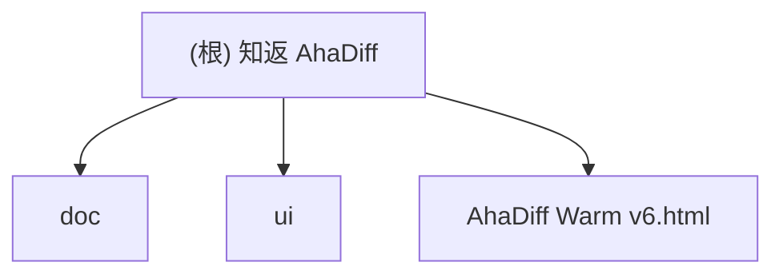

# 知返 AhaDiff

> AI 写完，Diff 教回。 / Ship with AI. Learn it back.

## 项目愿景

知返 AhaDiff 是一个 **local-first 的 verified diff learning layer**。它把 Claude / Codex / Cursor 等 AI 工具写出的 git diff，变成带代码证据链的学习笔记、概念图谱、主动回忆测验、SRS 复习卡和质量棘轮记录。

核心差异定位：Code Wiki 解释仓库，知返解释这次改动；而且每句话都能回到代码证据。

**当前阶段**：`Stage 1 / Task 1`、`Stage 1 / Task 2`、`Stage 2 / Task 5` 与 `Stage 2 / Task 6` 已落地。当前仓库已具备 `contract-freeze.md`、最小 contracts skeleton、`pyproject.toml`、可执行 CLI scaffold（`ahadiff init` / `ahadiff doctor` / `ahadiff config show --resolved` / `python -m ahadiff`）、`src/ahadiff/safety/` 安全层基础实现、`src/ahadiff/git/{__init__,repo,capture,parser,path_tokens,line_map,symbols,hunk_hash}.py`、`ahadiff learn --dry-run`、非 git 目录下可运行且会读取 workspace `.ahadiff/config.toml` 的 `--patch` / `--compare`、从 non-git workspace 子目录传 `--repo-root <subdir>` 也能回到工作区根的 `learn --dry-run`、`ahadiff graph status|import|refresh`、`ahadiff unlock --force`，以及对应的 Stage 0 + Stage 1 + Stage 2 单元测试。provider / evaluator / viewer runtime 仍未实现。

## 架构总览

本仓库当前仍以**设计文档和 HTML 原型**为主，但已补入 Stage 0、Stage 1 / Task 1、Stage 1 / Task 2、Stage 2 / Task 5 和 Stage 2 / Task 6 的后端产物：`doc/contract-freeze.md`、`src/ahadiff/contracts/` 最小 contracts skeleton、`pyproject.toml`、`src/ahadiff/{__main__,cli}.py`、`src/ahadiff/core/{__init__,config,paths,ids,errors}.py`、`src/ahadiff/safety/{__init__,_types,ignore,redact,injection,gates,audit}.py`、`src/ahadiff/git/{__init__,repo,capture,parser,path_tokens,line_map,symbols,hunk_hash}.py`，以及 `tests/unit/{test_contracts,test_stage1_task1,test_redact,test_injection,test_path_safety,test_allowlist,test_git_capture,test_diff_parser,test_hunk_hash,test_line_map,test_symbol_extract}.py`。当前已具备可执行的 CLI scaffold、安全层基础实现、diff capture 输入面和 diff 结构化基础模块；全局 `[security]` 配置、workspace `.ahadiff/config.toml`、non-git 子目录根解析、`line_map.json` / `symbols.json` / `artifact_set.json` 的结构化产物也已接线，但 provider / evaluator / viewer runtime 仍未实现。

### 计划技术栈

- **后端 CLI**：Python 3.11+, typer, rich, pydantic, httpx, pyyaml, fsrs (FSRS-6 间隔重复调度)
- **前端 Viewer**：React 19 + Vite + vanilla CSS（以 `AhaDiff Warm v6.html` 为设计参考模板）。`ahadiff serve` 启动本地 dev server（Starlette + Uvicorn API + Vite dev/build），CLI 运行完成后自动调用 `webbrowser.open()` 打开 WebUI（可通过 `--no-browser` 禁用）。不使用 Next.js 等 SSR 框架
- **评估系统**：LLM-as-judge + 8 维自研 rubric（accuracy/evidence/diff_coverage/learnability/quiz_transfer/spec_alignment/conciseness/safety_privacy = 100 分）+ git ratchet 棘轮
- **LLM Provider**：支持 8 种 API 格式（OpenAI Chat / OpenAI Responses / Gemini / Anthropic / Azure OpenAI / New API / CherryIN / Ollama）。BYOK 流程：用户提供 model_name + base_url + api_key → 自动探测 temperature 透传、TPM/RPM 限制、上下文长度。所有 LLM 调用必须确保不超过探测到的 max_context_length
- **不使用**：LiteLLM（供应链风险）、LangChain、Jinja2 模板渲染前端、Next.js 等 SSR 框架。注：Vite 属于前端构建工具（非传统 Node 后端构建链），仅用于 viewer/ 目录

### 八层架构（计划）

```
0. Schema & Contract     -- 核心契约冻结（ClaimStatus/RunSource/EvalBundle/EventLog）
1. Diff Capture Layer    -- git diff (last/since/staged/unstaged/show/range) / patch file/stdin / --compare
2. Context Layer
   2a. Context Assembly  -- repo files, graphify enrichment, specs
   2b. Safety Gate       -- secret scan → redact → 才能 log/cache/model/render
   2c. Budget & Degrade  -- token budget, large diff skip/clip/summarize, capability_level
3. Lesson Generation     -- prompts/*.md, claim extraction
4. Verification Layer    -- claims.jsonl, deterministic + LLM judge
5. Ratchet Layer         -- evaluation bundle (immutable), review.sqlite (唯一真相源), Graphify freshness query
6. Learning Layer        -- quiz, SRS review, section helpfulness, concepts.jsonl
7. Wiki + UI Layer       -- React SPA via `ahadiff serve`（Starlette API + Vite dev/build）
```

编排逻辑由 `core/orchestrator.py` 统一管理 learn/improve/verify 三条主链路，cli.py 仅做参数解析和输出格式化。results.tsv 降级为 review.sqlite 的人类可读导出视图。

### 数据范围架构

> 核心原则：**per-repo truth + global derived governance**

CLI 全局安装（`pip install ahadiff`），per-repo 运用（每个 repo 独立 `.ahadiff/`）。

```
global_config_dir()                   ← Global（派生/索引/偏好，非真相源）
  Linux:   ~/.config/ahadiff/
  macOS:   ~/Library/Application Support/ahadiff/
  Windows: %APPDATA%/ahadiff/
├── config.toml                       — 全局偏好/provider env alias
├── registry.json                     — repo 发现索引 (v0.2, opt-in; strict_local 下默认关闭)
├── usage.sqlite                      — LLM 花费汇总账本 (v0.2)
└── security/allowlist.yaml           — 全局 secret scan 规则 (v0.2)

<repo>/.ahadiff/                      ← Per-repo（唯一真相源）
├── config.toml                       — repo 级配置覆盖
├── review.sqlite                     — SRS/results/signals 唯一真相源
├── concepts.jsonl                    — branch-aware 概念累积
├── runs/<run_id>/                    — lesson/quiz/claims/score/patch
├── graphify/                         — repo-level code map cache
├── audit.jsonl                       — LLM 调用审计（schema_version + rotation）
├── audit.private.jsonl               — strict_local 本机专用审计（gitignored）
└── ahadiff.lock                      — portalocker 文件锁

<repo>/.ahadiffignore                 ← repo 根路径过滤规则
```

**Config 优先级链**（高到低）：`ENV(AHADIFF_*) → CLI flag → per-repo config.toml → global config.toml → defaults`。凭证类：`env secret → per-repo env_var_name → global env_var_name → none`。

**不可全局化的真相源**：review.sqlite / audit.jsonl / concepts.jsonl / prompts/ / VCR cassettes / Graphify cache。任何 global 数据不参与 ratchet 判定。

## 模块结构图



## 模块索引

| 模块 | 路径 | 语言 | 职责 |
|------|------|------|------|
| doc | `doc/` | Markdown | 产品设计文档：架构方案、改名方案、前端视觉手册、评估报告 |
| contracts | `src/ahadiff/contracts/` | Python | Stage 0 最小 contracts skeleton：枚举、DTO、契约 helper、错误类型 |
| core | `src/ahadiff/core/` | Python | Stage 1 / Task 1 工程骨架：CLI 配置、路径、ID、错误类型 |
| safety | `src/ahadiff/safety/` | Python | Stage 1 / Task 2 安全层基础实现：ignore / redaction / injection / gates / audit |
| tests | `tests/unit/` | Python | Stage 0 + Stage 1 单元测试：contracts、CLI/config/paths、安全层边界 |
| ui | `ui/` | HTML/CSS/JS | UI 原型：Warm 风格 v1-v6 迭代版本 |
| team-plan | `.claude/team-plan/` | Markdown | 团队计划：v0.1 kickoff + 修订方案 + CLI 接入扩展 |
| 根级原型 | `AhaDiff Warm v6.html` | HTML | 最新 UI 参考模板（相对 `ui/` 目录内 v6 快照继续演进，便于快速预览） |

## 运行与开发

### 查看 UI 原型

```bash
# 用浏览器打开最新原型
open "AhaDiff Warm v6.html"

# 或使用本地服务器
python3 -m http.server 8765
```

### 当前已落地的验证

```bash
uv run pytest tests/unit
uv run ruff check src tests
uv run ruff format --check src tests
uv run pyright
uv build --wheel
uv run python -m ahadiff --version
uv run ahadiff init
uv run ahadiff doctor
uv run ahadiff config show --resolved
```

本次 session 实际结果：`uv run pytest tests/unit` 为 `119 passed`；其中 `uv run pytest tests/unit/test_hunk_hash.py tests/unit/test_diff_parser.py tests/unit/test_line_map.py tests/unit/test_symbol_extract.py tests/unit/test_git_capture.py -q` 为 `56 passed`，Task 2 目标测试 `uv run pytest tests/unit/test_redact.py tests/unit/test_injection.py tests/unit/test_path_safety.py tests/unit/test_allowlist.py -q` 为 `27 passed`，`uv run pytest tests/unit/test_git_capture.py -q` 为 `30 passed`。`ruff check`、`ruff format --check`、`pyright` 全通过；`uv run ahadiff learn --unstaged --include-untracked --dry-run --repo-root /Users/yangjunjie/Desktop/ahadiff`、非 git 目录下的 `uv run python -m ahadiff learn --patch sample.patch --dry-run --repo-root <tmpdir>`、非 git 目录下的 `uv run python -m ahadiff learn --compare old.py new.py --dry-run --repo-root <tmpdir>`、从 non-git workspace 子目录传 `--repo-root <subdir>` 的 `learn --compare ... --dry-run`、`uv run ahadiff graph status --repo-root /Users/yangjunjie/Desktop/ahadiff` 与 non-git `uv run python -m ahadiff unlock --force --repo-root <tmpdir>` 本次也已实测可运行；非 `--dry-run` 的 `ahadiff learn` 现在会在写入任何 artifact 前直接报错退出。

### 仓库当前依赖状态

仓库根当前已落地 `pyproject.toml` 与 `uv.lock`，并通过 `uv sync` 建立本地 Python toolchain。当前依赖管理仍只覆盖后端 CLI scaffold；前端 `viewer/` 工程和后续 runtime 依赖尚未引入。

## 测试策略

当前已存在一组自动化测试：`tests/unit/test_contracts.py`，用于 Stage 0 的 contracts import / 序列化 / 边界约束验收。UI 原型仍通过 Playwright MCP 进行浏览器预览验证（见 `.playwright-mcp/` 缓存）。

计划测试策略（工程阶段）：
- 单元测试：pytest + VCR.py（录制 LLM 调用）
- 集成测试：10 份 pinned diff 端到端验证（frozen fixture 层）
- Eval 测试：20 份 pinned eval diff（10 份 benchmark + 10 份 judge-stability/edge regression）+ LLM-as-judge 稳定性验证
- 真实仓库 smoke：基于一个外部参考私有仓库做 live smoke，只做真实 diff / provider / 主链路冒烟，不进入 `suite_digest` 可比基线
- 覆盖率目标：核心路径 >= 85%
- VCR 双层版本：run 级用 `prompt_version`（prompts/ 目录 tree hash）判断整体是否变更；cassette 级用 `prompt_fingerprint + model_id + api_family_version + eval_bundle_version + output_lang` 五元组 hash 精确匹配单个 LLM 调用
- CI 分档：PR 触发 unit + pinned integration（无 LLM 或全 mock/VCR），nightly 触发 eval tests（有 LLM）
- Benchmark 分层：Python 主套件（7份）+ Non-Python 降级套件（3份），独立出 recall/precision

## 编码规范

### 设计文档规范
- 中文为主，技术术语保留英文
- Markdown 格式，代码块使用语法高亮
- 品牌写法统一为「知返 AhaDiff」，CLI 名 `ahadiff`

### 计划工程规范（未来开发阶段）
- Python：ruff + pyright strict + pre-commit
- 线宽 100，ruff 规则 `F,E,W,I,UP,B,C4,SIM,RET,PTH,TC,FA`
- 所有 LLM 调用走 `llm/provider.py`，禁止直接 import anthropic/openai
- prompt 写成独立 `.md` 文件，禁止 f-string 拼接长 prompt

## AI 使用指引

### 硬性要求
- **所有文档更新必须基于真实代码 + 真实测试结果 + 当前文档状态**。如文档间存在漂移，以代码和测试为准，修正文档使其一致。**严禁虚构函数、虚构测试结果、虚构库名或编造不存在的设计决策。**
- 中英文对照文档（如 README.md / README.en.md）修改时必须同步更新，保持口径一致。
- committed docs / 命令示例 / manifest 示例只允许使用占位符、环境变量名或相对表述；不得写入本地 provider endpoint、真实 API key 或带用户名的绝对路径。

### 关键设计决策（读取文档前必知）
1. **N-文件契约**（受 autoresearch 三文件启发的变体）：`program.md`（自然语言状态机）+ **evaluation bundle**（`evaluator.py` + `rubric.py` + `rubric.yaml` + `gates.py` + `deterministic.py` 共 5 文件，整体 immutable，任一变更都会生成新的 `eval_bundle_version` 并触发 VCR cassette 失效；`rubric_version` 仅保留为派生显示字段）+ `prompts/*.md`（可变 prompt 集合，improve loop 的唯一可写面）。原版 autoresearch 三文件：`program.md`（约束）+ `prepare.py`（不可改评估基座）+ `train.py`（唯一可改文件）。AhaDiff 核心创新：(1) 可变面从单一 Python 文件扩展为 prompt 目录；(2) agent 只改 Markdown prompt，不改用户代码；(3) immutable 边界从单文件扩展到 evaluation bundle
2. **Claim Verifier 是核心护城河**：每句解释必须绑定 file:line 证据，claim 有五种状态（verified / weak / not_proven / contradicted / rejected），其中 rejected 表示 claim 引用了 patch 外的文件或不存在的证据（附 reason_code），与 contradicted（证据直接反驳）语义不同
3. **棘轮机制**：improve loop 和 Phase 2.5 均在 `git worktree` 临时工作区执行，不触碰用户主分支。改进则 cherry-pick 回主分支，退步则删除 worktree。连续 2 个优化目标在首轮即无增益时触发 Phase 2.5 探索性重写（darwin-skill 原文："连续2个skill都在round1就break"，AhaDiff 沿用此阈值。autoresearch 无此机制）。Phase 2.5 最多触发 1 次/session，防止无限重写循环
4. **跨模型评估**：生产环境要求生成与评估使用不同模型（生成用 gpt-5.4/Sonnet，评估用 gpt-5.4-mini），防止自评偏差。**开发测试阶段**：为节省成本，生成和评估统一使用 gpt-5.4-mini（1M 上下文），此时跨模型约束暂时放松；`gpt-5.4` 等更大模型和其他候选模型只作为后续对比或生产切换选项，不作为默认开发基线
5. **SQLite 即唯一真相源**：`review.sqlite` 的 `result_events` 表是所有评估数据的唯一真相源。`results.tsv` 降级为人类可读的导出视图（先写 SQLite 有事务保护，成功后 append TSV；TSV 写入失败仅 warn 不阻塞；`ahadiff export-results` 可从 SQLite 重建 TSV）。前端只是 viewer，删除前端不丢功能
6. **安全脱敏顺序**：raw input → secret scan → redact → 才能 log/cache/model/render。任何 artifact 在完成 redaction 之前不得写入日志、进缓存或发送到模型
7. **隐私三档**（统一 snake_case）：`strict_local`（仅本地模型，默认）/ `redacted_remote`（脱敏后发远端）/ `explicit_remote`（用户显式授权发原文）。CLI 参数、config.toml、audit 日志和 CI 行为必须使用统一的 snake_case 命名
8. **i18n 全链路国际化**：手动切换（cookie `ahadiff_lang`）→ 浏览器检测 `navigator.language` → CLI `--lang` → `config.toml` → 系统 `LANG` → 降级 `en`。支持 `en` 和 `zh-CN`。Layer 3 Prompt 用单 prompt + `OUTPUT_LANGUAGE` 指令前缀（不分语言文件）。React 前端用 i18n JSON catalog（`messages/en.json` + `messages/zh-CN.json`）动态切换。SRS 卡片保留创建时语言不重翻译。概念图谱用英文规范术语 + `display_name` 本地化。审计日志始终英文。VCR cassette key 包含 `output_lang`
9. **UNTRUSTED_DIFF 扩展边界**：不可信输入面不仅包括 diff 正文，还包括文件名、commit message、branch/tag 名称、Graphify label、模型输出、VCR cassette 内容。所有外部文本和路径元数据均视为 untrusted，统一经 `redaction_pipeline()` 处理
10. **SQLite 运行时版本门禁**：启动时检查 SQLite 版本，不低于修复 WAL-reset bug 的最低版本。统一连接初始化：WAL + busy_timeout + trusted_schema=OFF + quick_check（非 integrity_check）
11. **架构权威源**：`contract-freeze.md` 是唯一架构权威源，所有契约定义以该文件为准，其他文档引用时不得与之冲突
12. **Graphify v0.1 是可选增强，不是主链前置**：`ahadiff learn` 阶段自动检测 `graphify-out/graph.json`，存在则导入 repo-level context，不存在则静默降级。导入的 `graph.json` 与 Graphify label 同样视为 untrusted，必须先过 sanitization，再进入 context / viewer；新鲜度查询沿用内部 7 态、对外 4 值投影。CLI 至少提供 `ahadiff graph status` / `ahadiff graph refresh` / `ahadiff graph import`，并支持 `--use-graphify` / `--no-graphify`；Viewer 至少支持 full / learning_only / empty 三态。当前 v0.1 权威路径是 `ahadiff serve` + React Viewer，旧静态 viewer / `file://` 设想不再作为 v0.1 权威路径

### 灵感项目
- Karpathy/autoresearch：三文件契约（AhaDiff 扩展为 N-文件变体：可变面从单一 train.py 扩展为 prompts/ 目录） + 单指标 val_bpb + git ratchet + 简洁性准则。**无 Phase 2.5 或 stuck 检测**，keep/discard 全在自然语言中
- SKILL0 (ZJU-REAL)：学习撤架 + skill file-level helpfulness（非 section 级，AhaDiff 自行扩展到 section 粒度）。budget 为线性递减公式 M(s)=ceil(N*(N_S-s)/(N_S-1))，N_S=3 时实际表现为 [6,3,0] 阶段跳变
- darwin-skill：8 维 rubric（结构 60 + 效果 40 = 100 分） + Phase 2.5 重写（连续 2 个 skill 在 round 1 就 break 时触发） + 子 agent 对照评测。**核心逻辑全在 SKILL.md 自然语言指令中**（scripts/ 仅有一个辅助截图脚本 `screenshot.mjs`，另有 `templates/*.html` 成果卡片模板和 `docs/` 说明页面）
- SkillCompass (Evol-ai)：PASS/CAUTION/FAIL + weakest-dimension-first（原版 6 维且评估 skill 文件质量，AhaDiff 自研 8 维体系评估学习笔记质量，阈值从 70/50 调高为 80/60）
- Graphify：repo-level map（AhaDiff 做 commit-level learning overlay）。cache.py 使用 SHA256 内容寻址（二态 fresh/stale）。AhaDiff 自研扩展为 7 态新鲜度状态机 + 4 值对外投影（受 Graphify 二态缓存启发，非 Graphify 原有设计）
- Karpathy LLM Wiki gist：persistent compounding wiki 思想，AhaDiff 落地为 `index.md`（diff-aware merge）+ `concepts.jsonl`（append-only 概念累积），与 Graphify 互补（Graphify = repo map，LLM Wiki = diff learning overlay）

## 多模型协作策略（全局方案）

本项目采用多模型协作开发模式，各模型职责明确分工：

### 角色分配

| 模型 | 角色 | 职责范围 |
|------|------|---------|
| **Claude** | 编排者 + 前端实现者 | 任务编排、前端代码实现、文档维护、集成协调 |
| **Codex** | 后端实现者 | Python CLI 代码实现、测试编写、包发布 |
| **Gemini** | 前端评审者 | UI/UX 设计评审、交互改进方案、视觉规范把关（**不写代码**） |

### 工作流规则

1. **前端工作流**：
   - Gemini（`gemini-3.1-pro-preview`）负责设计评审和改进方案 → Claude 负责代码实现
   - 完成后由 Claude + Codex + Gemini 交叉 review 测试
   - **Gemini 429 时用 Claude 兜底**，不降级模型

2. **后端工作流**：
   - Claude 负责编排和任务拆分 → Codex 负责代码实现
   - 完成后由 Claude + Codex 交叉 review 测试

3. **模型约束**：
   - Gemini 只能使用 `gemini-3.1-pro-preview`，禁止降级模型
   - Codex 用于后端权威判断
   - Claude 是默认编排者和前端实现者
   - LLM Provider 支持 8 种 API 格式（OpenAI Chat / OpenAI Responses / Gemini / Anthropic / Azure OpenAI / New API / CherryIN / Ollama）

### 文件所有权

| 文件范围 | 写入权限 | 审查权限 |
|---------|---------|---------|
| `src/ahadiff/**/*.py` | Codex 实现 | Claude + Codex review |
| `prompts/*.md` | Claude 编写 | Claude + Codex review |
| `viewer/src/**/*.tsx` | Claude 实现 | Claude + Gemini review |
| `viewer/src/**/*.css` | Claude 实现 | Gemini review |
| `tests/**` | Codex 实现 | Claude + Codex review |
| `doc/**` | Claude 维护 | 无需 review |
| `CLAUDE.md` | Claude 维护 | 无需 review |

### 阶段门禁：跨模型交叉审查（Stage Gate）

**硬性要求**：每完成一个 Stage/Phase 后，**必须**通过跨模型交叉审查门禁才能进入下一阶段。未通过门禁的代码不得合并到主分支。

#### 审查流程

```
Stage N 完成 → 三模型并行审查 → 汇总问题 → 修复 → 验证 → 进入 Stage N+1
```

#### 三模型职责

| 模型 | 审查重点 | 工具 | 参与 Stage |
|------|---------|------|-----------|
| **Codex CLI** | 代码正确性、边界条件、测试覆盖、类型安全 | `codex review --uncommitted` | 全部 |
| **Claude** | 架构一致性、文档同步、集成点验证、安全审计 | Claude Code CLI | 全部 |
| **Gemini CLI** | 前端/UX 评审、视觉一致性、交互合理性 | `gemini` CLI（429 时 Claude 兜底） | 含前端的 Stage（1/4/7） |

#### 门禁通过标准

- **GO**：0 Critical + 0 High findings → 直接进入下一 Stage
- **CONDITIONAL GO**：0 Critical + ≤3 High → 修复后重新验证，无需全量审查
- **NO GO**：≥1 Critical 或 >3 High → 全量修复 + 全量重新审查

#### 审查清单（每个 Stage 必检）

1. **功能正确性**：所有新增功能的 happy path + edge case 通过测试
2. **Corner case 覆盖**：对照 CC 列表验证相关 CC 已闭合
3. **文档同步**：CLAUDE.md、kickoff.md、stages-4-9.md 与代码一致
4. **类型安全**：`pyright --strict` 零错误
5. **代码规范**：`ruff check` + `ruff format --check` 通过
6. **安全扫描**：无 hardcoded secrets、无 SQL injection、无 path traversal
7. **跨平台兼容**：pathlib 使用、portalocker 调用、编码处理
8. **集成点验证**：上下游 Task 接口契约匹配

#### Stage 划分对应表

| Stage | 包含 Task | 门禁重点 | 审查模型 |
|-------|----------|---------|---------|
| Stage 0 | Task 0 (Schema Freeze) | 契约可 import + 序列化正确 | Codex + Claude |
| Stage 1 | Task 1-4 (Infra + CLI + Safety + UI Fix) | CLI 骨架 + 安全脱敏 + 响应式修复 | Codex + Claude + Gemini（Task 4 前端） |
| Stage 2 | Task 5-8 (Capture + Parse + Provider + Claim) | diff 捕获 + Graphify 导入/降级 + 结构化 + LLM 接入 + Claim 验证 | Codex + Claude |
| Stage 3 | Task 8.5 + 9-12 (Learnability Gate + Lesson + Quiz + Eval + Ratchet) | 前置判定 + 生成 + SRS + 评估 + 棘轮 | Codex + Claude |
| Stage 4 | Task 13 + 14 + 15 (React Viewer + Review DB) | React 前端基础 + 核心页面 + review.sqlite schema + Graphify/ConceptGraph 三态降级 | Codex + Claude + Gemini |
| Stage 5 | Task 14.5 + 16-17 (Serve + Improve) | Serve API（依赖 Task 15 DB schema）→ 改进循环 | Codex + Claude |
| Stage 6 | Task 18-20 (Bench + Deploy) | 基准测试 + CI + 发布 | Codex + Claude |
| Stage 7 | i18n Signoff（汇总 i18n-0~6 跨阶段产物） | 全链路双语 + locale 降级 + parity audit | Codex + Claude + Gemini |

注：`i18n-0~6` 是跨 Stage 3-6 的 overlay tasks，可与对应业务 Task 并行落地；Stage 7 只承担最终 parity/signoff gate，不要求把 i18n 当成独立串行开发流。

补充说明：
- `ahadiff-v01-kickoff.md` 中的 `Layer 0-3` 只是前半段实现拆分，对外 gate 仍以这里的 `Stage 0-7` 为准
- `ahadiff-v01-stages-4-9.md` 中的“第四段～第九段”和 `Layer 6a/6b` 只是后半段任务拆分；执行和 signoff 仍统一折叠回这里的 `Stage 3-7`

#### Corner Case 回归

每个 Stage 门禁期间，必须验证以下 CC 类别：
- **本 Stage 新增的 CC**：确认已实现闭合方案
- **跨 Stage CC**：确认未因本 Stage 修改而回归
- **CC-GAP 系列**：确认高风险项（GAP-2 网络中断、GAP-3 SQLite 损坏、GAP-10 Unicode 路径）已覆盖

## 变更记录 (Changelog)

| 时间 | 变更 |
|------|------|
| 2026-04-19 21:26:58 | 初始化 CLAUDE.md 文档体系，完成全仓扫描 |
| 2026-04-19 ~23:00 | 修正 3 处灵感项目引用不准确：Phase 2.5 阈值(2非3)、SkillCompass 维度(6非8)、SKILL0 helpfulness 粒度(file级非section级) |
| 2026-04-19 ~23:00 | 添加多模型协作策略：Claude 编排+前端实现、Codex 后端实现、Gemini 前端评审(gemini-3.1-pro-preview) |
| 2026-04-19 ~23:00 | 技术栈修正：首版用 Jinja2 静态 HTML 而非 Next.js/React，不用 LiteLLM |
| 2026-04-19 ~24:00 | 基于源码实测应用 12 项修订（3 P0 + 5 P1 + 4 P2），修正 Phase 2.5 触发条件/归因、三文件契约描述、SkillCompass 维度归因等 |
| 2026-04-19 ~24:00 | CLI 接入扩展：新增 Gemini CLI (GEMINI.md) / OpenCode (AGENTS.md+.opencode/agents/) / Git hooks / GitHub Action 支持 |
| 2026-04-19 ~24:00 | results.tsv 自定义 11 列方案（含 base_sha），status 枚举化，查询走 review.sqlite |
| 2026-04-20 ~22:00 | 三模型交叉审查修订：Claim 5态枚举冻结、rubric 权重统一、Task 5/6 并行修正、Viewer 只读边界、results.tsv 11列+base_sha、improve 分支隔离 |
| 2026-04-20 ~13:30 | 第二轮三模型+Explorer 审查修订(5模型)：N-文件契约改述、evaluation bundle 整体锁定、SQLite 唯一真相源、Layer 2 拆分为 2a/2b/2c、安全脱敏顺序工程化、隐私三档、Schema Freeze Gate 前置、统一错误类型、并发 PID lockfile、large diff 前移 capture stage、UNTRUSTED_DIFF 边界协议、secret detection 扩展覆盖 |
| 2026-04-20 ~14:00 | 第二轮修复后交叉验证：修复术语漂移（head_sha→source_ref、隐私模式统一 snake_case、git reset→worktree、三文件→N-文件）、补 non_ratcheted 到 RunStatus 枚举、event_type/status 区分明确化、evaluation bundle 5 文件（含 rubric.py）、Phase 2.5 最多 1 次/session、PID lockfile 含 liveness check、migration 事务包裹、degraded run ratchet 标记 |
| 2026-04-20 ~15:00 | 4 个 corner case 解决（Claude+Codex+网上研究）：(1) Quiz staleness 惰性检测（Anki 无此能力，AhaDiff 创新点）；(2) concepts.jsonl branch-aware 方案提前到 v0.1（repo 级 append-only + git ancestry 过滤）；(3) VCR cassette 双层版本（run 级 tree hash + cassette 级 per-prompt fingerprint）；(4) TSV 降级为导出视图，取消无损 repair 承诺，改用 SQLite backup API 作为恢复路径 |
| 2026-04-20 ~21:00 | 三轮三模型全面评估（Claude+Codex+Gemini）：取消静态 viewer 冻结，v0.1 引入 `ahadiff serve`（Starlette+Uvicorn）；Layer 7 拆分为 7a Static + 7b Serve 双适配器；三层锁模型（repo_write/db_write/serve_write）；Graphify 7 态新鲜度状态机 + 4 值对外投影；四 Lane 历史模型（L3_git_ratchet/L3_degraded/L2/L1）；serve 安全模型（write token + Origin 校验 + read-only 默认）；note 字段改为 note_json；Layer 5/6/7 显式服务契约 + query DTO 冻结 |
| 2026-04-20 ~21:30 | 四轮三模型评估+改进（Claude+Codex+Gemini+3 Web Agent）：(1) i18n 全链路设计（浏览器检测→手动切换→CLI→config→系统→en 降级，Layer 3 单 prompt+OUTPUT_LANGUAGE 前缀，Jinja2 _()函数+JSON catalog，VCR key 加 output_lang，10 个 i18n corner case 全闭合）；(2) 灵感项目 6 个源码 web 验证（31 条归因 28✅4⚠️0❌）修正 SKILL0 budget 为线性递减公式、darwin-skill 补 templates/、Graphify 7 态标注自研；(3) UNTRUSTED_DIFF 边界扩展到全外部文本；(4) Task 13/14 补 Task 12 显式依赖 |
| 2026-04-21 ~00:00 | 五轮改进（Claude+Codex，Gemini 429 Claude 兜底）：(1) 11 个新 CC 全部闭合（Codex 8 + Claude 3）：locale BCP47 归一化、混合语言检测+重试、evidence anchor file_id 分离、idempotency_key 幂等、概念 term_key 去重、archive bomb 限制、SSR/API cookie 同步、static 按钮降级、超长路径 CSS、窄屏 Unified 回退、z-index 层级表；(2) 文档不一致修复 5 处：知返设计坐标.md 标 archived、前端设计手册标注 v0.1=Jinja2/v1.0=React、revision.md 术语统一 source_ref/base_ref/note_json；(3) 前端字体栈补充中文回退（PingFang/Noto/YaHei/Sarasa）|
| 2026-04-21 ~02:00 | 六轮深度修订（Claude+Codex+Gemini 三模型交叉 review+fact-check）：(1) Task 0 扩展至 13 步（新增 orchestrator 契约、serve_app 契约、三层锁矩阵 repo_write→db_write→serve_write）；(2) Task 5 degraded_flags 完整触发规则（4 种 flag 各有设置点/传播点/UI 行为）；(3) Task 10 ReviewCard anchor 统一为 file_id+display_path（废弃 path 字段）；(4) Task 12 non_ratcheted 第 9 态判定条件（has_git_ancestry==false）；(5) Task 13 新增 6 步（print CSS/ratchet 图表迁移/XSS bleach/static 按钮/焦点陷阱/i18n 过滤器）+验收标准 3 项（WCAG AA/打印/XSS）；(6) 新增 Task 14.5 Serve Backend 完整定义（7 步实施+3 项验收）；(7) DAG 并行分组重写修正依赖关系；(8) HTML Blueprint 6 项 fact-check 修复（RunStatus 9 态/serve 契约/锁描述/状态标签）；(9) HTML Competitors 3 项措辞中性化；(10) 3 份早期文档标 ARCHIVED；(11) 前端手册加技术栈分版说明 |
| 2026-04-21 | 第三轮开工就绪审查（Claude+Codex，Gemini 429 Claude 兜底）：(1) 跨平台 10 项全闭合（portalocker 替代 os.kill / pathlib 强制 / locale.getlocale 替代已弃用 getdefaultlocale / webbrowser.open / os.replace / 短路径策略 / WAL 网络盘 fail-fast / Rich auto-detect / CI 三平台矩阵）；(2) Python 3.11+ 最终确认；(3) Windows 支持 PowerShell 一等 + cmd.exe fallback；(4) Blueprint HTML 修正 portalocker + WAL+busy_timeout |
| 2026-04-21 | 数据范围架构设计（Claude+Codex 双模型全功能评估）：(1) 确立 per-repo truth + global derived governance 原则；(2) 9 功能逐一评估（A-I）4 项需 v0.1 调整（cost schema / allowlist / benchmark manifest / config precedence）5 项不动；(3) Config 5 层优先级链冻结；(4) Task 0/1/2/7/18 补充新契约（portalocker / allowlist policy / UsageEvent / audit rotation / manifest）；(5) Blueprint 新增数据范围+跨平台可视化卡片 |
| 2026-04-21 | 第四轮终审（Claude Opus 4.6 + 3 并行代理）：(1) 判定 CONDITIONAL GO→GO（C-1 路径冲突复核降级为 Info，C-2 concepts.jsonl 已归入 Task 10）；(2) 新增 13 个 CC-GAP corner case（高优 GAP-2 网络中断需 Task 7 处理）；(3) 8 项 Warning 各需在相应 Task 启动前修复；(4) 新增阶段门禁制度（Stage Gate：Codex+Claude+Gemini 三模型交叉审查，0 Critical+0 High 方可进入下一 Stage）；(5) karpathy-skills 可追溯性测试/验证计划结构/Before-After 范例模式采纳；(6) 4 项过度工程化简化建议（CC-NEW-6/7/8/3）；(7) 实际工期修正为 14-16 天 |
| 2026-04-21 | 第五轮全面深度审查（Claude+Codex+Gemini 三模型并行）：(1) 前端从 Jinja2 改为 React 19+Vite，以 v6.html 为设计参考，`ahadiff serve` 自动开浏览器；(2) LLM Provider 支持 8 种 API 格式（OpenAI/Responses/Gemini/Anthropic/Azure/NewAPI/CherryIN/Ollama）+ BYOK 自动探测（temperature/TPM/RPM/context length）；(3) Judge 从 Haiku 升级为 gpt-5.4-mini（1M 上下文）；(4) SQLite WAL-reset version gate + 统一连接初始化；(5) UNTRUSTED_DIFF 边界扩展至 branch/tag 名称；(6) 新增 9 个 CC-REVIEW corner cases；(7) contract-freeze.md 升格唯一权威；(8) 商业可行性暂不考虑 |
| 2026-04-21 | 第六轮交叉审查（Codex+Claude+Gemini 全维度）：(1) 修复 3 High：Blueprint judge 描述/ui/CLAUDE.md Jinja2 残留/Task 13-14.5 依赖图+Stage 归属矛盾；(2) v6.html 修复 provider 标签"Anthropic→OpenAI"和 commits/→runs/ 旧路径 4 处；(3) competitors-research HC-4/HC-5/RISK-4 同步更新；(4) 技术栈三方评分确认（React 19=7-9/SQLite WAL=7/Starlette=8）；(5) 新增 7 个 CC-R6 corner cases（含 Ctrl+C 恢复/VCR schema version/多进程 half-write）；(6) Gemini 建议采纳：Zustand+虚拟列表+CSS Modules；(7) 跨平台 6 项新增缓解措施 |
| 2026-04-21 | Diff 捕获场景扩展 + 交叉审查修复（Codex+Claude）：(1) v0.1 新增 `--unstaged` + `git show` + `--compare`（Task 5 补全）+ `--include-untracked`；(2) 修复 4 Critical：`--staged --unstaged` 改为 `git diff HEAD`（不拼 patch）、`--since` 改为连续 ancestry 窗口 diff、`--compare` 补入 Task 5 实现步骤、capture pipeline 改为 raw/redacted 双表示（parse 在 raw 上执行，持久化只用 redacted）；(3) 补全 corner case：bare repo/detached HEAD/unmerged index/shallow clone/unborn HEAD/TTY stdin/编码检测/BOM sniffing；(4) v0.2 规划 `--compare-dir` + `--patch-url`；v0.3 规划 .ipynb + `--url PR` |
| 2026-04-21 | Install target 分期：v0.1 只实现 4 个核心 CLI（Claude Code / Codex CLI / Gemini CLI / OpenCode），v0.2 扩展 7 个 IDE/复用 target（Cursor / Copilot / Windsurf / Cline / Amp / Jules / Aider） |
| 2026-04-21 | 第七轮开工前最终深度审查（Claude Opus 4.6 + Codex CLI + Gemini 3.1 Pro，三模型并行）：(1) 20 项 findings 全部修复；(2) eval bundle hash 算法冻结（字节级 SHA-256 伪代码）；(3) improve 状态机统一：keep=仅 learn 链路、targeted_verify→keep_final=仅 improve 链路；(4) Layer 6 拆为 6a(Task 14+15 并行)+6b(Task 14.5 等 Task 15)；(5) 前端架构约束：Zustand 原子 i18n store + DiffView React.memo 隔离 + @tanstack/react-virtual + 防 FOUC head JS + Bottom Mini-Panel 三段 Snap Points + 概念图谱单击聚类；(6) crash-atomicity：concepts.jsonl 和 audit.jsonl 均用 write-to-temp-then-rename；(7) token 估算 per-adapter（tiktoken/len÷4/×1.1）；(8) 撤架命名统一 full\|hint\|compact；(9) cherry-pick→status 写入顺序冻结；(10) Stage 4 纳入 Task 15，Stage 5 纳入 Task 14.5 |
| 2026-04-21 | FSRS-6 Codex 深度调研 + HTML 全量更新 + 交叉 review：(1) Codex CLI 212 events 深度调研（6 官方源取证），改进 FSRS 决策文档 6 处（stability 驱动撤架/opaque weights/三按钮 UI/500-1000 冷启动/双门槛重训/misconception 卡/UTC 强制/scheduler_presets+review_logs 表）；(2) Blueprint HTML 新增 FSRS-6 FAQ section（SM-2 vs FSRS 对比表+调度流程图+撤架状态机+行业实践表），全文 SM-2→FSRS-6；(3) Competitors HTML 新增 FSRS 对比 section + 竞品 SRS 速览表，RemNote 修正为 FSRS v6，Mochi 标注算法未公开；(4) Codex 审查修复 3 项：Anki 从"默认调度器"改为"需手动启用"、RemNote 改为手动 optimizer、14 天固定间隔改为 FSRS 动态计算；(5) 宣传页 docs/index.html 同步更新 FSRS 描述和 i18n；(6) 竞品分析 MD 同步 RemNote→FSRS v6；(7) Claude+Codex 交叉 review 全 PASS |
| 2026-04-21 | 第八轮终极全方案审查（Claude Opus 4.6 + Codex CLI + Gemini 3.1 Pro，17 维度 v0.1→v1.0 全路径）：(1) 三模型交叉验证 CONDITIONAL GO（Claude 7.8 / Gemini 8.6 / Codex 6.5）；(2) **8 项前置条件全部落实到 Task**：29 项修复 canonical checklist 全部下沉 + SQLite 版本写死≥3.51.3 + Run 目录二阶段发布协议 + strict_local transport boundary 检查 + Learnability Gate 设计冻结 + DiffView 虚拟列表 dynamic measuring + ProviderCapabilities 契约；(3) **SRS 算法从 SM-2 替换为 FSRS-6**（py-fsrs v6.3.1，desired_retention=0.9，减少 20-30% 复习量），详见 ahadiff-fsrs-decision.md；(4) 新增 Learnability Gate 前置判定（三因子评分：complexity/novelty/pattern，低于阈值跳过 lesson/quiz 生成）；(5) Codex 独有发现 7 项（现已全部下沉，包括 SQLITE_DBCONFIG_DEFENSIVE、run finalize、config merge semantics、audit.private.jsonl、ProviderCapabilities、Windows cancel token 等）；(6) Gemini 独有发现（虚拟列表动态行高 + Scroll Chaining 防穿透 + FSRS 替代 SM-2 + Learnability Gate + IDE 插件化紧迫性）；(7) 学习科学 Web 研究确认 SRS+scaffolding 有 2024-2025 科学依据；(8) HTML 浏览器验证 3 份文件内容一致性全部通过；(9) 新增 GitHub Pages 宣传页面（docs/index.html + .github/workflows/pages.yml）；(10) 新增 62→65+ Corner Cases（CC-ULT-1/2/3）；(11) 技术栈依赖新增 `fsrs` |
| 2026-04-21 | Warm v6.2 前端模板 polish：补 safe-area/meta、语义 token、统一 easing/duration、scrollbar-gutter 与 overscroll、focus-visible 强化、reduced-transparency / forced-colors 降级、触控 44px 目标与打印 URL 展示；相关前端手册和 Task 13 同步更新 |
| 2026-04-21 | 4 个 HTML 原型继续做前端视觉增强：`AhaDiff Warm v6.html` 进入 `editorial-terminal` overlay（扩展字体 weight ramp，append-only CSS overlay，不改 DOM/信息架构），`AhaDiff-Blueprint.html`、`AhaDiff-Competitors-Research.html`、`docs/index.html` 同步纸张纹理、pull quote、divider、focal card 等展示层语言；前端手册、UI 模块说明与 Task 13 参考口径同步更新 |
| 2026-04-21 | 第九轮终极审查（Claude Opus 4.6，10 维度 v0.1→v1.0 全路径）：8.2/10 GO。0 Critical + 2 High + 7 Medium + 5 Low。HTML 浏览器验证 3 份全 PASS |
| 2026-04-21 | 第十轮三模型交叉审查（Codex CLI + Gemini 3.1 Pro + Claude team-reviewer）：发现 Round 9 盲点 16 项（3C+5H+5M+3L）。修复：(1) RunStatus 移除 `rollback`（8 态）；(2) CardState 四态 `active\|stale\|archived\|suspended` + `peeked_this_session`；(3) result_events 列集冻结 + weakest_dim 统一；(4) Task 5→Task 2 隐性依赖补入；(5) cards DDL 补 anchor 列（hunk_id/hunk_hash/symbol/change_kind）+ FK + card_state；(6) `fsrs_card_json` 统一为 `fsrs_state`；(7) VCR cassette key `rubric_version` 改为 `eval_bundle_version`；(8) Learnability Gate 升格 Task 8.5；(9) 前端验收标准量化（FCP<500ms/render-count≤1/long-task<50ms）；(10) entropy_scan=soft_detect + UUID/hash/minified 豁免；(11) ConceptGraph Cluster `⋮` 菜单替代长按；(12) cache key 扩展为 10 元素。全部修复后 GO 确认。Blueprint/Competitors HTML 同步更新 |
| 2026-04-22 | Stage 0 contract 收口（本次真实代码修复）：(1) `peeked_this_session` 改为 session-local，仅运行时存在，不参与持久化 dump；(2) `ClaimRecord` 增加 `status/reason_code` 联动校验，补 `source_hunks` 最小 schema；(3) `ReviewCard.fsrs_state` 要求合法 JSON object 字符串，`change_kind` 收紧到当前文档已支撑的最小值域；(4) `Orchestrator` contract stub 改为显式 `NotImplementedError`；(5) `compute_eval_bundle_version()` 在缺少 eval bundle 文件时返回清晰 guard 错误；(6) 数值字段 strict 校验补入 contract tests；(7) Task 13 验收改为 build + mock/proxy，不再依赖 Stage 5 `ahadiff serve`；(8) `tests/unit/test_contracts.py` 当前实测 `18 passed` |
| 2026-04-22 | Stage 1 / Task 1 落地与 review 收口（本次真实代码与测试）：(1) 落地 `pyproject.toml`、`uv.lock`、`src/ahadiff/{__main__,cli}.py`、`src/ahadiff/core/{__init__,config,paths,ids,errors}.py` 与 `tests/unit/test_stage1_task1.py`；(2) `ahadiff doctor` 现在对 corrupt `review.sqlite` 输出友好错误，不再泄露 traceback；(3) SQLite gate 在不满足冻结门槛时改为非零退出；(4) `python -m ahadiff --version` 可直接到达；(5) TOML 字符串序列化补齐换行转义，`HOME=\"\"` 不再回退真实 home；(6) config CLI 补 `--browser/--no-browser` 成对覆盖；(7) `src/ahadiff/core/__init__.py` 已补齐，wheel 构建通过；(8) 当次实测 `uv run pytest tests/unit/test_stage1_task1.py tests/unit/test_contracts.py` 为 `35 passed`，并且 `ruff check`、`ruff format --check`、`pyright`、`uv build --wheel` 全通过 |
| 2026-04-22 | Stage 1 / Task 2 安全层基础落地（本次真实代码与测试）：(1) 落地 `src/ahadiff/safety/{__init__,_types,ignore,redact,injection,gates,audit}.py` 与 `tests/unit/{test_redact,test_injection,test_path_safety,test_allowlist}.py`；(2) `.ahadiffignore`、双层 secret scan、branch/tag 走 `redaction_pipeline()`、allowlist digest、`audit.jsonl` / `audit.private.jsonl` 基础 rotation helper 已落地；(3) prompt injection 边界补上 `untrusted_diff` 包裹转义、Unicode/confusable 归一化检测、benign `system prompt` 文本误报收窄；(4) base64 包装的 JWT/DB URL/Slack webhook 现在会进入 hard block；(5) `AllowlistPolicy` 改为独立 dataclass，`SourceKind` 收口到共享类型，`safety/` 目录补 `__init__.py`；(6) 运行时 `get_type_hints()` 对安全层类型注解可正常解析；(7) 当次实测 `uv run pytest tests/unit` 为 `61 passed`，其中 Task 2 目标测试为 `26 passed`，并且 `ruff check`、`ruff format --check`、`pyright`、`uv build --wheel` 全通过 |
| 2026-04-22 | Stage 2 / Task 5 diff capture 落地（本次真实代码与测试）：(1) 落地 `src/ahadiff/git/{__init__,repo,capture}.py` 与 `tests/unit/test_git_capture.py`；(2) `ahadiff learn --dry-run` 现已支持 commit range、`--last`、`--since`、`--staged`、`--unstaged`、单 commit（`git show <sha>` 语义）、`--patch file|-`、`--compare a b`，其中 `--patch` / `--compare` 在非 git 目录下也可运行；(3) capture 层已接入 `redaction_pipeline()`、repo write lock、`metadata.json`、`patch.diff`、`audit.jsonl` / `audit.private.jsonl` 基础落盘，以及 Graphify detect/import/status 的最小 CLI 面；(4) `src/ahadiff/core/config.py` 新增 `[capture]` 默认配置 `max_files` / `hard_limit` / `max_patch_bytes`，并补齐 Windows stdin fallback、`--patch -` 的 `30s` 超时与 pipe read error 边界、untracked segmentation、Graphify source path safety/size limit、shallow clone boundary guard、merge first-parent changed_paths、一致的 compare hard-limit clipping、artifact 原子写入、bare `\\r` 保留、`unlock --force` 的 lock-path hardening、non-dry-run `learn` 的 zero-side-effect gate、non-git workspace `unlock --force`，以及 `_resolve_git_files()` 的批量 `git cat-file --batch`；(5) 当次实测 `uv run pytest tests/unit/test_git_capture.py` 为 `26 passed`，`uv run pytest tests/unit` 为 `87 passed`，并且 `ruff check`、`ruff format --check`、`pyright` 全通过；(6) 本次还实测 `uv run ahadiff learn --unstaged --include-untracked --dry-run --repo-root /Users/yangjunjie/Desktop/ahadiff`、非 git 目录下的 `uv run python -m ahadiff learn --patch sample.patch --dry-run --repo-root <tmpdir>`、非 git 目录下的 `uv run python -m ahadiff learn --compare old.py new.py --dry-run --repo-root <tmpdir>`、`uv run ahadiff graph status --repo-root /Users/yangjunjie/Desktop/ahadiff` 与 non-git `uv run python -m ahadiff unlock --force --repo-root <tmpdir>` 可运行 |
| 2026-04-22 | Stage 2 / Task 6 diff 解析与结构化落地（本次真实代码与测试）：(1) 新增 `src/ahadiff/git/{parser,path_tokens,line_map,symbols,hunk_hash}.py`，补齐 unified diff parser、共享 diff path normalization helper、`section_header` 提取、`compute_hunk_hash()`、`build_line_map()`、三层 symbol extraction（`python_ast > regex > section_header`）和 case-insensitive path collision guard；(2) `src/ahadiff/git/__init__.py` 已导出新的 parser/line-map/symbol API；(3) `write_input_artifacts()` 现已写出带显式 `schema/schema_version` 的 `line_map.json` 与 `symbols.json`，新增 `artifact_set.json`，并把 run artifact 写盘升级成临时目录完成后原子发布；(4) non-git `--patch` / `--compare` 现已读取 workspace `.ahadiff/config.toml`，且全局 `[security]` 配置、workspace allowlist、non-git 子目录根解析和未 `resolve()` 的 `capture_patch()` 库 API 都已按当前实现收口；(5) rename 场景现已记录 old/new 双侧 symbol 名，quoted `diff --git` no-hunk 路径恢复、literal backslash/C-style escape 反转义，以及 regex / section_header fallback 的保守 `parent` scope 信息也已补齐；(6) manifest 现在会明确区分 `line_map_from` 和 `symbols_from`，不再把 symbol provenance 误写成只来自 persisted patch；(7) 新增/扩充 `tests/unit/{test_stage1_task1,test_allowlist,test_diff_parser,test_hunk_hash,test_line_map,test_symbol_extract,test_git_capture}.py`，补上 hostile input/property-style corpus、schema wrapper、manifest、global+workspace allowlist、non-git config/allowlist、子目录 `--repo-root`、目录级原子发布与库 API 边界回归；(8) 当前实测 `uv run pytest tests/unit` 为 `119 passed`，并且 `ruff check`、`ruff format --check`、`pyright` 全通过 |
