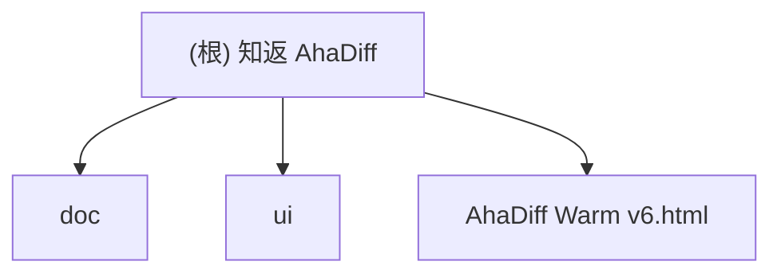

# 知返 AhaDiff

> AI 写完，Diff 教回。 / Ship with AI. Learn it back.

## 项目愿景

知返 AhaDiff 是一个 **local-first 的 verified diff learning layer**。它把 Claude / Codex / Cursor 等 AI 工具写出的 git diff，变成带代码证据链的学习笔记、概念图谱、主动回忆测验、SRS 复习卡和质量棘轮记录。

核心差异定位：Code Wiki 解释仓库，知返解释这次改动；而且每句话都能回到代码证据。

**当前阶段**：Stage 0-7 已落地（Task 0/1/2/5/6/7/8/8.5/9/10/11/12/14.5/15/16/17/18/19/20，另含 i18n-0 后端 + Stage 7 i18n signoff），覆盖 contracts、CLI scaffold、safety、LLM provider、diff capture/parse、claims、lesson、quiz、concepts、eval、review.sqlite + FSRS-6、serve backend、install targets、benchmark suite、improve loop + Phase 2.5 与后端 locale resolver。React Viewer（Stage 4 Task 13/14）Phase A-E 已完成并经 R1-R5 五轮跨模型深度对抗审查修复（累计 51 项 real findings 闭合）：`viewer/` Vite + React 19 + TS + Zustand scaffold、Dashboard/Lesson/Diff/Quiz/ConceptGraph 五页、LanguageSwitcher + i18n 全覆盖（82/82 key parity）、330/330 Playwright 测试跨 4 viewport × 3 浏览器（smoke + i18n + media features）、AbortController + token fetch timeout 全覆盖、token 过期 401/403 重试、ErrorBoundary 恢复按钮、WCAG AAA dark-mode 全 token ≥ 7.0:1、forced-colors 焦点环、reduced-transparency Safari 兼容、CSP 防护、unified diff 解析 inHunk 状态、Quiz Next 按钮强制 SRS rating gate、全交互元素 `:active` 按压反馈。v0.2 Gate 0（跨平台基础）已通过审查：subprocess 强制 UTF-8 encoding + Git `core.quotePath=false`、SQLite journal mode WSL2 `/mnt/*` 自动降级 DELETE + restore 前后 `wal_checkpoint(TRUNCATE)`、lock 文件 `O_NOFOLLOW` + inode 三重校验 + best-effort unlink、headless serve 检测（DISPLAY/WAYLAND_DISPLAY/CI）、`datetime.utcnow()` 静态 guard。v0.2 Gate 1（Review DB Migration + Write Safety）已通过审查：`PRAGMA user_version` migration chain（v1→v2 + 旧 `schema_version` 表清理 + legacy version 防御检查 + newer-version 友好报错）、serve signal 写入与 CLI db backup/restore 共用 `repo_write_lock`（`anyio.to_thread` + portalocker + `threading.Lock`，共享锁提取到 `serve/lock.py`）、`/api/runs` 与 `/api/ratchet/history` SQL pagination DAO（cursor-based `before` 参数 + finalized event_id/run_id 绑定校验）、`_finalized_run_path()` 签名统一为始终 raise、新增 `/api/review/queue` GET（公开）与 `/api/review/rate` POST（需 token）、`_initialize_schema` 包裹 `BEGIN EXCLUSIVE` 事务、`list_due_cards` 读路径不再触发 schema migration。v0.2 Gate 2（Backend Expansion）已通过审查：compare 文件读取改为 race-safe no-follow bounded read（`lstat` + `O_NOFOLLOW` + `O_NONBLOCK` + `fstat` 四层防御）、diff path token 转义感知 Windows 反斜杠归一化、provider streaming byte cap（`iter_bytes(chunk_size=65_536)` + `response_byte_cap` 10 MiB）+ 空 completion 拒绝 + `httpx.TransportError` 全覆盖 retry、install manifest preview/write/uninstall 三态（`InstallManifest` + `InstallFileStrategy`）+ hooks Windows `detect()` 返回 False 不阻塞 `--detect`。

## 架构总览

后端 CLI 主链路（learn/improve/verify/serve/install/benchmark）已基本闭合，具备：CLI scaffold、safety gate、8-provider LLM runtime、diff capture+parse、claim extract/verify、lesson/quiz/concepts 生成、8 维 evaluator + ratchet、review.sqlite + FSRS-6、localhost-only serve API（contract-freeze 4.4 双 slot locale 链 + cli/config 分离）、6 个 install target、benchmark suite、improve loop + Phase 2.5（candidate symlink 拒绝 + 三元组 baseline 隔离 + 256 KiB prompt cap），以及 i18n-0 后端 resolver。前端 `viewer/` React SPA 已落地 Phase A-E 并经 R1-R5 五轮深度审查：Vite + React 19 + TypeScript + vanilla CSS + Zustand + react-router-dom HashRouter，covering Dashboard / Lesson / Diff / Quiz / ConceptGraph 五页 + LanguageSwitcher 全链路 i18n（82/82 key parity）+ 330/330 Playwright 矩阵测试。具体模块文件见下方「模块索引」。

### 计划技术栈

- **后端 CLI**：Python 3.11+, typer, rich, pydantic, httpx, pyyaml, fsrs (FSRS-6 间隔重复调度)
- **前端 Viewer**：React 19 + Vite + vanilla CSS（以 `AhaDiff Warm v6.html` 为设计参考模板）。`ahadiff serve` 启动本地 dev server（Starlette + Uvicorn API + Vite dev/build），CLI 运行完成后自动调用 `webbrowser.open()` 打开 WebUI（可通过 `--no-browser` 禁用）。不使用 Next.js 等 SSR 框架
- **评估系统**：LLM-as-judge + 8 维自研 rubric（accuracy/evidence/diff_coverage/learnability/quiz_transfer/spec_alignment/conciseness/safety_privacy = 100 分）+ git ratchet 棘轮
- **LLM Provider**：支持 8 种 API 格式（OpenAI Chat / OpenAI Responses / Gemini / Anthropic / Azure OpenAI / New API / CherryIN / Ollama）。BYOK 流程：用户提供 model_name + base_url + api_key → 自动探测 temperature 透传、TPM/RPM 限制、上下文长度。所有 LLM 调用必须确保不超过探测到的 max_context_length
- **不使用**：LiteLLM（供应链风险）、LangChain、Jinja2 模板渲染前端、Next.js 等 SSR 框架。注：Vite 属于前端构建工具（非传统 Node 后端构建链），仅用于 viewer/ 目录

### 八层架构（计划）

```
0. Schema & Contract     -- 核心契约冻结（ClaimStatus/RunSource/EvalBundle/EventLog）
1. Diff Capture Layer    -- git diff (last/since/staged/unstaged/show/range) / patch file/stdin / --compare
2. Context Layer
   2a. Context Assembly  -- repo files, graphify enrichment, specs
   2b. Safety Gate       -- secret scan → redact → 才能 log/cache/model/render
   2c. Budget & Degrade  -- token budget, large diff skip/clip/summarize, capability_level
3. Lesson Generation     -- prompts/*.md, claim extraction
4. Verification Layer    -- claims.jsonl, deterministic + LLM judge
5. Ratchet Layer         -- evaluation bundle (immutable), review.sqlite (唯一真相源), Graphify freshness query
6. Learning Layer        -- quiz, SRS review, section helpfulness, concepts.jsonl
7. Wiki + UI Layer       -- React SPA via `ahadiff serve`（Starlette API + Vite dev/build）
```

编排逻辑由 `core/orchestrator.py` 统一管理 learn/improve/verify 三条主链路，cli.py 仅做参数解析和输出格式化。results.tsv 降级为 review.sqlite 的人类可读导出视图。

### 数据范围架构

> 核心原则：**per-repo truth + global derived governance**

CLI 全局安装（`pip install ahadiff`），per-repo 运用（每个 repo 独立 `.ahadiff/`）。

```
global_config_dir()                   ← Global（派生/索引/偏好，非真相源）
  Linux:   ~/.config/ahadiff/
  macOS:   ~/Library/Application Support/ahadiff/
  Windows: %APPDATA%/ahadiff/
├── config.toml                       — 全局偏好/provider env alias
├── registry.json                     — repo 发现索引 (v0.2, opt-in; strict_local 下默认关闭)
├── usage.sqlite                      — LLM 花费汇总账本 (v0.2)
└── security/allowlist.yaml           — 全局 secret scan 规则 (v0.2)

<repo>/.ahadiff/                      ← Per-repo（唯一真相源）
├── config.toml                       — repo 级配置覆盖
├── review.sqlite                     — SRS/results/signals 唯一真相源
├── concepts.jsonl                    — branch-aware 概念累积
├── runs/<run_id>/                    — lesson/quiz/claims/score/patch
├── graphify/                         — repo-level code map cache
├── audit.jsonl                       — LLM 调用审计（schema_version + rotation）
├── audit.private.jsonl               — strict_local 本机专用审计（gitignored）
└── ahadiff.lock                      — portalocker 文件锁

<repo>/.ahadiffignore                 ← repo 根路径过滤规则
```

**Config 优先级链**（高到低）：`ENV(AHADIFF_*) → CLI flag → per-repo config.toml → global config.toml → defaults`。凭证类：`env secret → per-repo env_var_name → global env_var_name → none`。

**不可全局化的真相源**：review.sqlite / audit.jsonl / concepts.jsonl / prompts/ / VCR cassettes / Graphify cache。任何 global 数据不参与 ratchet 判定。

## 模块结构图



## 模块索引

| 模块 | 路径 | 语言 | 职责 |
|------|------|------|------|
| doc | `doc/` | Markdown | 产品设计文档：架构方案、改名方案、前端视觉手册、评估报告 |
| contracts | `src/ahadiff/contracts/` | Python | Stage 0 最小 contracts skeleton：枚举、DTO、契约 helper、错误类型 |
| core | `src/ahadiff/core/` | Python | Stage 1 / Task 1 工程骨架：CLI 配置、路径（含 `is_wsl2_mnt` WSL2 挂载检测）、ID、错误类型 |
| safety | `src/ahadiff/safety/` | Python | Stage 1 / Task 2 安全层基础实现：ignore / redaction / injection / gates / audit |
| llm | `src/ahadiff/llm/` | Python | Layer 1.5 / Task 7 + v0.2 Gate 2：provider（streaming byte cap `response_byte_cap` + `iter_bytes(chunk_size=65_536)` + 空 completion 拒绝 + `httpx.TransportError` 全覆盖 retry）、probe、cache、cost、schemas、adapters |
| claims | `src/ahadiff/claims/` | Python | Stage 2 / Task 8：claim candidate 解析、claim runtime、negative scan、deterministic verifier、claims.jsonl 写盘 |
| lesson | `src/ahadiff/lesson/` | Python | Stage 3 / Task 8.5 + 9：learnability gate、lesson schema、三档 lesson 生成、撤架辅助与 lesson 目录发布 |
| quiz | `src/ahadiff/quiz/` | Python | Stage 3 / Task 10：quiz.jsonl、cards.jsonl 生成与 `ahadiff quiz` CLI |
| wiki | `src/ahadiff/wiki/` | Python | Stage 3 / Task 10：`concepts.jsonl` / `concepts_local.jsonl` 累积与可见性过滤 |
| eval | `src/ahadiff/eval/` | Python | Stage 3 / Task 11-12：8 维评分、hard gates、ratchet、result_events、results.tsv 导出与 score/finalized 发布 |
| review | `src/ahadiff/review/` | Python | Stage 4 / Task 15 + v0.2 Gate 1：review.sqlite schema / `PRAGMA user_version` migration chain（v1→v2 + legacy version 防御 + newer-version 友好报错）、FSRS-6 调度、review queue、learning signals、lossy import、review CLI 后端、`resolve_sqlite_journal_mode` WSL2 降级、`checkpoint_review_db`、SQL pagination DAO（`load_result_events_page` / `load_finalized_ratchet_history_page`） |
| serve | `src/ahadiff/serve/` | Python | Task 14.5 + v0.2 Gate 1：localhost-only serve API、finalized run 读取门禁、token + Origin/Referer 写保护、`serve/lock.py` 共享写锁、`/api/review/queue` GET + `/api/review/rate` POST、`/api/runs` 与 `/api/ratchet/history` SQL pagination + finalized event_id/run_id 绑定校验 |
| install | `src/ahadiff/install/` | Python | Task 19/20 + v0.2 Gate 2：Claude / Codex / Gemini / OpenCode / hooks / GitHub Action 安装目标与模板、`InstallManifest` + `InstallFileStrategy` + `manifest_preview_for` re-export、`--manifest` CLI JSON 输出、hooks Windows `detect()` 返回 False 不阻塞全局 `--detect` |
| improve | `src/ahadiff/improve/` | Python | Stage 5 / Task 16/17：improve session、immutable improve_program、worktree replay、prompt 白名单、targeted verification、Phase 2.5、cherry-pick 与 pending worktree guard |
| i18n | `src/ahadiff/i18n/` | Python | i18n-0：locale resolver、`AHADIFF_LANG`、Accept-Language / cookie / config / LANG fallback、prompt output-language helper |
| benchmarks | `benchmarks/` | Markdown/JSON/Patch | Task 18：local benchmark fixtures、manifest、expected concepts 与 ground_truth consistency checks |
| viewer | `viewer/` | TypeScript/TSX/CSS | Stage 4 Task 13/14 + i18n-3/4：Vite + React 19 + Zustand + HashRouter + vanilla CSS tokens；AppShell / Topbar / LanguageSwitcher / Sidebar / Dashboard / Lesson / Diff / Quiz / ConceptGraph / RatchetChart / VirtualList / SRSCard / EvidencePanel / ScaffoldingTabs / BottomMiniPanel / ErrorBoundary；`src/i18n/messages/{en,zh-CN}.json` catalog 82/82 parity；`src/state/{locale,runs}-store.ts`；`src/api/{client,runs,locale,signals}.ts` 消费 serve API（AbortController + token 重试）；`tests/e2e/{smoke,i18n,media-features}.spec.ts` Playwright 330 tests 跨 4 viewport × 3 浏览器 |
| tests | `tests/unit/` / `tests/eval/` / `tests/integration/` / `tests/live/` | Python | Stage 0-6、i18n-0、v0.2 Gate 0-2 测试：contracts、CLI/config/paths、安全层、provider（streaming byte cap + 空 completion + TransportError retry + response_byte_cap 校验）、diff capture（symlink/FIFO 拒绝 + 总预算边界 + POSIX header + 转义感知路径归一化）、claims、lesson、quiz、concepts、evaluator、ratchet、review（含 migration v1→v2 数据保留 / newer-version 报错 / rollback / legacy schema_version 检查）、serve（含 SQL pagination / review queue+rate auth / finalized binding 校验 / legacy DB 读路径无 migration）、install（manifest JSON + generated/user-managed 策略 + Windows hooks 拒绝 + re-export smoke）、benchmark、improve、targeted verification、Phase 2.5、跨平台静态 guard（`test_cross_platform_static.py`）、真实 LLM judge smoke |
| ui | `ui/` | HTML/CSS/JS | UI 原型：Warm 风格 v1-v6 迭代版本 |
| team-plan | `.claude/team-plan/` | Markdown | 团队计划：v0.1 kickoff + 修订方案 + CLI 接入扩展 |
| 根级原型 | `AhaDiff Warm v6.html` | HTML | 最新 UI 参考模板（相对 `ui/` 目录内 v6 快照继续演进，便于快速预览） |

## 运行与开发

### 查看 UI 原型

```bash
# 用浏览器打开最新原型
open "AhaDiff Warm v6.html"

# 或使用本地服务器
python3 -m http.server 8765
```

### 当前已落地的验证

```bash
uv run pytest tests/unit
uv run ruff check src tests
uv run ruff format --check src tests
uv run pyright
uv build --wheel
uv run python -m ahadiff --version
uv run ahadiff init
uv run ahadiff doctor
uv run ahadiff config show --resolved
uv run python -m ahadiff claims --help
uv run python -m ahadiff learn --help
uv run python -m ahadiff quiz --help
uv run python -m ahadiff review --help
uv run python -m ahadiff improve --help
uv run python -m ahadiff db check --help
uv run python -m ahadiff install github-action --help
```

真实 LLM judge smoke 需要显式开启，默认模型顺序是 `gpt-5.3-codex-spark,gpt-5.4-mini`，每个模型都会先试 OpenAI Responses，再试 Chat Completions fallback：

```bash
AHADIFF_LIVE_LLM_JUDGE=1 \
AHADIFF_LIVE_LLM_API_KEY="$AHADIFF_LIVE_LLM_API_KEY" \
AHADIFF_LIVE_LLM_BASE_URL="$AHADIFF_LIVE_LLM_BASE_URL" \
AHADIFF_LIVE_LLM_MODELS="gpt-5.3-codex-spark,gpt-5.4-mini" \
pytest tests/live/test_llm_judge_live.py -q
```

最近一次验证（v0.2 Gate 2 通过后，2026-04-27）：后端全量 `pytest tests -q` = 607 passed, 1 skipped（live judge 默认跳过，单独跑 1 passed）；ruff check / ruff format --check / pyright 全通过。前端 `pnpm run typecheck` = 0 errors、`pnpm run build` = 261.39 KB（gzip 82.49 KB）、`pnpm exec playwright test` = 330/330 passed。i18n parity = 82/82。WCAG AAA dark-mode 全 token（含语义 + accent）在 paper / subtle / elevated 三个表面均 ≥ 7.0:1。

### 仓库当前依赖状态

仓库根当前已落地 `pyproject.toml` 与 `uv.lock`，并通过 `uv sync` 建立本地 Python toolchain。当前依赖管理已覆盖后端 CLI scaffold、provider runtime 与对应测试依赖；前端 `viewer/` 工程和后续 runtime 依赖尚未引入。

## 测试策略

`tests/unit/`、`tests/eval/` 与 `tests/integration/` 覆盖 Stage 0-6、i18n-0 和 v0.2 Gate 0-2 当前已落地模块，另有 `tests/unit/test_cross_platform_static.py` 作为 `datetime.utcnow()` 零使用的静态 guard，以及 `tests/live/test_llm_judge_live.py`（opt-in）。UI 原型通过 Playwright MCP 浏览器验证。

计划测试策略（工程阶段）：
- 单元测试：pytest + VCR.py（录制 LLM 调用）
- 集成测试：10 份 pinned diff 端到端验证（frozen fixture 层）
- Eval 测试：20 份 pinned eval diff（10 份 benchmark + 10 份 judge-stability/edge regression）+ LLM-as-judge 稳定性验证
- 真实仓库 smoke：基于一个外部参考私有仓库做 live smoke，只做真实 diff / provider / 主链路冒烟，不进入 `suite_digest` 可比基线
- 覆盖率目标：核心路径 >= 85%
- VCR 双层版本：run 级用 `prompt_version`（AhaDiff 自带 prompt 资源的 tree hash）判断整体是否变更；cassette 级用 `prompt_fingerprint + model_id + api_family_version + eval_bundle_version + output_lang` 五元组 hash 精确匹配单个 LLM 调用
- CI 分档：PR 触发 unit + pinned integration（无 LLM 或全 mock/VCR），nightly 触发 eval tests（有 LLM）
- Benchmark 分层：Python 主套件（7份）+ Non-Python 降级套件（3份），独立出 recall/precision

## 编码规范

### 设计文档规范
- 中文为主，技术术语保留英文
- Markdown 格式，代码块使用语法高亮
- 品牌写法统一为「知返 AhaDiff」，CLI 名 `ahadiff`

### 计划工程规范（未来开发阶段）
- Python：ruff + pyright strict + pre-commit
- 线宽 100，ruff 规则 `F,E,W,I,UP,B,C4,SIM,RET,PTH,TC,FA`
- 所有 LLM 调用走 `llm/provider.py`，禁止直接 import anthropic/openai
- prompt 写成独立 `.md` 文件，禁止 f-string 拼接长 prompt

## AI 使用指引

### 硬性要求
- **所有文档更新必须基于真实代码 + 真实测试结果 + 当前文档状态**。如文档间存在漂移，以代码和测试为准，修正文档使其一致。**严禁虚构函数、虚构测试结果、虚构库名或编造不存在的设计决策。**
- 中英文对照文档（如 README.md / README.en.md）修改时必须同步更新，保持口径一致。
- committed docs / 命令示例 / manifest 示例只允许使用占位符、环境变量名或相对表述；不得写入本地 provider endpoint、真实 API key 或带用户名的绝对路径。

### 关键设计决策（读取文档前必知）
1. **N-文件契约**（受 autoresearch 三文件启发的变体）：`program.md`（自然语言状态机）+ **evaluation bundle**（`evaluator.py` + `rubric.py` + `rubric.yaml` + `gates.py` + `deterministic.py` 共 5 文件，统一位于 `src/ahadiff/eval/` 命名空间，整体 immutable，任一变更都会生成新的 `eval_bundle_version` 并触发 VCR cassette 失效；`rubric_version` 仅保留为派生显示字段）+ prompt 集合。**可写 prompt 白名单** 仅限 `lesson_generate.md`、`lesson_hint.md`、`lesson_compact.md`、`quiz_generate.md`、`claim_extract.md`；`prompts/improve_program.md` 是 human-written immutable state machine，不在 improve loop 可写集合内。原版 autoresearch 三文件：`program.md`（约束）+ `prepare.py`（不可改评估基座）+ `train.py`（唯一可改文件）。AhaDiff 核心创新：(1) 可变面从单一 Python 文件扩展为受白名单约束的 prompt 目录；(2) agent 只改 Markdown prompt，不改用户代码；(3) immutable 边界从单文件扩展到 evaluation bundle
2. **Claim Verifier 是核心护城河**：每句解释必须绑定 file:line 证据，claim 有五种状态（verified / weak / not_proven / contradicted / rejected），其中 rejected 表示 claim 引用了 patch 外的文件或不存在的证据（附 reason_code），与 contradicted（证据直接反驳）语义不同
3. **棘轮机制**：improve loop 和 Phase 2.5 均在 `git worktree` 临时工作区执行，不触碰用户主分支。改进则 cherry-pick 回主分支，退步则删除 worktree。连续 2 个优化目标在首轮即无增益时触发 Phase 2.5 探索性重写（darwin-skill 原文："连续2个skill都在round1就break"，AhaDiff 沿用此阈值。autoresearch 无此机制）。Phase 2.5 最多触发 1 次/session，防止无限重写循环
4. **跨模型评估**：生产环境要求生成与评估使用不同模型（生成用 gpt-5.4/Sonnet，评估用 gpt-5.4-mini），防止自评偏差。**开发测试阶段**：为节省成本，生成和评估统一使用 gpt-5.4-mini（1M 上下文），此时跨模型约束暂时放松；`gpt-5.4` 等更大模型和其他候选模型只作为后续对比或生产切换选项，不作为默认开发基线
5. **SQLite 即唯一真相源**：`review.sqlite` 的 `result_events` 表是所有评估数据的唯一真相源。`results.tsv` 降级为人类可读的导出视图（先写 SQLite 有事务保护，成功后 append TSV；TSV 写入失败仅 warn 不阻塞；`ahadiff export-results` 可从 SQLite 重建 TSV）。前端只是 viewer，删除前端不丢功能
6. **安全脱敏顺序**：raw input → secret scan → redact → 才能 log/cache/model/render。任何 artifact 在完成 redaction 之前不得写入日志、进缓存或发送到模型
7. **隐私三档**（统一 snake_case）：`strict_local`（仅本地模型，默认）/ `redacted_remote`（脱敏后发远端）/ `explicit_remote`（用户显式授权发原文）。CLI 参数、config.toml、audit 日志和 CI 行为必须使用统一的 snake_case 命名
8. **i18n 全链路国际化**：手动切换（cookie `ahadiff_lang`）→ Accept-Language → AHADIFF_LANG → CLI `--lang` → `config.toml` → 系统 `LANG` → 降级 `en`。支持 `en` 和 `zh-CN`。Layer 3 Prompt 用单 prompt + `OUTPUT_LANGUAGE` 指令前缀（不分语言文件）。React 前端用 i18n JSON catalog（`messages/en.json` + `messages/zh-CN.json`）动态切换。SRS 卡片保留创建时语言不重翻译。概念图谱用英文规范术语 + `display_name` 本地化。审计日志始终英文。VCR cassette key 包含 `output_lang`
9. **UNTRUSTED_DIFF 扩展边界**：不可信输入面不仅包括 diff 正文，还包括文件名、commit message、branch/tag 名称、Graphify label、模型输出、VCR cassette 内容。所有外部文本和路径元数据均视为 untrusted，统一经 `redaction_pipeline()` 处理
10. **SQLite 运行时版本门禁**：启动时检查 SQLite 版本，不低于修复 WAL-reset bug 的最低版本。统一连接初始化：WAL + busy_timeout + trusted_schema=OFF + quick_check（非 integrity_check）
11. **架构权威源**：`contract-freeze.md` 是唯一架构权威源，所有契约定义以该文件为准，其他文档引用时不得与之冲突
12. **Graphify v0.1 是可选增强，不是主链前置**：`ahadiff learn` 阶段自动检测 `graphify-out/graph.json`，存在则导入 repo-level context，不存在则静默降级。导入的 `graph.json` 与 Graphify label 同样视为 untrusted，必须先过 sanitization，再进入 context / viewer；新鲜度查询沿用内部 7 态、对外 4 值投影。CLI 至少提供 `ahadiff graph status` / `ahadiff graph refresh` / `ahadiff graph import`，并支持 `--use-graphify` / `--no-graphify`；Viewer 至少支持 full / learning_only / empty 三态。当前 v0.1 权威路径是 `ahadiff serve` + React Viewer，旧静态 viewer / `file://` 设想不再作为 v0.1 权威路径

### 灵感项目
- **autoresearch**（Karpathy）：三文件契约 + git ratchet → AhaDiff 扩展为 N-文件变体 + prompts/ 可变面
- **SKILL0**（ZJU-REAL）：学习撤架 + file-level helpfulness → AhaDiff 扩展到 section 粒度
- **darwin-skill**：8 维 rubric + Phase 2.5 重写（连续 2 次 round1 break 触发）
- **SkillCompass**（Evol-ai）：weakest-dimension-first → AhaDiff 自研 8 维体系，阈值 80/60
- **Graphify**：repo-level map → AhaDiff 自研 7 态新鲜度 + 4 值投影
- **LLM Wiki**（Karpathy gist）：persistent compounding wiki → `concepts.jsonl` append-only

## 多模型协作策略（全局方案）

本项目采用多模型协作开发模式，各模型职责明确分工：

### 角色分配

| 模型 | 角色 | 职责范围 |
|------|------|---------|
| **Claude** | 编排者 + 前端实现者 | 任务编排、前端代码实现、文档维护、集成协调 |
| **Codex** | 后端实现者 | Python CLI 代码实现、测试编写、包发布 |
| **Gemini** | 前端评审者 | UI/UX 设计评审、交互改进方案、视觉规范把关（**不写代码**） |

### 工作流规则

1. **前端工作流**：
   - Gemini（`gemini-3.1-pro-preview`）负责设计评审和改进方案 → Claude 负责代码实现
   - 完成后由 Claude + Codex + Gemini 交叉 review 测试
   - **Gemini 429 时用 Claude 兜底**，不降级模型

2. **后端工作流**：
   - Claude 负责编排和任务拆分 → Codex 负责代码实现
   - 完成后由 Claude + Codex 交叉 review 测试

3. **模型约束**：
   - Gemini 只能使用 `gemini-3.1-pro-preview`，禁止降级模型
   - Codex 用于后端权威判断
   - Claude 是默认编排者和前端实现者
   - LLM Provider 支持 8 种 API 格式（OpenAI Chat / OpenAI Responses / Gemini / Anthropic / Azure OpenAI / New API / CherryIN / Ollama）

### 文件所有权

| 文件范围 | 写入权限 | 审查权限 |
|---------|---------|---------|
| `src/ahadiff/**/*.py` | Codex 实现 | Claude + Codex review |
| `prompts/*.md` | Claude 编写 | Claude + Codex review |
| `viewer/src/**/*.tsx` | Claude 实现 | Claude + Gemini review |
| `viewer/src/**/*.css` | Claude 实现 | Gemini review |
| `tests/**` | Codex 实现 | Claude + Codex review |
| `doc/**` | Claude 维护 | 无需 review |
| `CLAUDE.md` | Claude 维护 | 无需 review |

### 阶段门禁：跨模型交叉审查（Stage Gate）

**硬性要求**：每完成一个 Stage/Phase 后，**必须**通过跨模型交叉审查门禁才能进入下一阶段。未通过门禁的代码不得合并到主分支。

#### 审查流程

```
Stage N 完成 → 三模型并行审查 → 汇总问题 → 修复 → 验证 → 进入 Stage N+1
```

#### 三模型职责

| 模型 | 审查重点 | 工具 | 参与 Stage |
|------|---------|------|-----------|
| **Codex CLI** | 代码正确性、边界条件、测试覆盖、类型安全 | `codex review --uncommitted` | 全部 |
| **Claude** | 架构一致性、文档同步、集成点验证、安全审计 | Claude Code CLI | 全部 |
| **Gemini CLI** | 前端/UX 评审、视觉一致性、交互合理性 | `gemini` CLI（429 时 Claude 兜底） | 含前端的 Stage（1/4/7） |

#### 门禁通过标准

- **GO**：0 Critical + 0 High findings → 直接进入下一 Stage
- **CONDITIONAL GO**：0 Critical + ≤3 High → 修复后重新验证，无需全量审查
- **NO GO**：≥1 Critical 或 >3 High → 全量修复 + 全量重新审查

#### 审查清单（每个 Stage 必检）

1. **功能正确性**：所有新增功能的 happy path + edge case 通过测试
2. **Corner case 覆盖**：对照 CC 列表验证相关 CC 已闭合
3. **文档同步**：CLAUDE.md、kickoff.md、stages-4-9.md 与代码一致
4. **类型安全**：`pyright --strict` 零错误
5. **代码规范**：`ruff check` + `ruff format --check` 通过
6. **安全扫描**：无 hardcoded secrets、无 SQL injection、无 path traversal
7. **跨平台兼容**：pathlib 使用、portalocker 调用、编码处理
8. **集成点验证**：上下游 Task 接口契约匹配

#### Stage 划分对应表

| Stage | 包含 Task | 门禁重点 | 审查模型 |
|-------|----------|---------|---------|
| Stage 0 | Task 0 (Schema Freeze) | 契约可 import + 序列化正确 | Codex + Claude |
| Stage 1 | Task 1-4 (Infra + CLI + Safety + UI Fix) | CLI 骨架 + 安全脱敏 + 响应式修复 | Codex + Claude + Gemini（Task 4 前端） |
| Stage 2 | Task 5-8 (Capture + Parse + Provider + Claim) | diff 捕获 + Graphify 导入/降级 + 结构化 + LLM 接入 + Claim 验证 | Codex + Claude |
| Stage 3 | Task 8.5 + 9-12 (Learnability Gate + Lesson + Quiz + Eval + Ratchet) | 前置判定 + 生成 + SRS + 评估 + 棘轮 | Codex + Claude |
| Stage 4 | Task 13 + 14 + 15 (React Viewer + Review DB) | React 前端基础 + 核心页面 + review.sqlite schema + Graphify/ConceptGraph 三态降级 | Codex + Claude + Gemini |
| Stage 5 | Task 14.5 + 16-17 (Serve + Improve) | Serve API（依赖 Task 15 DB schema）→ 改进循环 | Codex + Claude |
| Stage 6 | Task 18-20 (Bench + Deploy) | 基准测试 + CI + 发布 | Codex + Claude |
| Stage 7 | i18n Signoff（汇总 i18n-0~6 跨阶段产物） | 全链路双语 + locale 降级 + parity audit | Codex + Claude + Gemini |

注：`i18n-0~6` 是跨 Stage 3-6 的 overlay tasks，可与对应业务 Task 并行落地；Stage 7 只承担最终 parity/signoff gate，不要求把 i18n 当成独立串行开发流。

补充说明：
- `ahadiff-v01-kickoff.md` 中的 `Layer 0-3` 只是前半段实现拆分，对外 gate 仍以这里的 `Stage 0-7` 为准
- `ahadiff-v01-stages-4-9.md` 中的“第四段～第九段”和 `Layer 6a/6b` 只是后半段任务拆分；执行和 signoff 仍统一折叠回这里的 `Stage 3-7`

#### Corner Case 回归

每个 Stage 门禁期间，必须验证以下 CC 类别：
- **本 Stage 新增的 CC**：确认已实现闭合方案
- **跨 Stage CC**：确认未因本 Stage 修改而回归
- **CC-GAP 系列**：确认高风险项（GAP-2 网络中断、GAP-3 SQLite 损坏、GAP-10 Unicode 路径）已覆盖

## 变更记录 (Changelog)

> 设计阶段（2026-04-19 ~ 04-21）经历 10 轮三模型交叉审查（Claude+Codex+Gemini），完成架构冻结、65+ corner cases 闭合、FSRS-6 替代 SM-2、React 19+Vite 前端确定、8 种 LLM Provider 格式设计。详见 `git log` 和 `doc/` 下各轮审查报告。

| 时间 | 变更 |
|------|------|
| 2026-04-22 | Stage 0 contract 收口 + Stage 1 Task 1/2 落地（CLI scaffold + safety gate），61 passed |
| 2026-04-22 | Stage 2 Task 5/6 diff capture + parse 落地，119 passed |
| 2026-04-23 | Stage 2 Task 7/8 provider + claims 落地 + learnability gate，286 passed |
| 2026-04-23 ~ 04-24 | Stage 3 Task 8.5/9/10/11/12 lesson+quiz+eval+ratchet 落地，335 passed |
| 2026-04-24 | Stage 4 Task 15 review.sqlite + FSRS-6 + Review CLI 落地，383 passed |
| 2026-04-24 | Stage 5 Task 16/17 improve loop + Phase 2.5 + live judge 落地，当轮 406 passed |
| 2026-04-24 | Stage 6 Task 14.5/18/19/20 + i18n-0 review 修复收口：serve backend、benchmark、6 个 install target、GitHub Action 模板、locale resolver 与 prompt output language helper 已同步到文档；后续又补齐 macOS+Ubuntu CI / workflow、Windows hooks 明确拒绝、static-only install template render、serve artifact SQL 查询，以及 `ServeState.with_locale()` 复用运行时字段；随后把 pinned integration cards fixture 改成生产 `generate_cards_for_run()` 路径并逐行校验 `ReviewCard` schema；本次实测 unit 461 passed、eval 7 passed、pinned integration 10 passed、quiz/review 38 passed、全量 tests 478 passed + 1 skipped、live judge 1 passed，且 `gpt-5.3-codex-spark` 已单独确认可用 |
| 2026-04-25 | LLM cache key 后端边界收口：`CacheKeyInput`、`build_cache_key()` 与 provider dispatch 已纳入 `api_family_version`，同一 `api_family` 下不同 API version 不再共享 cache key；新增 provider 回归覆盖，当轮 provider 回归、全量 tests、ruff check / ruff format --check / pyright / wheel build 均通过 |
| 2026-04-25 | **Viewer v0.1 Phase A-E 完成 + R1/R2 深度审查**：新建 `viewer/` Vite + React 19 + TS + Zustand 工程；落地 5 核心页面（Dashboard/Lesson/Diff/Quiz/ConceptGraph）、AppShell/Topbar/Sidebar/LanguageSwitcher/RatchetChart/VirtualList/SRSCard/EvidencePanel/ScaffoldingTabs/BottomMiniPanel/ErrorBoundary 组件；i18n 初版 cookie `ahadiff_lang` + `aria-pressed` 切换 + `html lang` 同步；Phase A-E 修复三个 Critical + 20 余项 High/Medium；R1/R2 又修复 14 项（含 AbortController 全覆盖、token 过期 401/403 重试、ErrorBoundary 恢复按钮、ScaffoldingTabs 键盘导航、runs-store TTL、`{resource}` 错误提示 i18n 修正、diff parser `index` 行容错、fadeUp 动画、CSP meta、forced-colors token 完整覆盖、ClaimBadge verdict glyph、QuizPage stable error flag）；R1/R2 之后 i18n parity 升至 82/82、Playwright 升至 330/330。后续 R3 修复另见专门 changelog 行 |
| 2026-04-25 | **Stage 7 i18n signoff 通过**：全链路 i18n 审计 82/82 key parity、后端 locale chain 验证、CLI 输出英文设计决策记录、审计日志英文记录；diff parser `index` 行容错回归测试已新增并通过后端验证 |
| 2026-04-25 | **R3 全面对抗式审查门禁通过**：四路独立审查（Codex 后端 + Codex 前端 + Claude 后端 + Claude+Gemini 前端）共识别 31 项 finding，交叉判定后 22 项 real 全部本 gate 修复 + 3 项 follow-up（Codex 终验抓出的 WCAG 7:1 边界 + 注释 stale + 359px lang-switcher 紧凑度）。后端 11 项（Codex 修）含 candidate staging symlink reject + resolve guard、improve baseline triplet 隔离、`content_lang` 不再伪造、oversized finalized 跳过、regenerate quiz 继承 lang、ServeState cli/config 拆分、`QuizAnswerRequest` 与 `RunDetail.graphify_notes` Pydantic DTO、`https://localhost` Origin 放行、`_MAX_MUTATED_PROMPT_BYTES` 边界测试、文档测试计数 → 537。前端 11 项（Claude 修）含 Quiz Next 按钮 `rated` gate 防绕过 SRS rating、DiffView `inHunk` 状态防 `++/--` content 误判 file header 与 `\ No newline` 行号错误、token fetch 8s timeout 防卡死、forced-colors 焦点环恢复、`-webkit-backdrop-filter` 配对清除、RunDetail index signature 移除 + `graphify_notes` 显式字段、dark-mode WCAG AAA tokens 升级（`--muted #ABA69D→#D0CABF` 7.42:1、`--muted-strong #A09586→#DBD5CB` 8.29:1、`--add-fg #7ABF9A→#95D4B4` 7.11:1、`--del-fg #E09080→#F4B7AC` 7.03:1）、print.css overflow-wrap、AppShell 359px lang-switcher 紧凑 ellipsis 而非隐藏。Codex 终验前端 9 PASS + 1 FAIL + 2 PARTIAL → follow-up 3/3 PASS；Claude 终验后端 11/11 PASS。回归 537+1 / 330/330 / i18n 82/82 / WCAG AAA dark mode 全 ≥ 7.0:1 全绿；累计 R1+R2+R3 闭合 39 项 real findings |
| 2026-04-26 | **R4 全方位严苛对抗式审查门禁通过**：四路独立审查（Codex 后端 sub-agents + Codex 前端 + Claude 后端 + Claude+Gemini 前端）共识别 25 项 finding，交叉判定后 14 项 real、10 项本轮修复。后端 6 项：lock symlink 攻击防护（`O_NOFOLLOW` + `lstat()`）、provider retry 扩展到 `httpx.TransportError` 全覆盖、improve 拒绝 `redacted_remote` 模式、`max_concurrent >= 1` 校验、probe transport 异常 fallback、middleware POST body size 1MiB + Content-Type 校验。前端 3 项：dark-mode 语义 token（`--success #7ABF9A→#A1D2B8`、`--warning #D9A65A→#E5C18C`、`--danger #E09080→#ECBCB2`、`--info #7AA0C8→#B3C9E0`、`--accent-ink #E0B89E→#E3C0A8`）全部提升至 AAA 7.0:1 on paper/subtle/elevated；forced-colors 新增 `.srs-card__rating-btn` / `.scaffolding-tab` / `.kpi-card` 规则。+10 new tests。Codex 终验前端 PASS（独立对比度计算验证）；Claude 终验后端 6/6 PASS。回归 547+1 / 330/330 / i18n 82/82 / WCAG AAA dark mode 全 token ≥ 7.0:1 全绿；累计 R1+R2+R3+R4 闭合 49 项 real findings |
| 2026-04-26 | **R5 全功能验收通过**：四路并行验收（Codex 后端 E2E + Claude 后端 serve/install/provider/db + Claude 前端 Playwright + Claude UX 审查）确认全部功能端到端正常。2 项 real findings 本轮修复：R5-UX-13 全交互元素 `:active` 按压反馈（12 条 CSS 规则覆盖 button/sidebar/kpi-card/quiz-btn/rating-btn/claim-card/scaffolding-tab/lang-switcher + 即时 transition-duration:0s）、R5-BE-5 diff parser Unicode 文件名测试（中文 + emoji）。R5-UX-14 skeleton/shimmer 加载 + 66 个 v6 token 未移植 + 5 个 v6 页面列入 v0.2。回归 559+1 / 330/330 / i18n 82/82 / WCAG AAA dark mode 全 ≥ 7.0:1 全绿；累计 R1-R5 闭合 51 项 real findings |
| 2026-04-26 | **v0.2 Gate 0 跨平台基础通过**（Codex 实现 + Claude 交叉审查，GO 判定：0 Critical / 0 High / 2 Low）：Task 0.1 所有 `subprocess.run(text=True)` 加 `encoding="utf-8", errors="replace"`，`run_git` / `run_git_bytes` 注入 `core.quotePath=false`，`improve/loop.py` 子 Python 进程设置 `PYTHONUTF8=1`；Task 0.2 新增 `is_wsl2_mnt()` 检测 WSL2 `/mnt/*` 路径（需 Linux + WSL 环境变量），`resolve_sqlite_journal_mode()` 在 WSL2 挂载点降级 DELETE，`checkpoint_review_db()` 调用 `PRAGMA wal_checkpoint(TRUNCATE)`，`restore_review_db` 前后三次 checkpoint + `_remove_sqlite_sidecars_with_retry` 5 次重试清理 -wal/-shm/-journal；Task 0.3 `repo_write_lock` 和 `unlock_repo_write_lock` 加 `O_NOFOLLOW` + `lstat/fstat` inode 三重校验 + best-effort unlink（Windows 降级写空文件），headless 检测 `_should_open_serve_browser()` 覆盖 CI / Linux 无 DISPLAY / WAYLAND_DISPLAY，serve 输出 `127.0.0.1` 替代 `localhost`；Task 0.4 新增 `test_cross_platform_static.py` 扫描 `src/ahadiff/` 全部 `.py` 确保 `datetime.utcnow()` 零使用。回归 unit 559 passed / 全量 576 passed + 1 skipped / ruff + pyright 全绿 |
| 2026-04-27 | **v0.2 Gate 2 Backend Expansion 通过**（Codex 实现 + Claude+Codex 对抗审查 + Codex 最终回归审查，GO 判定：0 Critical / 0 High / 0 Medium）：Task 2.1 compare 文件读取改为 race-safe no-follow bounded read，`_read_regular_file_no_follow_bounded` 四层防御（`os.lstat()` 前置跨平台 symlink 检查 + `O_NOFOLLOW` + `O_NONBLOCK` 防 FIFO 阻塞 + `os.fstat()` 确认 regular file），old/new 共享 `max_patch_bytes` 总预算，diff header 输出 POSIX `a/dir/file`；Task 2.2 diff path token 支持 Windows 反斜杠，`_normalize_quoted_diff_path_separators` 转义感知归一化（保留 `\\`/`\t`/`\n`/octal 等 git 转义序列，仅裸反斜杠归一化为 `/`），`_has_windows_drive_prefix` + UNC 路径拒绝；Task 4.1 provider `_send_once()` 改为 streaming read，`iter_bytes(chunk_size=65_536)` + `response_byte_cap`（默认 10 MiB，`DEFAULT_PROVIDER_RESPONSE_BYTE_CAP`）超长 response 在 streaming 阶段拒绝 + 空 completion 拒绝 + `httpx.TransportError` 全覆盖 retry（含 body streaming 阶段 `ReadError`/`RemoteProtocolError`），`_RetryableProviderError` 从 frozen 改为 mutable dataclass；Task 5.1 install manifest 支持 preview/write/uninstall 三态（`InstallManifest` + `InstallFileStrategy` + `manifest_preview_for`），`generated`/`user-managed` 文件策略区分，hooks Windows `detect()` 返回 False 不阻塞 `--detect` 全局列表（preview/write/uninstall 仍明确 raise），`--manifest` CLI 选项输出 JSON，`ahadiff install hooks --help` 显示 Windows v0.1 不支持提示；re-export 清理：`InstallManifest`/`InstallFileStrategy`/`manifest_preview_for` 从 `install/__init__.py`，`DEFAULT_PROVIDER_RESPONSE_BYTE_CAP` 从 `llm/__init__.py` + `provider.__all__`。回归 607 passed + 1 skipped / ruff + pyright 全绿 |
| 2026-04-27 | **v0.2 Gate 1 Review DB Migration + Write Safety 通过**（Codex 实现 + Claude+Codex 对抗审查，GO 判定：0 Critical / 0 High / 1 Low）：Task 1.1 `review.sqlite` 改用 `PRAGMA user_version` migration chain，拆 `_ensure_schema()` 为 `_get_schema_version()` / `_initialize_schema()` / `_run_migrations()` / `_set_schema_version()` 四步，新增 `_get_legacy_schema_version()` 防御旧 `schema_version` 表 version > current，`_initialize_schema` 包裹 `BEGIN EXCLUSIVE` 事务，v1→v2 迁移末尾 `DROP TABLE IF EXISTS schema_version` 清理孤表，newer-version 友好报错；Task 1.2 serve signal 写入改用 `anyio.to_thread.run_sync` + `repo_write_lock`（portalocker）+ `threading.Lock` 三层锁，共享锁 context manager 提取到 `src/ahadiff/serve/lock.py`；Task 1.3 `/api/runs` 与 `/api/ratchet/history` 改用 SQL pagination DAO（`load_result_events_page` cursor-based `before` 参数 + event_id chunking），`finalized_event_ids` 保留 `dict[run_id, event_id]` 绑定并做 post-fetch 校验；Task 1.4 `_finalized_run_path()` 签名统一为始终 raise `InputError`；Task 1.5 新增 `/api/review/queue` GET（公开，`list_due_cards` 只做 schema version 检查不触发 migration）与 `/api/review/rate` POST（需 token，走 `record_card_review_once` + idempotency）、`DueReviewCardResponse` / `ReviewRateRequest` DTO。回归 587 passed + 1 skipped / live judge 1 passed / ruff + pyright 全绿 |
