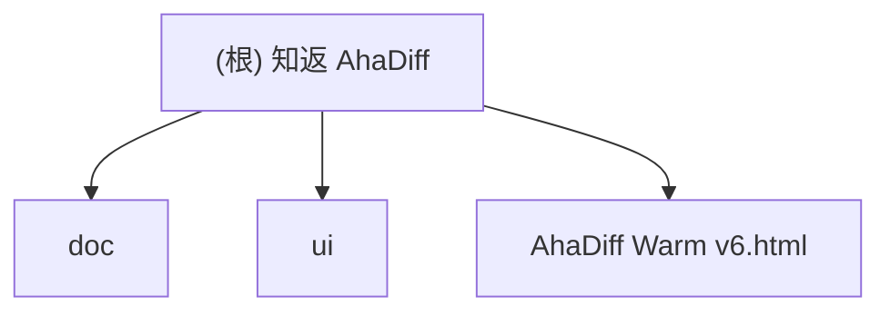

# 知返 AhaDiff

> AI 写完，Diff 教回。 / Ship with AI. Learn it back.

## 项目愿景

知返 AhaDiff 是一个 **local-first 的 verified diff learning layer**。它把 AI 工具写出的 git diff，变成带代码证据链的学习笔记、概念图谱、主动回忆测验、SRS 复习卡和质量棘轮记录。核心差异定位：Code Wiki 解释仓库，知返解释这次改动；而且每句话都能回到代码证据。

**当前阶段**：v0.2 Gate 0-6 底座 + v1.0 后端增量（helpfulness/transfer、misconception cards、Graphify 全栈、learn orchestrator + `POST /api/learn`、watcher core）。Phase 0G 合同边界已收口（2026-04-29）。symbol extraction 顺序 `python_ast -> tree_sitter -> regex -> section_header`。**最新 gate（2026-05-07）**：后端 `1925 passed`；前端 unit `187 passed`、E2E `1549 passed`（含 axe-core a11y 12 页面 12/12）。`/api/tasks*` 已提升为 stable product API。`POST /api/learn` 10 req/min rate limit + `TaskErrorCode` + `recovery_hint` + preflight estimate。当前是 55 concrete `/api/*` routes（含 Provider CRUD 5 端点 + probe 真实接入 + model discovery 3 端点 + learn estimate 1 端点）；benchmark suite digest `99feae11...ef1f1`、Graphify perf gate `ok`。5E provenance API 已暴露（`GraphProvenance` + `graph_sha256`/`import_time`/`parser_version`，字段收紧为 64-hex/max64），large-repo benchmark gate ok（500/5000-node）。Quiz ABCD 选项全栈（`AnswerMode` + `QuizChoice` 契约 / review.sqlite v8→v9 / eval rubric v0.1→v0.2 quiz_transfer 加 `choice_shape_ratio`+`choice_answer_ratio`）。Learn pipeline 鲁棒性全面加固（per-step output token caps + LLM 步骤重试策略 + 子步骤进度 + 后端 timeout 真相源 + 前端 polling 错误分流）。MIT LICENSE 已就位。

## 架构总览

后端 CLI 主链路（learn/improve/verify/serve/install/benchmark）已跑通：8-provider LLM + diff capture + claims + lesson/quiz/concepts + 8 维 eval + review.sqlite FSRS-6 + serve API（55 routes）+ 13 install targets + improve loop + i18n-0。`POST /api/learn` 已有 in-memory 10 req/min 写限流 + `POST /api/learn/estimate` preflight 预检，`TaskInfoResponse` 稳定暴露 `result_summary`、`TaskErrorCode`、`recovery_hint`、`timeout_seconds` 和 `deadline_at`；`/api/tasks*` 已于 2026-05-02 提升为 stable product API（§9.10）。Provider CRUD API（`POST/PUT/DELETE /api/providers`）+ probe 真实接入（TaskRunner 异步 + TOCTOU core fingerprint 防漂移 + 全局 3 并发配额）+ model discovery（`POST /api/providers/discover-models` + `GET/PUT /api/providers/{alias}/models`）已就位。`generate_provider`/`judge_provider` 配置支持多 provider 场景下指定生成和评判分别使用哪个 provider。前端 `viewer/` React 19 SPA：12 页面、28 TSX 组件、31 CSS 文件。核心安全 helper 集中在 `core/json_util.py` / `sqlite_util.py`；serve 拒绝 proxy trace headers，token bootstrap 做同源检查。

### 计划技术栈

- **后端 CLI**：Python 3.11+, typer, rich, pydantic, httpx, pyyaml, fsrs (FSRS-6)
- **前端 Viewer**：React 19 + Vite + vanilla CSS（`AhaDiff Warm v6.html` 设计参考）。`ahadiff serve` 启动 Starlette + Uvicorn + Vite dev/build，`--no-browser` 禁用自动打开。不使用 Next.js 等 SSR 框架
- **评估系统**：LLM-as-judge + 8 维 rubric（accuracy/evidence/diff_coverage/learnability/quiz_transfer/spec_alignment/conciseness/safety_privacy = 100 分）+ git ratchet
- **LLM Provider**：8 种 API 格式（OpenAI Chat / Responses / Gemini / Anthropic / Azure OpenAI / New API / LM Studio / Ollama）。BYOK：model_name + base_url + api_key → 自动探测 TPM/RPM/context_length。`thinking_level`（none/low/medium/high）按 provider 映射到原生参数（Anthropic budget_tokens / OpenAI reasoning.effort / Gemini thinkingLevel / Azure reasoning_effort / Ollama think bool）。每个 provider 支持 `available_models` 列表（通过 `/v1/models` 自动发现或手动配置）；`generate_provider`/`judge_provider` 分别指定生成和评判使用的 provider
- **不使用**：LiteLLM（供应链风险）、LangChain、Jinja2 渲染前端、Next.js

### 八层架构（计划）

```
0. Schema & Contract     -- 核心契约冻结（ClaimStatus/RunSource/EvalBundle/EventLog）
1. Diff Capture Layer    -- git diff / patch / --compare / --compare-dir / --patch-url
2. Context Layer         -- 2a Assembly / 2b Safety Gate (redact) / 2c Budget & Degrade
3. Lesson Generation     -- prompts/*.md, claim extraction
4. Verification Layer    -- claims.jsonl, deterministic + LLM judge
5. Ratchet Layer         -- evaluation bundle (immutable), review.sqlite, Graphify freshness
6. Learning Layer        -- quiz, SRS review, section helpfulness, concepts.jsonl
7. Wiki + UI Layer       -- React SPA via `ahadiff serve`
```

编排 contract 冻结在 `src/ahadiff/contracts/orchestrator.py`；运行时 learn 主链在 `src/ahadiff/core/orchestrator.py`。results.tsv 降级为 review.sqlite 的导出视图。

### 数据范围架构

> 核心原则：**per-repo truth + global derived governance**

CLI 全局安装（`pip install ahadiff`），per-repo 运用（每个 repo 独立 `.ahadiff/`）。

```
global_config_dir()                   ← Global（派生/索引/偏好，非真相源）
  Linux: ~/.config/ahadiff/  macOS: ~/Library/Application Support/ahadiff/  Windows: %APPDATA%/ahadiff/
├── config.toml / registry.json / usage.sqlite / security/allowlist.yaml

<repo>/.ahadiff/                      ← Per-repo（唯一真相源）
├── config.toml / review.sqlite / concepts.jsonl / ahadiff.lock
├── runs/<run_id>/  graphify/  audit.jsonl  audit.private.jsonl
```

**Config 优先级链**（高到低）：`ENV(AHADIFF_*) → CLI flag → per-repo config.toml → global config.toml → defaults`。凭证类：`env secret → per-repo env_var_name → global env_var_name → none`。

**不可全局化的真相源**：review.sqlite / audit.jsonl / concepts.jsonl / prompts/ / VCR cassettes / Graphify cache。任何 global 数据不参与 ratchet 判定。

## 模块结构图



## 模块索引

| 模块 | 路径 | 职责 |
|------|------|------|
| contracts | `src/ahadiff/contracts/` | 枚举、DTO、契约 helper、错误类型；公开 ID 拒绝空字符串；`quiz_choice.py`（`QuizChoice`/`QuizChoiceLabel`/`AnswerMode` + `validate_quiz_choices`）；`ReviewCard` 携带 `answer_mode`+`choices`；`DueReviewCardResponse`/signal DTO 携带 ABCD payload |
| core | `src/ahadiff/core/` | CLI 配置、路径（含 WSL2）、ID、json_util/sqlite_util 安全 helper、registry、task_runner（1800s timeout + 7 天上限 clamp + draining + shutdown + 终态单调保护 + `timeout_seconds`/`deadline_at` 元数据暴露 + `step_started_at` 随 message 变化刷新 + ProviderError transient/config 分类）、orchestrator（error budget 8 + per-step output token caps `_STEP_OUTPUT_CAPS` + LLM 步骤 `max_retries_override=1` + `is_timeout_or_network_error` timeout/network 不步骤重试 + 子步骤 `on_sub_progress` callback + decompression/JSON parse failure recoverable + 统一异常包装）、config（6 个 per-step cap 可配置项 + env 映射）、watcher（debounce + dead/hung observer） |
| safety | `src/ahadiff/safety/` | ignore / redaction（含 URL-embedded secret + URL userinfo 检测规则）/ injection / gates / audit |
| llm | `src/ahadiff/llm/` | provider（streaming byte cap + cache + usage.sqlite + DNS IP pinning TOCTOU 闭合 + `Accept-Encoding: identity` 强制 + `DecodingError` 重试 + content-encoding 头剥离防双重解压）、probe、cache、cost、adapters（含 `thinking.py` 集中映射 thinking_level → provider 原生参数 + `reasoning_content` fallback 兼容 reasoning 模型）、usage |
| claims | `src/ahadiff/claims/` | claim 解析（claim_id null 容错自动生成 + 重复 claim_id 自动追加序号去重 + 截断 JSON 恢复 `_try_recover_truncated_json` + string-aware 定界符计数）、runtime（per-step output cap 16000 + `<=0` 回退默认）、negative scan、deterministic verifier |
| lesson | `src/ahadiff/lesson/` | learnability gate、三档 lesson 生成（per-step output cap full 24000/hint 3000/compact 2500 + `on_sub_progress` 子步骤回调 + 截断 JSON 恢复 `_try_recover_truncated_object`）、section helpfulness、learning transfer |
| quiz | `src/ahadiff/quiz/` | quiz/cards/misconception_cards JSONL（dict→list + JSONL + fenced block + 单对象容错解析，无效卡片跳过）、review_card_id 回填；`QuizQuestion` 扩展 `answer_mode: AnswerMode = "open"` + `choices: list[QuizChoice] | None`，`parse_quiz_payload(require_choices=...)` 强校验 4 项 ABCD + 唯一 correct；per-step output cap quiz 6000/misconception 3000 + `on_sub_progress` 子步骤回调 |
| wiki | `src/ahadiff/wiki/` | concepts.jsonl 累积、streaming reader（FIFO 拒绝）、ancestry cache（v7 derived index）、DB/JSONL cursor 分页、Graphify linking |
| graphify | `src/ahadiff/graphify/` | models/parser/matcher/linker/slicer/search/freshness（7 态 + 4 值投影；source 存在但未 commit + 已导入 → CURRENT 而非 UNKNOWN）；parser：50 MiB 上限 + 50k edge cap + dedup + dangling removal + sanitization + graph_sha256 provenance |
| eval | `src/ahadiff/eval/` | 8 维评分、hard gates（contradicted_claims 容忍 ≤2 个）、ratchet、result_events、results.tsv 导出；rubric v0.1→v0.2 `quiz_transfer` 新增 `choice_shape_ratio`(0.15) + `choice_answer_ratio`(0.10) |
| review | `src/ahadiff/review/` | review.sqlite schema v1→v9 migration（v9 = `answer_mode TEXT` + `choices_json TEXT` 列）+ FTS5（concepts/result_events/cards/graph_nodes）+ FSRS-6（NaN/Inf 拒绝）+ search + optimizer（cold/warm/hot）+ cards question/answer 字段 + `get_card()` 公共 DAO + `_row_to_due_review_card()` 共享 row parser；`DueReviewCard` 扩展 `answer_mode`+`choices` |
| serve | `src/ahadiff/serve/` | 55 routes；auth（token + 同源 bootstrap）/ CORS / CSP / proxy-trace 拒绝；learn/tasks（stable API）/graph/config/search/usage/audit 端点；`POST /api/learn/estimate` preflight 预检（快速 capture + token 估算 + risk_level ok/warn/danger）；Provider CRUD（`POST/PUT/DELETE /api/providers` + probe 真实接入：TaskRunner 异步 + TOCTOU fingerprint + 全局 3 并发配额 + masked key 回写防护）含 alias 校验 + base_url normalize + SSRF 校验 + stale probe 清理 + audit trail；model discovery（`POST /api/providers/discover-models` 从 base_url 发现可用模型 + `GET/PUT /api/providers/{alias}/models` 获取/保存 available_models）；`POST /api/learn` 10 req/min 写限流 + cookie `ahadiff_lang` 语言偏好传播（config `lang=auto` 时从 cookie 读取用户 UI 语言传入 pipeline）；TaskInfoResponse `TaskErrorCode`（config_error/internal_error/lesson_error/quiz_error/claim_error 透传脱敏原始消息）+ `recovery_hint` + `timeout_seconds`/`deadline_at`（pending 时 deadline_at=None，running 时 = started_at + timeout）；`PUT /api/config` 支持 lang/privacy_mode/generate_provider/generate_model/judge_provider/judge_model/serve_port/capture/llm 九组字段持久化到 config.toml；GraphProvenance；review 路由 ABCD 全栈（`DueReviewCardResponse` 携 `answer_mode`+`choices`，signal/grade 端点接收 `selected_choice_label` + 服务端正误判定）；读路径 DB 迁移 + 损坏降级；lifespan shutdown hook |
| install | `src/ahadiff/install/` | 13 安装目标、Jinja2 模板、InstallManifest、hook leaf no-follow 校验 |
| improve | `src/ahadiff/improve/` | improve session、worktree replay、prompt 白名单、Phase 2.5、cherry-pick |
| i18n | `src/ahadiff/i18n/` | locale resolver、Accept-Language / cookie / config / LANG fallback |
| benchmarks | `benchmarks/` | 7+3 fixtures（含 500/5000-node + graph-present）、manifest、scripts runner |
| viewer | `viewer/` | React 19 + Vite + Zustand + HashRouter；12 页面 + 28 组件 + 79 design tokens（含 v6 spacing/radius/shadow/duration/easing + font-size 9 级 + line-height 4 级）；全量 design token normalize 完成（848 token 引用覆盖 27 CSS 文件，legacy --radius-*/--shadow-*/--duration-* 转 v6 alias）；Settings 8-tab（Account/Provider/Capture/Privacy/Audit/Language/Appearance/Integrations），Provider tab 完整 CRUD（ProviderCard 组件：展开/编辑/删除/probe polling + thinking_level select + max_output_tokens + per-provider placeholder 示例 + 模型发现「获取模型列表」按钮 + available_models 多选持久化，Inline Accordion + grid 跨列编辑态 + AbortController 轮询清理 + direct API key masking）+ 模型选择（provider select + model select 联动下拉，基于 available_models）+ LLM 设置；Capture（capture limits + file_ranking）、Privacy（隐私模式+端口）均可编辑并持久化到 config.toml；Landing 页面 SAMPLE_LESSON markdown 渲染（共享 `utils/markdown.tsx` renderMarkdownProse）；Diff 页面文件级折叠（parseDiffFileSections + sticky header + IntersectionObserver）+ ClaimInspector 简化（jump-to-code + gutter dots + claim ID ellipsis 截断）+ 长行 soft-wrap；Lesson 页面 claim 浮动面板（点击 claim card → createPortal 浮动 EvidencePanel，Escape/click-outside 关闭，视口边界约束）+ scaffolding tabs 默认精简模式（compact→hint→full 顺序 + 模式描述 hint 文字）；Quiz/Review 双模 ABCD 渲染（SRSCard `radiogroup` + A-D 键盘快捷键 + click-to-submit 即时揭示 + `.srs-card__choice-letter` 28x28 mono block + hover translateX(2px) + correct/wrong 配色，open 题型沿用 textarea 翻卡；ReviewPage `multiple_choice` 卡片渲染 ABCD，open 卡片保留 flip-card；wrong 答案 disable Easy/Good，`selected_choice_label` 上送、choice mode `peeked_this_session=false`）+ `quiz-contract.ts` `parseChoices`/`hasChoices` guard + `review-store.rate()` 转发 `selected_choice_label` + 6 i18n keys（`Quiz.select_prompt`/`correct_answer_is`/`choice_a11y`/`selected_choice` + `Review.select_prompt`/`choice_a11y`）；learn task UI（LearnTaskBanner + learn-store，信任后端 `timeout_seconds`/`deadline_at` 驱动超时（删除前端 660s 伪超时）+ 已用时间/剩余时间/long-running hint 展示 + 子步骤 progress 文案实时更新 + polling 错误按 HTTP status 分流：401/403 认证失败、404 任务不存在、429 尊重 retry_after、5xx/网络连续 10 次后 `poll_connection_lost` + `reconnectPoll` 重连机制 + preflight estimate 确认流程 + `recovery_hint` Retry gate）；Zod `taskInfoResponseSchema` 使用 `.passthrough()` 容忍后端新增字段；Graphify shared freshness store（graph-store）+ GraphifySourceCard 共享展示组件 + provenance UI；Landing APG tabs（circular wrap + RTL）；StaticSwitch 只读语义修正；InfoHint tooltip 组件（hover/focus/Escape/a11y）；Review q/a 全栈 + 错误状态分级 + 评分刷新 + 证据链接；Ratchet 8 维 InfoHint；右侧栏溢出修复（AppShell overflow-x hidden + grid minmax(0,*) + claim-card display:block 治 button inline-block 溢出）；axe-core a11y 12/12；E2E 1549 passed；unit 187 |
| tests | `tests/unit/eval/integration/live/` | 1925 passed；含跨平台 static guard + live LLM judge（opt-in） |
| doc | `doc/` | 产品设计文档 |
| ui | `ui/` | UI 原型 Warm v1-v6 |
| team-plan | `.claude/team-plan/` | v0.1 kickoff + 修订方案 |

## 运行与开发

### 验证命令

```bash
uv run pytest tests/unit
uv run ruff check src tests
uv run pyright
uv build --wheel
uv run python -m ahadiff --version
uv run ahadiff init / doctor / config show --resolved
```

LLM judge smoke（opt-in）：

```bash
AHADIFF_LIVE_LLM_JUDGE=1 \
AHADIFF_LIVE_LLM_API_KEY="$AHADIFF_LIVE_LLM_API_KEY" \
AHADIFF_LIVE_LLM_BASE_URL="$AHADIFF_LIVE_LLM_BASE_URL" \
AHADIFF_LIVE_LLM_MODELS="gpt-5.3-codex-spark,gpt-5.4-mini" \
pytest tests/live/test_llm_judge_live.py -q
```

### 依赖状态

`pyproject.toml` + `uv.lock`（后端 Python）；`viewer/package.json` + pnpm（前端 React 19 + Vite + Vitest + Playwright）。

## 测试策略

- 单元/集成/eval 测试覆盖 Stage 0-6 + v0.2 Gate 0-6 + v1.0 增量
- VCR 双层版本：run 级 `prompt_version` + cassette 级 `prompt_fingerprint + model_id + api_family_version + eval_bundle_version + output_lang` 五元组 hash
- CI 分档：PR unit+pinned（`ubuntu py311/py312 + macOS py312`）+ Windows runtime guard；nightly eval；release 全量 + coverage ≥85% + doctor + wheel smoke
- Benchmark：Python 主套件（7份）+ Non-Python 降级套件（3份），独立 recall/precision

## 编码规范

- 中文为主，技术术语保留英文。品牌「知返 AhaDiff」，CLI `ahadiff`
- Python：ruff + pyright strict + pre-commit；线宽 100，ruff 规则 `F,E,W,I,UP,B,C4,SIM,RET,PTH,TC,FA`
- 所有 LLM 调用走 `llm/provider.py`，禁止直接 import anthropic/openai
- prompt 写独立 `.md`，禁止 f-string 拼长 prompt

## AI 使用指引

### 硬性要求
- **所有文档更新必须基于真实代码 + 真实测试结果 + 当前文档状态**。如文档间漂移，以代码和测试为准。**严禁虚构函数、虚构测试结果、虚构库名或编造不存在的设计决策。**
- 中英文对照文档修改时必须同步更新。
- committed docs 不得写入真实 API key、本地 endpoint 或带用户名的绝对路径。

### 关键设计决策（读取文档前必知）
1. **N-文件契约**（受 autoresearch 启发）：`program.md` + **evaluation bundle**（eval/ 下 5 文件，整体 immutable，变更触发 `eval_bundle_version` 更新 + VCR 失效）+ prompt 集合。**可写 prompt 白名单** 仅限 `lesson_generate.md`、`lesson_hint.md`、`lesson_compact.md`、`quiz_generate.md`、`claim_extract.md`；`prompts/improve_program.md` 是 immutable state machine
2. **Claim Verifier 是核心护城河**：每句解释绑定 file:line 证据，claim 五种状态（verified/weak/not_proven/contradicted/rejected），rejected = 引用 patch 外文件或不存在的证据（附 reason_code）
3. **棘轮机制**：improve/Phase 2.5 在 `git worktree` 执行，不碰主分支。连续 2 个优化目标 round1 无增益触发 Phase 2.5（最多 1 次/session）
4. **跨模型评估**：生产要求生成≠评估模型。开发阶段统一 gpt-5.4-mini
5. **SQLite 唯一真相源**：`review.sqlite` result_events 表。TSV 为导出视图（写入失败仅 warn）。前端只是 viewer
6. **安全脱敏顺序**：raw → secret scan → redact → 才能 log/cache/model/render
7. **隐私三档**（统一 snake_case）：`strict_local`（默认）/ `redacted_remote` / `explicit_remote`
8. **i18n 全链路**：cookie `ahadiff_lang` → Accept-Language → AHADIFF_LANG → CLI `--lang` → config.toml → LANG → en。支持 en/zh-CN。SRS 卡片保留创建时语言不重翻译。审计日志始终英文
9. **UNTRUSTED_DIFF 扩展边界**：diff/文件名/commit message/branch 名/Graphify label/模型输出/VCR cassette 均视为 untrusted，统一经 `redaction_pipeline()` 处理
10. **SQLite 运行时版本门禁**：WAL + busy_timeout + trusted_schema=OFF + quick_check
11. **架构权威源**：`contract-freeze.md` 是唯一架构权威源
12. **Graphify v0.1 可选增强**：存在则导入 + sanitization，不存在则降级。7 态内部、4 值对外投影。v0.1 权威路径是 `ahadiff serve` + React Viewer

### 灵感项目
- **autoresearch**（Karpathy）：三文件契约 + git ratchet → N-文件变体
- **SKILL0**（ZJU-REAL）：学习撤架 → section 粒度 helpfulness
- **darwin-skill**：8 维 rubric + Phase 2.5
- **SkillCompass**（Evol-ai）：weakest-dimension-first → 8 维体系阈值 80/60
- **Graphify** → 7 态新鲜度 + 4 值投影
- **LLM Wiki**（Karpathy）→ concepts.jsonl append-only

## 多模型协作策略

| 模型 | 角色 | 职责 |
|------|------|------|
| **Claude** | 编排 + 前端实现 | 任务编排、前端实现、文档、集成 |
| **Codex** | 后端实现 | Python CLI、测试、包发布 |
| **Gemini** | 前端评审 | UI/UX 评审（不写代码），仅用 `gemini-3.1-pro-preview`，429 时 Claude 兜底 |

### 文件所有权

| 范围 | 写入 | 审查 |
|-----|------|------|
| `src/ahadiff/**/*.py` / `tests/**` | Codex | Claude + Codex |
| `viewer/src/**/*.tsx` / `*.css` | Claude | Claude + Gemini |
| `prompts/*.md` / `doc/**` / `CLAUDE.md` | Claude | — |

### 阶段门禁（Stage Gate）

每 Stage 完成后必须跨模型交叉审查（Codex 代码正确性 + Claude 架构/安全 + Gemini 前端 UX）。

- **GO**：0 Critical + 0 High → 进入下一 Stage
- **CONDITIONAL GO**：0 Critical + ≤3 High → 修复后验证
- **NO GO**：≥1 Critical 或 >3 High → 全量重审

审查清单：功能正确性、CC 覆盖、文档同步、`pyright` 零错误、`ruff` 通过、安全扫描、跨平台兼容、集成点验证。

Stage 0-7 对应 Task 0→20 + i18n signoff，详见 `doc/` 设计文档。

## 变更记录 (Changelog)

> 设计阶段（04-19~21）10 轮三模型审查完成架构冻结。详见 `git log`。

| 日期 | 里程碑 | Tests |
|------|--------|-------|
| 04-22~24 | Stage 0-5: contracts → CLI → safety → capture → provider → claims → lesson → quiz → eval → ratchet → review.sqlite → improve | 61→406 |
| 04-24~25 | Stage 6-7 + Viewer A-E + R1-R5 审查（51 findings closed） | 478→559 |
| 04-26~27 | v0.2 Gate 0-5 + Frontend Phase 1-4 | 576→808 |
| 04-28 | Phase 0 follow-up + v0.2 Gate 6（FTS5 + optimizer） | 845→993 |
| 04-29 | v1.0 Phase 0G/1A-D/3A-E/6B 收口 + backend medium slice | 1191→1266 |
| 04-30 | 文档同步 + 对抗式审查（Codex+Claude 8轨）+ auth/FSRS/watcher closure | 1479→1526 |
| 05-01 | Phase 4D Settings + 5B concept linking + 5C FTS graph + 6B tasks API + 7B 安全加固 + learn UI + DNS pinning 闭合 | 1526→1689 |
| 05-02 | Graphify graph-present fixture + 完整 gate 重跑（coverage 87.33%） | 1736 |
| 05-02 | viewer learn/graph follow-up：safe retry/cancel/recovery、Graphify shared cache、task schema 对齐；前端 unit 118，目标 Learn E2E 8 | 1736 |
| 05-02 | Phase 6B hardening：`/api/learn` 10 req/min rate limit、TaskErrorCode/recovery_hint 合约、LearnTaskBanner 429/retry 文案；后端全量 1754，前端 unit 123，i18n 459/459 | 1754 |
| 05-02 | R0 真值重建 + P1-P6：`/api/tasks*` 提升 stable API、Graphify 5E provenance API + large-repo signoff、concepts CLI hardening（verify/export/rollback）、watcher circuit breaker + retry backoff、axe-core a11y 测试、MIT LICENSE；前端 unit 123，i18n 462/462 | 1754 |
| 05-03 | Viewer UI/UX round：Landing APG tabs（circular wrap + RTL + aria-label）、StaticSwitch 只读语义修正（去 role="switch" + sr-only sibling）、GraphifySourceCard 共享展示组件抽取、print demo-boundary 对齐、CopyButton aria-live 反馈；后端 1755，前端 unit 130，i18n 470/470，E2E 1170 | 1755 |
| 05-03~04 | Onboard-UX Phase 1-3：InfoHint tooltip 组件 + 14 单测；Review q/a 全栈（DB v7→v8 + contract + Zod + 渲染）；错误状态分级（network/auth/unknown）+ 评分后刷新；证据链接；ARIA 补全（rating aria-describedby + 翻卡焦点）；InfoHint 扩展（Dashboard/Ratchet 8 维）；跨浏览器 E2E（Chromium+Firefox+WebKit）；读路径 DB 迁移 + 损坏降级；weak concepts partial index；ConceptGraph RAF 优化；Codex 4 轮对抗式审查 + Gemini UX 审查 98/100；后端 1781，前端 unit 152，i18n 552/552，E2E 1920 | 1781 |
| 05-04 | Settings 可编辑化 + capture 优化：capture 默认值调优（max_files 50→30, hard_limit 5000→3000, max_patch_bytes 10MB→5MB）；新增 `capture.file_ranking` 智能文件排序（learning_value/changed_lines/path，按源码>配置>测试>文档>生成优先）；`PUT /api/config` 扩展支持 privacy_mode/generate_model/judge_model/serve_port/capture/llm 七组字段持久化到 config.toml；Settings tab 从 9 合并为 8（Keys+Models→Provider），Provider/Capture/Privacy 三个 tab 均可编辑保存；diff parser 防御性跳过 hunk body 中的 git metadata 行；provider 401/403 错误从 SafetyError 改为 ProviderError（正确映射 config_error）；injection.py protect_untrusted_text 尾换行修复；后端 1781，前端 unit 152 | 1781 |
| 05-04 | 全量 design token normalize：tokens.css 新增 --fs-2xs~3xl（9 级 font-size）+ --lh-tight~relaxed（4 级 line-height）；legacy token（--radius-8/12/pill、--duration-fast/normal）转 v6 alias；27 CSS 文件迁移 848 处 token 引用（--sp-* 474 + --r-* 114 + --dur-* 89 + --ease-* 74 + --fs-* 72 + --sh-* 25）；移除错误 fallback（var(--accent, #6366f1) 等）；Settings --bg-card/--fg→--elevated/--ink；SearchOverlay -webkit-backdrop-filter 补全；Claude UX 审查 91/100 + Codex 交叉审查 PASS；后端 1781，前端 unit 152，E2E 1809 | 1781 |
| 05-04 | Diff 页面 UX 重构 + Provider Settings 全功能改造：Diff 布局修复（`minmax(0,1fr)` 治右侧面板溢出）+ 长行 soft-wrap（`pre-wrap`）+ ClaimInspector filter 回弹 bug 修复；Provider CRUD 后端（`contracts/serve_providers.py` DTO + `routes_providers.py` 4 端点 + config helpers：alias 校验/base_url normalize/stale probe 清理/fingerprint）+ 前端 ProviderCard 组件（Inline Accordion 展开编辑 + probe polling AbortController + 状态 dot + inline 删除确认 + sr-only a11y）+ API 层（`providers.ts` + Zod schema 对齐）；Codex 双轮对抗式审查 + 3 CRITICAL 修复（DTO 字段对齐/响应 schema 补全/probe stub 501）+ 5 WARNING 修复（alias 校验统一/base_url 校验/URL secret mask/polling cleanup/sr-only）；后端 1810，前端 unit 166 | 1810 |
| 05-04 | Probe 真实接入 + URL secret masking 加固：`POST /api/providers/{alias}/probe` 从 501 stub 接入真实 `probe_provider()`（TaskRunner 异步提交 + TOCTOU core fingerprint 防漂移 + 全局 3 并发配额）；`redact.py` 新增 `URL_EMBEDDED_SECRET`（case-insensitive）+ `URL_USERINFO_SECRET` 检测规则；`validate_provider_base_url` 错误消息通过 `_safe_url_repr` 遮盖原始 URL 防泄露；probe task 异常全捕获防信息外泄；Claude+Codex 双路对抗式审查 0 CRITICAL 0 HIGH；后端 1835 | 1835 |
| 05-05 | Provider Settings 增强 + thinking_level 全栈：`thinking_budget: int` → `thinking_level: Literal["none","low","medium","high"]` 全栈替换（契约/DTO/ProviderRequest/CacheKeyInput/adapter/config/API/前端）；新建 `llm/adapters/thinking.py` 集中映射（Anthropic budget_tokens + temperature 互斥、OpenAI Responses reasoning.effort、Gemini thinkingConfig.thinkingLevel、Azure reasoning_effort + max_completion_tokens、Ollama think bool、OpenAI/NewAPI/LMStudio 拒绝非 none）；`max_output_tokens` 加入 cache key；CherryIN provider 移除，LMStudio 新增；`api_key_env` 支持直接 API key（`resolve_provider_api_key()` 双模式解析 + provider summary 非 env-var 值自动 mask）；per-provider placeholder 示例（base_url/model_name/api_key）；`supports_temperature` 从 ProviderConfig 移除；前端 thinking_level `<select>` 下拉 + i18n；Codex+Gemini 双模型审查 2 CRITICAL 修复（Gemini enum 值 + API key 暴露）；后端 1834，前端 unit 166 | 1834 |
| 05-05 | Provider+Model 选择全栈 + Graphify 新鲜度修复 + Landing markdown 渲染：`generate_provider`/`judge_provider` 配置字段全栈（config.py default + orchestrator role-based resolution + routes_config GET/PUT + 前端 provider+model 联动下拉）；model discovery 3 端点（`POST /api/providers/discover-models` 从 base_url+api_key 发现模型 + `GET/PUT /api/providers/{alias}/models` 获取/保存 available_models）；ProviderCard 新增"获取模型列表"按钮（已保存 provider 展开态 + 新建/编辑态 ↻ 按钮）；`ProviderSummary` 新增 `available_models` 字段；Graphify 新鲜度修复（source 存在但未 commit + 已导入 → `CURRENT` 而非 `UNKNOWN→stale`）；task_runner 错误分类修复（`requires --provider` 归 `config_error` 而非 `lesson_error`，`config_error` 透传原始错误消息）；Landing 页面 `SAMPLE_LESSON` 改用共享 `utils/markdown.tsx` renderMarkdownProse（支持 heading/bold/code/list）；legacy provider fallback 移除（`GET /api/providers` 不再从 llm config 创建虚拟 provider）；后端 1834，前端 unit 166 | 1834 |
| 05-05 | Learn pipeline 鲁棒性加固：`httpx.DecodingError` 重试 + content-encoding 头剥离防双重解压 + `Accept-Encoding: identity` 强制覆盖；openai/azure/ollama adapter `reasoning_content` fallback 兼容 reasoning 模型空 content；`claim_id: null` 容错（`setdefault` → `get` 检查）；`parse_misconception_cards` dict→list 自动提取；pipeline error budget 3→8、task_runner 默认超时 600→1800s；`ProviderError` transient/config 分类（decompression/transport/rate-limit → `network_error`）；`internal_error` 透传脱敏原始消息；orchestrator 统一异常包装带步骤上下文；Codex 双轮对抗式审查 GO（0 CRITICAL 0 HIGH）；后端 1840，前端 unit 166 | 1840 |
| 05-06 | Lesson V6 对齐 + Learn preflight + pipeline 容错全面加固：Lesson 页面 TOC 锚点修复（HashRouter `#fragment` 冲突 → `scrollIntoView` + `preventDefault`）+ V6 editorial 排版对齐（serif 字体/archival TOC/stamp badge/folio eyebrow/320px right rail）+ 共享 `markdown.tsx` heading `tabIndex={-1}` 焦点迁移；AppShell skip-to-content 同修；`POST /api/learn/estimate` preflight 预检端点（快速 capture + token 估算 + risk_level ok/warn/danger）+ 前端 estimating/confirming 流程（learn-store 新增 `requestLearn`/`confirmLearn` + LearnTaskBanner 确认 UI）；Provider masked key 回写防护（`PUT /api/providers` 过滤含 `****` 的 `api_key_env`）；`parse_misconception_cards` 全面容错（JSONL + fenced block + 单对象 wrap + 无效卡片跳过不报错）；`claim_id` 重复自动追加序号去重；`is_recoverable_error` 新增 JSON 解析失败可重试（`does not contain`/`not valid json`/`extra data`）；`TaskErrorCode` 错误透传扩展到 `lesson_error`/`quiz_error`/`claim_error`（脱敏后原始消息）；`contradicted_claims` hard gate 从零容忍放宽为 ≤2 个；后端 1848，前端 unit 166 | 1848 |
| 05-06 | Viewer 右侧栏溢出修复 + Lesson UX 优化：Diff/Lesson 页面右侧栏水平溢出修复（AppShell `overflow-x: hidden` + grid 列 `minmax(0, 320px)` + `.claim-card` 从 button 默认 `inline-block` 改 `display: block` 治根因 + ClaimInspector claim ID `text-overflow: ellipsis` 截断）；Lesson claim 浮动面板（点击 claim card → `createPortal` 渲染 fixed 定位 EvidencePanel 在 card 左侧弹出，Escape/click-outside 关闭，视口底部边界约束）；scaffolding tabs 默认精简模式（`compact` 替代 `full`，初始 fetch 同步）+ tab 顺序改为精简→提示→完整（从简到繁）+ 已有 i18n `level_*_hint` key 接入展示当前模式描述 + 各 tab title tooltip；后端 1848，前端 unit 166 | 1848 |
| 05-06 | Quiz ABCD 选项全栈改造：新建 `contracts/quiz_choice.py`（`QuizChoice`/`QuizChoiceLabel`/`AnswerMode` + `validate_quiz_choices` 强校验 4 项 ABCD + 唯一 correct）；`QuizQuestion` 扩展 `answer_mode: AnswerMode = "open"` + `choices: list[QuizChoice] | None`，`parse_quiz_payload(require_choices=...)` 强校验；`prompts/quiz_generate.md` 改为生成 4 项 ABCD（`max_output_tokens` 2500→4000）；`ReviewCard` 携带 `answer_mode`+`choices`；review.sqlite v8→v9 迁移（`answer_mode TEXT` + `choices_json TEXT`）+ `get_card()` 公共 DAO + `_row_to_due_review_card()` 共享 row parser；`DueReviewCard`/`DueReviewCardResponse` 扩展 `answer_mode`+`choices`；signal/grade DTO 与端点接收 `selected_choice_label` + 服务端正误判定；`eval/deterministic.py` `quiz_transfer` 加 `choice_shape_ratio`(0.15) + `choice_answer_ratio`(0.10)；rubric v0.1→v0.2；`ahadiff quiz` CLI 支持 ABCD 输入；前端 `quiz-contract.ts` 新增 `QuizChoice` 类型 + `parseChoices` + `hasChoices` guard；SRSCard 双模渲染（ABCD `radiogroup` + textarea 翻卡）+ A-D 键盘快捷键 + click-to-submit；`Quiz.css` `.srs-card__choice-letter` 28x28 mono block + hover translateX(2px) + correct/wrong 配色；QuizPage choice mode wrong 答案 disable Easy/Good + `peeked_this_session=false`；ReviewPage `multiple_choice` 卡片 ABCD 渲染、open 卡片保留 flip-card；`Review.css` `.review__choice*` 镜像 Quiz；`api/types.ts`+`api/schemas.ts` 扩展；`review-store.rate()` 转发 `selected_choice_label`；6 新 i18n keys；后端 1913（+65），前端 unit 173（+7），E2E 1549 | 1913 |
| 05-07 | Learn pipeline timeout 全面修复（P0.1+P0.2+P1+P1.5）：**P0.1 后端 timeout 真相源**：`TaskInfoResponse` 新增 `timeout_seconds`/`deadline_at`（pending 时 deadline_at=None，running 时 = started_at + timeout）+ `field_validator` 拒绝 NaN/Inf/<=0；`TaskInfo` 在 `_run_task` 获取 semaphore 后计算 deadline（非 submit 时）；`_MAX_TASK_TIMEOUT_SECONDS` 7 天上限 clamp；前端删除 `MAX_POLL_DURATION_MS=660000` 伪超时，改为信任后端状态；LearnTaskBanner 新增已用时间 + 剩余时间 + 5 分钟 long-running hint。**P0.2 per-step output token caps**：`_STEP_OUTPUT_CAPS` 定义 claim 16000/lesson full 24000/hint 3000/compact 2500/quiz 6000/misconception 3000；`_step_output_cap()` 取 `min(provider_max, output_budget, per_step_cap)`；6 个可配置项 + env 映射（`AHADIFF_LLM_*_OUTPUT_CAP`）；claims/lesson/quiz resolver 统一拒绝 `<=0` 回退默认。**P1 降低双层重试**：`run_with_retry` 新增 `max_retries_override`；LLM 步骤传 `max_retries_override=1`；`is_timeout_or_network_error()` 分类 timeout/network/retryable status 错误直接 raise 不步骤重试，仅 format/parse 错误允许 1 次步骤重试。**P1.5 子步骤进度**：lesson/quiz generator 新增 `on_sub_progress` callback；Step 5 拆为 extract (1/2) + verify (2/2)，Step 6 full/hint/compact (1/3)(2/3)(3/3)，Step 7 quiz/misconception (1/2)(2/2)；`step_started_at` 随 message 变化刷新。**审查修复**：H1 Zod `taskInfoResponseSchema` 从 `.strict()` 改为 `.passthrough()`；H2 终态单调（failed/timeout 不反转 completed）；M1 polling 按 HTTP status 分流（401/403 认证失败、404 任务不存在、429 尊重 retry_after、5xx/网络连续 10 次 `poll_connection_lost` + `reconnectPoll` 重连）；M2 `_TIMEOUT_OR_NETWORK_ERROR_MARKERS` 删除裸 HTTP 数字匹配保留 `retryable status`；M3 token cap `<=0` 统一拒绝回退默认。Claude+Codex 全量对抗式审查 + Playwright 浏览器实测 + 双模型交叉 review GO；后端 1925（+12），前端 unit 187（+14） | 1925 |
| 05-07 | Learn pipeline output cap 全面修复 + 截断 JSON 恢复 + ReviewPage hooks 修复 + 语言传播修复：`_STEP_OUTPUT_CAPS["claim_extraction"]` 8000→**16000**、`lesson_full` 12000→**24000**（orchestrator + runtime/generator + config 三处同步）；claims `extract.py` 新增 `_try_recover_truncated_json()` + `_count_unquoted_delimiters()` string-aware 定界符计数；lesson `schemas.py` 新增 `_try_recover_truncated_object()` + `_count_unquoted_delimiters()`，`_decode_json_objects()` 在无完整 JSON 时尝试截断恢复；`parse_claim_candidates_text()` 在 JSON/JSONL 都失败后尝试截断恢复；ReviewPage `useMemo` hooks 移到 `if (loading) return` 之前修复 "Rendered fewer hooks than expected" 崩溃；`routes_learn.py` `post_learn` + `post_learn_estimate` 从 `ahadiff_lang` cookie 读取用户语言偏好传入 pipeline（修复 config `lang=auto` 时卡片内容回退英文）；Codex 双轮对抗式审查全修复；Playwright 浏览器实测 Learn Run 10/10 步骤通过（得分 89.36 通过）；后端 1928（+3），前端 unit 187 | 1928 |

> 每条门禁的详细实现笔记见 `git log` 对应 commit message。
