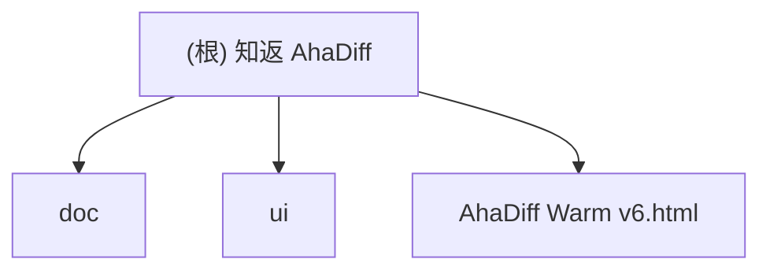

# 知返 AhaDiff

> AI 写完，Diff 教回。 / Ship with AI. Learn it back.

## 项目愿景

知返 AhaDiff 是一个 **local-first 的 verified diff learning layer**。它把 Claude / Codex / Cursor 等 AI 工具写出的 git diff，变成带代码证据链的学习笔记、概念图谱、主动回忆测验、SRS 复习卡和质量棘轮记录。

核心差异定位：Code Wiki 解释仓库，知返解释这次改动；而且每句话都能回到代码证据。

**当前阶段**：产品设计与 UI 原型迭代阶段（尚未进入工程开发）。

## 架构总览

本仓库目前是 **设计文档仓库**，包含产品架构设计、改名方案、前端视觉手册和 HTML 原型。尚无可执行的后端或前端工程代码。

### 计划技术栈

- **后端 CLI**：Python 3.11+, typer, rich, pydantic, jinja2, httpx, pyyaml
- **前端 Viewer**（首版）：Jinja2 静态 HTML（从 Warm v6 原型转化），不使用 Next.js/React
- **评估系统**：LLM-as-judge + 8 维自研 rubric（accuracy/evidence/diff_coverage/learnability/quiz_transfer/spec_alignment/conciseness/safety_privacy = 100 分）+ git ratchet 棘轮
- **不使用**：LiteLLM（供应链风险）、LangChain、Node 构建链

### 七层架构（计划）

```
1. Diff Capture Layer    -- git diff / PR patch / staged changes
2. Context Layer         -- repo files, graphify, specs, privacy filter
3. Lesson Generation     -- generator_prompt.md, claim extraction
4. Verification Layer    -- claims.jsonl, deterministic + LLM judge
5. Ratchet Layer         -- evaluator.py (immutable), results.tsv
6. Learning Layer        -- quiz, SRS review, section helpfulness
7. Wiki + UI Layer       -- index.md, concept graph, dashboard
```

编排逻辑由 `core/orchestrator.py` 统一管理 learn/improve/verify 三条主链路，cli.py 仅做参数解析和输出格式化。

## 模块结构图



## 模块索引

| 模块 | 路径 | 语言 | 职责 |
|------|------|------|------|
| doc | `doc/` | Markdown | 产品设计文档：架构方案、改名方案、前端视觉手册、评估报告 |
| ui | `ui/` | HTML/CSS/JS | UI 原型：Warm 风格 v1-v6 迭代版本 |
| team-plan | `.claude/team-plan/` | Markdown | 团队计划：v0.1 kickoff + 修订方案 + CLI 接入扩展 |
| 根级原型 | `AhaDiff Warm v6.html` | HTML | 最新 UI 原型（v6 副本，便于快速预览） |

## 运行与开发

### 查看 UI 原型

```bash
# 用浏览器打开最新原型
open "AhaDiff Warm v6.html"

# 或使用本地服务器
python3 -m http.server 8765
```

### 项目当前无需安装依赖

本仓库为纯文档/原型仓库，无 package.json、pyproject.toml 等依赖管理文件。

## 测试策略

当前阶段无自动化测试。UI 原型通过 Playwright MCP 进行浏览器预览验证（见 `.playwright-mcp/` 缓存）。

计划测试策略（工程阶段）：
- 单元测试：pytest + VCR.py（录制 LLM 调用）
- 集成测试：10 份 pinned diff 端到端验证
- Eval 测试：20 份 benchmark diff + LLM-as-judge 稳定性验证
- 覆盖率目标：核心路径 >= 85%
- VCR cassette key: `prompt_version + model_id + rubric_version` 三元组 hash，任一变更自动失效
- CI 分档：PR 触发 unit tests（无 LLM），nightly 触发 eval tests（有 LLM）
- Benchmark 分层：Python 主套件（7份）+ Non-Python 降级套件（3份），独立出 recall/precision

## 编码规范

### 设计文档规范
- 中文为主，技术术语保留英文
- Markdown 格式，代码块使用语法高亮
- 品牌写法统一为「知返 AhaDiff」，CLI 名 `ahadiff`

### 计划工程规范（未来开发阶段）
- Python：ruff + pyright strict + pre-commit
- 线宽 100，ruff 规则 `F,E,W,I,UP,B,C4,SIM,RET,PTH,TC,FA`
- 所有 LLM 调用走 `llm/provider.py`，禁止直接 import anthropic/openai
- prompt 写成独立 `.md` 文件，禁止 f-string 拼接长 prompt

## AI 使用指引

### 关键设计决策（读取文档前必知）
1. **三文件契约**：`program.md`（自然语言状态机）+ `evaluator.py`（不可改）+ `generator_prompt.md`（可改），受 Karpathy/autoresearch 启发（原版三文件：program.md + prepare.py + train.py，agent 改 Python 代码）。AhaDiff 改编为 program.md + evaluator.py + generator_prompt.md，agent 只改 Markdown prompt，不改用户代码
2. **Claim Verifier 是核心护城河**：每句解释必须绑定 file:line 证据，claim 有五种状态（verified / weak / not_proven / contradicted / rejected），其中 rejected 表示 claim 引用了 patch 外的文件或不存在的证据（附 reason_code），与 contradicted（证据直接反驳）语义不同
3. **棘轮机制**：改进则保留（git commit 到 improve 分支，cherry-pick 回主分支），退步则回滚（git reset improve 分支，不影响用户主分支），连续 2 个优化目标在首轮即无增益时触发 Phase 2.5 探索性重写（darwin-skill 原文："连续2个skill都在round1就break"，AhaDiff 沿用此阈值。autoresearch 无此机制）
4. **跨模型评估**：生成用大模型（Sonnet），评估用小模型（Haiku），绝不同模型自评
5. **文件即真相源**：前端只是 viewer/editor，删除前端不丢功能

### 灵感项目
- Karpathy/autoresearch：三文件契约（概念改编） + 单指标 val_bpb + git ratchet + 简洁性准则。**无 Phase 2.5 或 stuck 检测**，keep/discard 全在自然语言中
- SKILL0 (ZJU-REAL)：学习撤架 + skill file-level helpfulness（非 section 级，AhaDiff 自行扩展到 section 粒度）。budget 为阶段跳变 [6,3,0]（非线性递减）
- darwin-skill：8 维 rubric（结构 60 + 效果 40 = 100 分） + Phase 2.5 重写（连续 2 个 skill 在 round 1 就 break 时触发） + 子 agent 对照评测。**零可执行代码**，全部逻辑在 SKILL.md 自然语言指令中
- SkillCompass (Evol-ai)：PASS/CAUTION/FAIL + weakest-dimension-first（原版 6 维且评估 skill 文件质量，AhaDiff 自研 8 维体系评估学习笔记质量，阈值从 70/50 调高为 80/60）
- Graphify：repo-level map（AhaDiff 做 commit-level learning overlay）
- Karpathy LLM Wiki gist：persistent compounding wiki 思想，AhaDiff 落地为 `index.md`（diff-aware merge）+ `concepts.jsonl`（append-only 概念累积），与 Graphify 互补（Graphify = repo map，LLM Wiki = diff learning overlay）

## 多模型协作策略（全局方案）

本项目采用多模型协作开发模式，各模型职责明确分工：

### 角色分配

| 模型 | 角色 | 职责范围 |
|------|------|---------|
| **Claude** | 编排者 + 前端实现者 | 任务编排、前端代码实现、文档维护、集成协调 |
| **Codex** | 后端实现者 | Python CLI 代码实现、测试编写、包发布 |
| **Gemini** | 前端评审者 | UI/UX 设计评审、交互改进方案、视觉规范把关（**不写代码**） |

### 工作流规则

1. **前端工作流**：
   - Gemini（`gemini-3.1-pro-preview`）负责设计评审和改进方案 → Claude 负责代码实现
   - 完成后由 Claude + Codex + Gemini 交叉 review 测试
   - **Gemini 429 时用 Claude 兜底**，不降级模型

2. **后端工作流**：
   - Claude 负责编排和任务拆分 → Codex 负责代码实现
   - 完成后由 Claude + Codex 交叉 review 测试

3. **模型约束**：
   - Gemini 只能使用 `gemini-3.1-pro-preview`，禁止降级模型
   - Codex 用于后端权威判断
   - Claude 是默认编排者和前端实现者

### 文件所有权

| 文件范围 | 写入权限 | 审查权限 |
|---------|---------|---------|
| `src/ahadiff/**/*.py` | Codex 实现 | Claude + Codex review |
| `prompts/*.md` | Claude 编写 | Claude + Codex review |
| `viewer/templates/**` | Claude 实现 | Claude + Gemini review |
| `viewer/assets/*.css` | Claude 实现 | Gemini review |
| `tests/**` | Codex 实现 | Claude + Codex review |
| `doc/**` | Claude 维护 | 无需 review |
| `CLAUDE.md` | Claude 维护 | 无需 review |

## 变更记录 (Changelog)

| 时间 | 变更 |
|------|------|
| 2026-04-19 21:26:58 | 初始化 CLAUDE.md 文档体系，完成全仓扫描 |
| 2026-04-19 ~23:00 | 修正 3 处灵感项目引用不准确：Phase 2.5 阈值(2非3)、SkillCompass 维度(6非8)、SKILL0 helpfulness 粒度(file级非section级) |
| 2026-04-19 ~23:00 | 添加多模型协作策略：Claude 编排+前端实现、Codex 后端实现、Gemini 前端评审(gemini-3.1-pro-preview) |
| 2026-04-19 ~23:00 | 技术栈修正：首版用 Jinja2 静态 HTML 而非 Next.js/React，不用 LiteLLM |
| 2026-04-19 ~24:00 | 基于源码实测应用 12 项修订（3 P0 + 5 P1 + 4 P2），修正 Phase 2.5 触发条件/归因、三文件契约描述、SkillCompass 维度归因等 |
| 2026-04-19 ~24:00 | CLI 接入扩展：新增 Gemini CLI (GEMINI.md) / OpenCode (AGENTS.md+.opencode/agents/) / Git hooks / GitHub Action 支持 |
| 2026-04-19 ~24:00 | results.tsv 自定义 10 列方案，status 枚举化，查询走 review.sqlite |
| 2026-04-20 ~22:00 | 三模型交叉审查修订：Claim 5态枚举冻结、rubric 权重统一、Task 5/6 并行修正、Viewer 只读边界、results.tsv 11列+base_sha、improve 分支隔离 |
