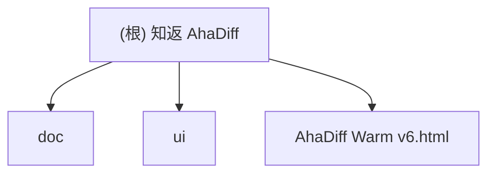

# 知返 AhaDiff

> AI 写完，Diff 教回。 / Ship with AI. Learn it back.

## 项目愿景

知返 AhaDiff 是一个 **local-first 的 verified diff learning layer**。它把 Claude / Codex / Cursor 等 AI 工具写出的 git diff，变成带代码证据链的学习笔记、概念图谱、主动回忆测验、SRS 复习卡和质量棘轮记录。

核心差异定位：Code Wiki 解释仓库，知返解释这次改动；而且每句话都能回到代码证据。

**当前阶段**：v0.2 Gate 0-6 的主链能力仍然是当前仓库底座，当前工作树又补上了一轮 v1.0 后端增量：section-level helpfulness / learning transfer、misconception cards、`/api/search` / `usage` / `audit` / `review/mastery` / `concepts/weak` / `spec/alignment` / `stats/learning`、Graphify 后端基础与部分深一层能力（parser / matcher / linker / slicer / search / freshness / `/api/graph/status`）、watcher core，以及 concrete learn orchestrator + `POST /api/learn` + task queue cancel/queue-depth hardening；repo 级 8A workflow 也已收口到 PR unit+pinned + Windows runtime guard + nightly-eval + release coverage gate。**Phase 0G 合同边界已收口**（2026-04-29）：`HelpfulnessRequest` 的 `target_kind=section` 时 `target_id` 必须含 `:` 分隔符并规范化到 canonical `{run_id}:{section_name}`、MisconceptionCard 确认继续 artifact-only（frozen dataclass + JSONL，不升级到 contracts DTO / SQLite）、Graphify 确认 runtime-only 边界（无 pip extras）。当前 symbol extraction 也已经接上 optional tree-sitter runtime consumer，顺序是 `python_ast -> tree_sitter -> regex -> section_header`；Python 仍优先走 AST，`ClaimExtractor` / artifact metadata 已包含 `tree_sitter`。最近一轮后端实测（本 session，2026-04-30）：全量 `1514 passed, 1 skipped`，`ruff check src tests` 通过，touched files `ruff format --check` 通过，`pyright = 0 errors`。当前 serve 面是 **42 个 concrete `/api/*` routes + 1 个 catchall**（`44 total Route(`，另含 `/healthz`），Starlette app 已接入 lifespan shutdown hook（`TaskRunner.shutdown()` + `FileWatcher.stop()`）。本轮还收口了：learn Step 10 发布边界、watcher dead observer restart / hung observer status-only、concepts DB/JSONL cursor、public `/api/search` rank/order、`/api/auth/token` 同源 bootstrap gate（GET 兼容 + POST bootstrap）、proxy trace header 拒绝、thread-backed `/api/learn` 取消与 draining shutdown、FSRS `NaN/Inf` 拒绝、公开 ID DTO 空字符串拒绝。需要诚实保留的 caveat：`/api/tasks*` 现在已经有真实 submitter（`POST /api/learn`），但仍然只作为 low-level、internal/unstable 的 task 状态 / 进度 surface，对外合约继续按 unstable 处理；Graphify 的 7 态 freshness 已实现并接入 `detect_graphify_status()`（Phase 3E 完成），运行时通过 `compute_freshness()` + `project_freshness()` 计算真实 4 值投影，`/api/graph/status` 当前读取的是 imported `.ahadiff/graphify/graph.json`，不是 raw `graphify-out/graph.json`；`/api/usage` 现已使用 workspace-specific identity，并兼容 legacy usage key 读取；watcher core、`ahadiff watch`、`serve --watch` 和 `/api/watch/status` 都已进代码。前端 Playwright / i18n / build 与 live judge 本 session 未重跑，仍以上一轮基线为准。全仓 `ruff format --check src tests` 仍有既有 `src/ahadiff/graphify/parser.py` 重排遗留；本轮未改该文件。Phase 0 follow-up 已收口（json_util/sqlite_util 集中 helper + serve CORS + benchmarks scripts）。

## 架构总览

后端 CLI 主链路（learn/improve/verify/serve/install/benchmark）已经可跑通：8-provider LLM + diff capture + claims + lesson/quiz/concepts + 8 维 eval + review.sqlite FSRS-6 + serve API（42 个 concrete `/api/*` routes + 1 个 catchall）+ 13 install targets + improve loop + i18n-0。当前工作树已经把 helpfulness / transfer、misconception cards、search / usage / audit / mastery / weak concepts / spec alignment / learning stats、Graphify parser/matcher/linker/slicer/search/freshness/graph status、watcher core、`/api/watch/status`，以及 `core/orchestrator.py` 抽出的 learn 主链 + `POST /api/learn` 接线进代码与测试；其中 `registry.json` learn auto-register、Graphify freshness runtime wiring、usage workspace identity dual-read、tree-sitter symbol extraction runtime wiring、learn 发布边界回归、concepts DB/JSONL cursor、public search rank/order 都已接线或固化，`/api/tasks*` 现在有真实 submitter，并在运行时 payload 里带 `error_code` / `elapsed_seconds` 这类低层字段，但仍保持 low-level status/progress surface。核心安全 helper 集中在 `core/json_util.py` / `sqlite_util.py`；serve 侧当前还拒绝 proxy trace headers，并对 token bootstrap 做同源信号检查。前端 `viewer/` React 19 SPA 当前规模是 12 个页面、16 个 TSX 组件、14 个页面/组件 CSS 文件，经 R1-R5 审查（780 Playwright / 201/201 i18n）。具体模块见下方「模块索引」。

### 计划技术栈

- **后端 CLI**：Python 3.11+, typer, rich, pydantic, httpx, pyyaml, fsrs (FSRS-6 间隔重复调度)
- **前端 Viewer**：React 19 + Vite + vanilla CSS（以 `AhaDiff Warm v6.html` 为设计参考模板）。`ahadiff serve` 启动本地 dev server（Starlette + Uvicorn API + Vite dev/build），CLI 运行完成后自动调用 `webbrowser.open()` 打开 WebUI（可通过 `--no-browser` 禁用）。不使用 Next.js 等 SSR 框架
- **评估系统**：LLM-as-judge + 8 维自研 rubric（accuracy/evidence/diff_coverage/learnability/quiz_transfer/spec_alignment/conciseness/safety_privacy = 100 分）+ git ratchet 棘轮
- **LLM Provider**：支持 8 种 API 格式（OpenAI Chat / OpenAI Responses / Gemini / Anthropic / Azure OpenAI / New API / CherryIN / Ollama）。BYOK 流程：用户提供 model_name + base_url + api_key → 自动探测 temperature 透传、TPM/RPM 限制、上下文长度。所有 LLM 调用必须确保不超过探测到的 max_context_length
- **不使用**：LiteLLM（供应链风险）、LangChain、Jinja2 模板渲染前端、Next.js 等 SSR 框架。注：Vite 属于前端构建工具（非传统 Node 后端构建链），仅用于 viewer/ 目录

### 八层架构（计划）

```
0. Schema & Contract     -- 核心契约冻结（ClaimStatus/RunSource/EvalBundle/EventLog）
1. Diff Capture Layer    -- git diff (last/since/staged/unstaged/show/range) / patch file/stdin / --compare / --compare-dir / --patch-url
2. Context Layer
   2a. Context Assembly  -- repo files, graphify enrichment, specs
   2b. Safety Gate       -- secret scan → redact → 才能 log/cache/model/render
   2c. Budget & Degrade  -- token budget, large diff skip/clip/summarize, capability_level
3. Lesson Generation     -- prompts/*.md, claim extraction
4. Verification Layer    -- claims.jsonl, deterministic + LLM judge
5. Ratchet Layer         -- evaluation bundle (immutable), review.sqlite (唯一真相源), Graphify freshness query
6. Learning Layer        -- quiz, SRS review, section helpfulness, concepts.jsonl
7. Wiki + UI Layer       -- React SPA via `ahadiff serve`（Starlette API + Vite dev/build）
```

编排 contract 已冻结在 `src/ahadiff/contracts/orchestrator.py`；当前运行时的 learn 主链已经抽成 `src/ahadiff/core/orchestrator.py` 并供 serve 复用，improve/verify 主链路仍主要由 `cli.py` 和各模块 helper 组合完成。results.tsv 降级为 review.sqlite 的人类可读导出视图。

### 数据范围架构

> 核心原则：**per-repo truth + global derived governance**

CLI 全局安装（`pip install ahadiff`），per-repo 运用（每个 repo 独立 `.ahadiff/`）。

```
global_config_dir()                   ← Global（派生/索引/偏好，非真相源）
  Linux:   ~/.config/ahadiff/
  macOS:   ~/Library/Application Support/ahadiff/
  Windows: %APPDATA%/ahadiff/
├── config.toml                       — 全局偏好/provider env alias
├── registry.json                     — repo 发现索引 (v0.2, opt-in; strict_local 下默认关闭)
├── usage.sqlite                      — LLM 花费汇总账本 (v0.2)
└── security/allowlist.yaml           — 全局 secret scan 规则 (v0.2)

<repo>/.ahadiff/                      ← Per-repo（唯一真相源）
├── config.toml                       — repo 级配置覆盖
├── review.sqlite                     — SRS/results/signals 唯一真相源
├── concepts.jsonl                    — branch-aware 概念累积
├── runs/<run_id>/                    — lesson/quiz/claims/score/patch
├── graphify/                         — repo-level code map cache
├── audit.jsonl                       — LLM 调用审计（schema_version + rotation）
├── audit.private.jsonl               — strict_local 本机专用审计（gitignored）
└── ahadiff.lock                      — portalocker 文件锁

<repo>/.ahadiffignore                 ← repo 根路径过滤规则
```

**Config 优先级链**（高到低）：`ENV(AHADIFF_*) → CLI flag → per-repo config.toml → global config.toml → defaults`。凭证类：`env secret → per-repo env_var_name → global env_var_name → none`。

**不可全局化的真相源**：review.sqlite / audit.jsonl / concepts.jsonl / prompts/ / VCR cassettes / Graphify cache。任何 global 数据不参与 ratchet 判定。

## 模块结构图



## 模块索引

| 模块 | 路径 | 语言 | 职责 |
|------|------|------|------|
| doc | `doc/` | Markdown | 产品设计文档：架构方案、改名方案、前端视觉手册、评估报告 |
| contracts | `src/ahadiff/contracts/` | Python | Stage 0 最小 contracts skeleton：枚举、DTO、契约 helper、错误类型；当前公开标识字段 `run_id` / `task_id` / `event_id` / `claim_id` / `card_id` 已拒绝空字符串，`source_ref` 等历史引用字段保持兼容 |
| core | `src/ahadiff/core/` | Python | Stage 1 / Task 1 工程骨架：CLI 配置、路径（含 `is_wsl2_mnt` WSL2 挂载检测）、ID、错误类型，以及 Phase 0 的 `json_util.py` / `sqlite_util.py` 集中安全 helper；当前分支还补了 `registry.py` repo discovery helper（learn 成功后自动 `register_repo()`，失败 warn 不阻塞）、`task_runner.py`（默认 600s timeout、`AHADIFF_DEFAULT_TASK_TIMEOUT_SECONDS` env 覆盖、per-task `task_timeout_seconds` override、`error_code` 分类、thread-backed worker draining、`shutdown()` graceful cleanup）和 `watcher.py`（debounce/cooldown + 线程安全 stop + `restartable/stop_timed_out` 状态；dead observer 可替换，hung observer 明确暴露为 non-restartable） |
| safety | `src/ahadiff/safety/` | Python | Stage 1 / Task 2 安全层基础实现：ignore / redaction / injection / gates / audit |
| llm | `src/ahadiff/llm/` | Python | Layer 1.5 / Task 7 + v0.2 Gate 2+5+6：provider（streaming byte cap + cache hit 跳过网络 + usage.sqlite 记录，失败不打断响应）、probe、cache（lookup/store + orphan .tmp 清理）、cost、schemas、adapters、usage（`usage.sqlite` DDL guard + locked retry + summary/by-model 查询 + schema cache 稳定签名） |
| claims | `src/ahadiff/claims/` | Python | Stage 2 / Task 8：claim candidate 解析、claim runtime、negative scan、deterministic verifier、claims.jsonl 写盘 |
| lesson | `src/ahadiff/lesson/` | Python | Stage 3 / Task 8.5 + 9 + 当前分支后端：learnability gate、lesson schema、三档 lesson 生成、section-level helpfulness 聚合、learning transfer validation、撤架辅助与 lesson 目录发布 |
| quiz | `src/ahadiff/quiz/` | Python | Stage 3 / Task 10 + 当前分支后端：open-answer `quiz.jsonl`、`cards.jsonl`、`misconception_cards.jsonl`、`review_card_id` 回填与 viewer 兼容、`ahadiff quiz` CLI、misconception prompt / parser / writer |
| wiki | `src/ahadiff/wiki/` | Python | Stage 3 / Task 10 + v0.2 Gate 5+6：`concepts.jsonl` / `concepts_local.jsonl` 累积与可见性过滤、streaming line reader + `_AncestryCache`（`_MAX_ANCESTRY_CHECKS=200` subprocess cap）、`load_concepts_page` cursor 分页、`load_concepts_page_from_storage` DB/JSONL 统一入口（`jsonl:` / `db:` cursor 分流，legacy cursor 兼容）、`load_concepts_page_from_db` keyset 分页 |
| graphify | `src/ahadiff/graphify/` | Python | 当前分支的 Graphify 后端基础与部分深一层实现：`models.py`（Pydantic graph schema）、`parser.py`（flat field normalization + `links/edges` + hyperedges + HTML/entity/URI sanitization + 50 MiB 文件大小上限）、`matcher.py`、`linker.py`、`slicer.py`、`search.py` 和 `freshness.py`（7 态 freshness + 4 值投影）。当前运行时已经由 `git/capture.py` 接回 freshness 计算，并把 legacy `source_present` / `missing_partial` / `missing` 规范映射到 canonical 4 值输出。 |
| eval | `src/ahadiff/eval/` | Python | Stage 3 / Task 11-12：8 维评分、hard gates、ratchet、result_events、results.tsv 导出与 score/finalized 发布 |
| review | `src/ahadiff/review/` | Python | Stage 4 / Task 15 + v0.2 Gate 1+6：review.sqlite schema / `PRAGMA user_version` migration chain（v1→v2→v3→v4 + legacy version 防御 + newer-version 友好报错）、v3 concepts 表 + review_logs.review_duration、v4 FTS5 全文索引（`fts_concepts` / `fts_result_events` / `fts_cards` + content table 触发器 + rebuild）、FSRS-6 调度（`None -> 0.0` 新卡快照语义保留，`NaN/Inf` 拒绝）、review queue、learning signals、lossy import、review CLI 后端（含 `--optimize` 真实 FSRS 权重优化）、`resolve_sqlite_journal_mode` WSL2 降级、`checkpoint_review_db`、SQL pagination DAO（`load_result_events_page` / `load_finalized_ratchet_history_page`）、concepts CRUD（原子 `INSERT ON CONFLICT DO UPDATE` + `ahadiff_merge_json_arrays` SQLite 自定义函数）、`search.py` FTS5 查询（`_sanitize_fts_query` token 提取 + double-quote + allowlist 校验；raw FTS rank 是 lower-is-better，public merged rank 是 higher-is-better）、`optimizer.py` FSRS 权重优化（cold/warm/hot 三阶段 + `_validate_optimizer_weights` finite 校验） |
| serve | `src/ahadiff/serve/` | Python | Task 14.5 + v0.2 Gate 1+5+6 + 当前分支 medium APIs：localhost-only serve API、finalized run 读取门禁、token + Origin/Referer 写保护、`/api/auth/token` 同源 bootstrap gate（GET 兼容 + POST bootstrap）、preflight/origin/proxy-trace header 收口 + 安全响应头、`serve/lock.py` 共享写锁、Starlette lifespan shutdown hook（graceful 停止 task_runner + file_watcher）、`/api/review/queue` GET + `/api/review/rate` POST、`/api/runs` 与 `/api/ratchet/history` SQL pagination + finalized event_id/run_id 绑定校验、`/api/concepts` cursor 分页 + `anyio.to_thread.run_sync` 包裹阻塞 IO、`/api/search` / `usage` / `audit` / `review/mastery` / `concepts/weak` / `spec/alignment` / `stats/learning` / `graph/status`、`/api/config` PUT、`POST /api/learn`（含未知字段 422 拒绝）、`/api/watch/status`，以及低层 `/api/tasks*` 轮询/SSE 状态接口；task routes 现在已有真实 submitter，运行时 payload 带 `error_code` / `elapsed_seconds`，但仍按 low-level status/progress surface 使用 |
| install | `src/ahadiff/install/` | Python | Task 19/20 + v0.2 Gate 2+5 + 当前分支安装收口：13 个安装目标（Claude / Codex / Gemini / OpenCode / hooks / GitHub Action / Cursor / Windsurf / Copilot / Continue / Aider / Cline / Roo）、Jinja2 模板 + `generated`/`user-managed` 文件策略、`InstallManifest` + `InstallFileStrategy` + `manifest_preview_for` re-export、`--manifest` CLI JSON 输出、hooks Windows `detect()` 返回 False 不阻塞全局 `--detect`、`hooks.json` schema/load、以及已有 hook leaf 的 no-follow regular-file 校验与 mode 保留 |
| improve | `src/ahadiff/improve/` | Python | Stage 5 / Task 16/17：improve session、immutable improve_program、worktree replay、prompt 白名单、targeted verification、Phase 2.5、cherry-pick 与 pending worktree guard |
| i18n | `src/ahadiff/i18n/` | Python | i18n-0：locale resolver、`AHADIFF_LANG`、Accept-Language / cookie / config / LANG fallback、prompt output-language helper |
| benchmarks | `benchmarks/` | Markdown/JSON/Patch | Task 18：local benchmark fixtures、manifest、expected concepts 与 ground_truth consistency checks，以及 `benchmarks/scripts/` 下的 CLI / diff parse / SQLite query / API / bundle / aggregate runner |
| viewer | `viewer/` | TypeScript/TSX/CSS | Stage 4 Task 13/14 + i18n-3/4 + v0.2 Frontend Phase 1-4：Vite + React 19 + Zustand + HashRouter + vanilla CSS tokens（含 66 个 v6 design tokens）；12 页面（Dashboard / Lesson / Diff / Quiz / ConceptGraph / Review / Ratchet / Landing / Settings / Onboarding / Skills / NotFound）+ **16 个 TSX 组件 / 14 个页面或组件 CSS 文件**；`src/i18n/messages/{en,zh-CN}.json` catalog 201/201 parity；`src/state/{locale,runs,review}-store.ts`；`src/api/{client,runs,locale,signals,review,types}.ts` 消费 serve API（AbortController + token 重试）；Quiz viewer 兼容缺少 `review_card_id` 的 open-answer 行，并单独读取 `misconception_cards.jsonl`；`tests/e2e/{smoke,i18n,media-features,cross-browser,walkthrough}.spec.ts` Playwright 780 tests 跨 5 viewport × 3 浏览器 |
| tests | `tests/unit/` / `tests/eval/` / `tests/integration/` / `tests/live/` | Python | Stage 0-6、i18n-0、v0.2 Gate 0-6 + 当前分支后端测试：contracts、CLI/config/paths、安全层、provider（streaming byte cap + 空 completion + TransportError retry + response_byte_cap + cache hit/miss + usage 记录）、diff capture（symlink/FIFO 拒绝 + 总预算边界 + POSIX header + 转义感知路径归一化 + compare-dir 限制 + patch-url SSRF）、claims、lesson（含 helpfulness / transfer）、quiz（含 misconception cards / optional `review_card_id`）、concepts（含 10k entries streaming + ancestry cap + DB upsert + 并发 UPSERT 回归 + JSONL import guard + DB/JSONL cursor fallback）、evaluator、ratchet、review（含 migration v1→v2→v3→v4 数据保留 / newer-version 报错 / rollback / legacy schema_version 检查 / FTS5 rebuild + search）、serve（含 SQL pagination / review queue+rate auth / finalized binding / concepts cursor pagination / threadpool / medium APIs / task routes / formula injection 防护 / public search rank / auth bootstrap）、install（13 targets + manifest JSON + generated/user-managed 策略 + Windows hooks 拒绝 + hook leaf symlink/reparse guard + re-export smoke）、learn publish boundary、watcher restart/status、benchmark、improve、targeted verification、Phase 2.5、Graphify、跨平台静态 guard（`test_cross_platform_static.py`）、usage query（summary + by-model + schema cache 稳定性）、optimizer（cold/warm/hot + weights 校验 + concurrent safety）、真实 LLM judge smoke |
| ui | `ui/` | HTML/CSS/JS | UI 原型：Warm 风格 v1-v6 迭代版本 |
| team-plan | `.claude/team-plan/` | Markdown | 团队计划：v0.1 kickoff + 修订方案 + CLI 接入扩展 |
| 根级原型 | `AhaDiff Warm v6.html` | HTML | 最新 UI 参考模板（相对 `ui/` 目录内 v6 快照继续演进，便于快速预览） |

## 运行与开发

### 查看 UI 原型

```bash
# 用浏览器打开最新原型
open "AhaDiff Warm v6.html"

# 或使用本地服务器
python3 -m http.server 8765
```

### 当前已落地的验证

```bash
uv run pytest tests/unit
uv run ruff check src tests
uv run pyright
uv build --wheel
uv run python -m ahadiff --version
uv run ahadiff init
uv run ahadiff doctor
uv run ahadiff config show --resolved
uv run python -m ahadiff claims --help
uv run python -m ahadiff learn --help
uv run python -m ahadiff quiz --help
uv run python -m ahadiff review --help
uv run python -m ahadiff improve --help
uv run python -m ahadiff db check --help
uv run python -m ahadiff install github-action --help
```

真实 LLM judge smoke 需要显式开启，默认模型顺序是 `gpt-5.3-codex-spark,gpt-5.4-mini`，每个模型都会先试 OpenAI Responses，再试 Chat Completions fallback：

```bash
AHADIFF_LIVE_LLM_JUDGE=1 \
AHADIFF_LIVE_LLM_API_KEY="$AHADIFF_LIVE_LLM_API_KEY" \
AHADIFF_LIVE_LLM_BASE_URL="$AHADIFF_LIVE_LLM_BASE_URL" \
AHADIFF_LIVE_LLM_MODELS="gpt-5.3-codex-spark,gpt-5.4-mini" \
pytest tests/live/test_llm_judge_live.py -q
```

最近一次后端验证（2026-04-30）：后端全量 `PYTHONDONTWRITEBYTECODE=1 UV_CACHE_DIR=/tmp/ahadiff-uv-cache uv run --frozen --no-sync pytest tests -q -p no:cacheprovider` = `1514 passed, 1 skipped in 56.60s`；`UV_CACHE_DIR=/tmp/ahadiff-uv-cache uv run --frozen --no-sync ruff check src tests` 通过；本轮 touched files 的 `ruff format --check` 通过；`UV_CACHE_DIR=/tmp/ahadiff-uv-cache uv run --frozen --no-sync pyright` = `0 errors, 0 warnings, 0 informations`。本轮没有重跑 coverage gate / wheel build / `uv lock --check`；此前 coverage/wheel/lock 结果不能冒充本轮新验证。全仓 `ruff format --check src tests` 仍有既有 `src/ahadiff/graphify/parser.py` 重排遗留，本轮未修改该文件。前端 Playwright / i18n / build 与 live judge 本 session 未重跑，仍以上一轮记录为准。dark-mode 对比度结论本轮没有重新量测；这里继续保留的是此前前端审查结论，而不是本 session 新产出的数值。

### 仓库当前依赖状态

仓库根当前已落地 `pyproject.toml` 与 `uv.lock`，并通过 `uv sync` 建立本地 Python toolchain。当前依赖管理已覆盖后端 CLI scaffold、provider runtime 与对应测试依赖；前端 `viewer/` 也已经有独立 `package.json` / `pnpm` 工具链（React 19、Vite、Vitest、Playwright）。

## 测试策略

`tests/unit/`、`tests/eval/` 与 `tests/integration/` 覆盖 Stage 0-6、i18n-0 和 v0.2 Gate 0-6 当前已落地模块，另有 `tests/unit/test_cross_platform_static.py` 作为 `datetime.utcnow()` 零使用的静态 guard，以及 `tests/live/test_llm_judge_live.py`（opt-in）。UI 原型通过 Playwright MCP 浏览器验证。

计划测试策略（工程阶段）：
- 单元测试：pytest + VCR.py（录制 LLM 调用）
- 集成测试：10 份 pinned diff 端到端验证（frozen fixture 层）
- Eval 测试：20 份 pinned eval diff（10 份 benchmark + 10 份 judge-stability/edge regression）+ LLM-as-judge 稳定性验证
- 真实仓库 smoke：基于一个外部参考私有仓库做 live smoke，只做真实 diff / provider / 主链路冒烟，不进入 `suite_digest` 可比基线
- 覆盖率目标：核心路径 >= 85%
- VCR 双层版本：run 级用 `prompt_version`（AhaDiff 自带 prompt 资源的 tree hash）判断整体是否变更；cassette 级用 `prompt_fingerprint + model_id + api_family_version + eval_bundle_version + output_lang` 五元组 hash 精确匹配单个 LLM 调用
- CI 分档：PR 触发 unit + pinned integration（`ubuntu py311/py312 + macOS py312`）并另跑 Windows runtime guard；nightly 触发 eval tests（有 LLM）；release 触发全量 tests + coverage `>= 85%` + doctor + wheel smoke
- Benchmark 分层：Python 主套件（7份）+ Non-Python 降级套件（3份），独立出 recall/precision

## 编码规范

### 设计文档规范
- 中文为主，技术术语保留英文
- Markdown 格式，代码块使用语法高亮
- 品牌写法统一为「知返 AhaDiff」，CLI 名 `ahadiff`

### 计划工程规范（未来开发阶段）
- Python：ruff + pyright strict + pre-commit
- 线宽 100，ruff 规则 `F,E,W,I,UP,B,C4,SIM,RET,PTH,TC,FA`
- 所有 LLM 调用走 `llm/provider.py`，禁止直接 import anthropic/openai
- prompt 写成独立 `.md` 文件，禁止 f-string 拼接长 prompt

## AI 使用指引

### 硬性要求
- **所有文档更新必须基于真实代码 + 真实测试结果 + 当前文档状态**。如文档间存在漂移，以代码和测试为准，修正文档使其一致。**严禁虚构函数、虚构测试结果、虚构库名或编造不存在的设计决策。**
- 中英文对照文档（如 README.md / README.en.md）修改时必须同步更新，保持口径一致。
- committed docs / 命令示例 / manifest 示例只允许使用占位符、环境变量名或相对表述；不得写入本地 provider endpoint、真实 API key 或带用户名的绝对路径。

### 关键设计决策（读取文档前必知）
1. **N-文件契约**（受 autoresearch 三文件启发的变体）：`program.md`（自然语言状态机）+ **evaluation bundle**（`evaluator.py` + `rubric.py` + `rubric.yaml` + `gates.py` + `deterministic.py` 共 5 文件，统一位于 `src/ahadiff/eval/` 命名空间，整体 immutable，任一变更都会生成新的 `eval_bundle_version` 并触发 VCR cassette 失效；`rubric_version` 仅保留为派生显示字段）+ prompt 集合。**可写 prompt 白名单** 仅限 `lesson_generate.md`、`lesson_hint.md`、`lesson_compact.md`、`quiz_generate.md`、`claim_extract.md`；`prompts/improve_program.md` 是 human-written immutable state machine，不在 improve loop 可写集合内。原版 autoresearch 三文件：`program.md`（约束）+ `prepare.py`（不可改评估基座）+ `train.py`（唯一可改文件）。AhaDiff 核心创新：(1) 可变面从单一 Python 文件扩展为受白名单约束的 prompt 目录；(2) agent 只改 Markdown prompt，不改用户代码；(3) immutable 边界从单文件扩展到 evaluation bundle
2. **Claim Verifier 是核心护城河**：每句解释必须绑定 file:line 证据，claim 有五种状态（verified / weak / not_proven / contradicted / rejected），其中 rejected 表示 claim 引用了 patch 外的文件或不存在的证据（附 reason_code），与 contradicted（证据直接反驳）语义不同
3. **棘轮机制**：improve loop 和 Phase 2.5 均在 `git worktree` 临时工作区执行，不触碰用户主分支。改进则 cherry-pick 回主分支，退步则删除 worktree。连续 2 个优化目标在首轮即无增益时触发 Phase 2.5 探索性重写（darwin-skill 原文："连续2个skill都在round1就break"，AhaDiff 沿用此阈值。autoresearch 无此机制）。Phase 2.5 最多触发 1 次/session，防止无限重写循环
4. **跨模型评估**：生产环境要求生成与评估使用不同模型（生成用 gpt-5.4/Sonnet，评估用 gpt-5.4-mini），防止自评偏差。**开发测试阶段**：为节省成本，生成和评估统一使用 gpt-5.4-mini（1M 上下文），此时跨模型约束暂时放松；`gpt-5.4` 等更大模型和其他候选模型只作为后续对比或生产切换选项，不作为默认开发基线
5. **SQLite 即唯一真相源**：`review.sqlite` 的 `result_events` 表是所有评估数据的唯一真相源。`results.tsv` 降级为人类可读的导出视图（先写 SQLite 有事务保护，成功后 append TSV；TSV 写入失败仅 warn 不阻塞；`ahadiff export-results` 可从 SQLite 重建 TSV）。前端只是 viewer，删除前端不丢功能
6. **安全脱敏顺序**：raw input → secret scan → redact → 才能 log/cache/model/render。任何 artifact 在完成 redaction 之前不得写入日志、进缓存或发送到模型
7. **隐私三档**（统一 snake_case）：`strict_local`（仅本地模型，默认）/ `redacted_remote`（脱敏后发远端）/ `explicit_remote`（用户显式授权发原文）。CLI 参数、config.toml、audit 日志和 CI 行为必须使用统一的 snake_case 命名
8. **i18n 全链路国际化**：手动切换（cookie `ahadiff_lang`）→ Accept-Language → AHADIFF_LANG → CLI `--lang` → `config.toml` → 系统 `LANG` → 降级 `en`。支持 `en` 和 `zh-CN`。Layer 3 Prompt 用单 prompt + `OUTPUT_LANGUAGE` 指令前缀（不分语言文件）。React 前端用 i18n JSON catalog（`messages/en.json` + `messages/zh-CN.json`）动态切换。SRS 卡片保留创建时语言不重翻译。概念图谱用英文规范术语 + `display_name` 本地化。审计日志始终英文。VCR cassette key 包含 `output_lang`
9. **UNTRUSTED_DIFF 扩展边界**：不可信输入面不仅包括 diff 正文，还包括文件名、commit message、branch/tag 名称、Graphify label、模型输出、VCR cassette 内容。所有外部文本和路径元数据均视为 untrusted，统一经 `redaction_pipeline()` 处理
10. **SQLite 运行时版本门禁**：启动时检查 SQLite 版本，不低于修复 WAL-reset bug 的最低版本。统一连接初始化：WAL + busy_timeout + trusted_schema=OFF + quick_check（非 integrity_check）
11. **架构权威源**：`contract-freeze.md` 是唯一架构权威源，所有契约定义以该文件为准，其他文档引用时不得与之冲突
12. **Graphify v0.1 是可选增强，不是主链前置**：`ahadiff learn` 阶段自动检测 `graphify-out/graph.json`，存在则导入 repo-level context，不存在则静默降级。导入的 `graph.json` 与 Graphify label 同样视为 untrusted，必须先过 sanitization，再进入 context / viewer；新鲜度查询沿用内部 7 态、对外 4 值投影。CLI 至少提供 `ahadiff graph status` / `ahadiff graph refresh` / `ahadiff graph import`，并支持 `--use-graphify` / `--no-graphify`；Viewer 至少支持 full / learning_only / empty 三态。当前 v0.1 权威路径是 `ahadiff serve` + React Viewer，旧静态 viewer / `file://` 设想不再作为 v0.1 权威路径

### 灵感项目
- **autoresearch**（Karpathy）：三文件契约 + git ratchet → AhaDiff 扩展为 N-文件变体 + prompts/ 可变面
- **SKILL0**（ZJU-REAL）：学习撤架 + file-level helpfulness → AhaDiff 扩展到 section 粒度
- **darwin-skill**：8 维 rubric + Phase 2.5 重写（连续 2 次 round1 break 触发）
- **SkillCompass**（Evol-ai）：weakest-dimension-first → AhaDiff 自研 8 维体系，阈值 80/60
- **Graphify**：repo-level map → AhaDiff 自研 7 态新鲜度 + 4 值投影
- **LLM Wiki**（Karpathy gist）：persistent compounding wiki → `concepts.jsonl` append-only

## 多模型协作策略（全局方案）

本项目采用多模型协作开发模式，各模型职责明确分工：

### 角色分配

| 模型 | 角色 | 职责范围 |
|------|------|---------|
| **Claude** | 编排者 + 前端实现者 | 任务编排、前端代码实现、文档维护、集成协调 |
| **Codex** | 后端实现者 | Python CLI 代码实现、测试编写、包发布 |
| **Gemini** | 前端评审者 | UI/UX 设计评审、交互改进方案、视觉规范把关（**不写代码**） |

### 工作流规则

1. **前端工作流**：
   - Gemini（`gemini-3.1-pro-preview`）负责设计评审和改进方案 → Claude 负责代码实现
   - 完成后由 Claude + Codex + Gemini 交叉 review 测试
   - **Gemini 429 时用 Claude 兜底**，不降级模型

2. **后端工作流**：
   - Claude 负责编排和任务拆分 → Codex 负责代码实现
   - 完成后由 Claude + Codex 交叉 review 测试

3. **模型约束**：
   - Gemini 只能使用 `gemini-3.1-pro-preview`，禁止降级模型
   - Codex 用于后端权威判断
   - Claude 是默认编排者和前端实现者
   - LLM Provider 支持 8 种 API 格式（OpenAI Chat / OpenAI Responses / Gemini / Anthropic / Azure OpenAI / New API / CherryIN / Ollama）

### 文件所有权

| 文件范围 | 写入权限 | 审查权限 |
|---------|---------|---------|
| `src/ahadiff/**/*.py` | Codex 实现 | Claude + Codex review |
| `prompts/*.md` | Claude 编写 | Claude + Codex review |
| `viewer/src/**/*.tsx` | Claude 实现 | Claude + Gemini review |
| `viewer/src/**/*.css` | Claude 实现 | Gemini review |
| `tests/**` | Codex 实现 | Claude + Codex review |
| `doc/**` | Claude 维护 | 无需 review |
| `CLAUDE.md` | Claude 维护 | 无需 review |

### 阶段门禁：跨模型交叉审查（Stage Gate）

**硬性要求**：每完成一个 Stage/Phase 后，**必须**通过跨模型交叉审查门禁才能进入下一阶段。未通过门禁的代码不得合并到主分支。

#### 审查流程

```
Stage N 完成 → 三模型并行审查 → 汇总问题 → 修复 → 验证 → 进入 Stage N+1
```

#### 三模型职责

| 模型 | 审查重点 | 工具 | 参与 Stage |
|------|---------|------|-----------|
| **Codex CLI** | 代码正确性、边界条件、测试覆盖、类型安全 | `codex review --uncommitted` | 全部 |
| **Claude** | 架构一致性、文档同步、集成点验证、安全审计 | Claude Code CLI | 全部 |
| **Gemini CLI** | 前端/UX 评审、视觉一致性、交互合理性 | `gemini` CLI（429 时 Claude 兜底） | 含前端的 Stage（1/4/7） |

#### 门禁通过标准

- **GO**：0 Critical + 0 High findings → 直接进入下一 Stage
- **CONDITIONAL GO**：0 Critical + ≤3 High → 修复后重新验证，无需全量审查
- **NO GO**：≥1 Critical 或 >3 High → 全量修复 + 全量重新审查

#### 审查清单（每个 Stage 必检）

1. **功能正确性**：所有新增功能的 happy path + edge case 通过测试
2. **Corner case 覆盖**：对照 CC 列表验证相关 CC 已闭合
3. **文档同步**：CLAUDE.md、kickoff.md、stages-4-9.md 与代码一致
4. **类型安全**：`pyright --strict` 零错误
5. **代码规范**：`ruff check` + `ruff format --check` 通过
6. **安全扫描**：无 hardcoded secrets、无 SQL injection、无 path traversal
7. **跨平台兼容**：pathlib 使用、portalocker 调用、编码处理
8. **集成点验证**：上下游 Task 接口契约匹配

#### Stage 划分对应表

| Stage | 包含 Task | 门禁重点 | 审查模型 |
|-------|----------|---------|---------|
| Stage 0 | Task 0 (Schema Freeze) | 契约可 import + 序列化正确 | Codex + Claude |
| Stage 1 | Task 1-4 (Infra + CLI + Safety + UI Fix) | CLI 骨架 + 安全脱敏 + 响应式修复 | Codex + Claude + Gemini（Task 4 前端） |
| Stage 2 | Task 5-8 (Capture + Parse + Provider + Claim) | diff 捕获 + Graphify 导入/降级 + 结构化 + LLM 接入 + Claim 验证 | Codex + Claude |
| Stage 3 | Task 8.5 + 9-12 (Learnability Gate + Lesson + Quiz + Eval + Ratchet) | 前置判定 + 生成 + SRS + 评估 + 棘轮 | Codex + Claude |
| Stage 4 | Task 13 + 14 + 15 (React Viewer + Review DB) | React 前端基础 + 核心页面 + review.sqlite schema + Graphify/ConceptGraph 三态降级 | Codex + Claude + Gemini |
| Stage 5 | Task 14.5 + 16-17 (Serve + Improve) | Serve API（依赖 Task 15 DB schema）→ 改进循环 | Codex + Claude |
| Stage 6 | Task 18-20 (Bench + Deploy) | 基准测试 + CI + 发布 | Codex + Claude |
| Stage 7 | i18n Signoff（汇总 i18n-0~6 跨阶段产物） | 全链路双语 + locale 降级 + parity audit | Codex + Claude + Gemini |

注：`i18n-0~6` 是跨 Stage 3-6 的 overlay tasks，可与对应业务 Task 并行落地；Stage 7 只承担最终 parity/signoff gate，不要求把 i18n 当成独立串行开发流。

补充说明：
- `ahadiff-v01-kickoff.md` 中的 `Layer 0-3` 只是前半段实现拆分，对外 gate 仍以这里的 `Stage 0-7` 为准
- `ahadiff-v01-stages-4-9.md` 中的“第四段～第九段”和 `Layer 6a/6b` 只是后半段任务拆分；执行和 signoff 仍统一折叠回这里的 `Stage 3-7`

#### Corner Case 回归

每个 Stage 门禁期间，必须验证以下 CC 类别：
- **本 Stage 新增的 CC**：确认已实现闭合方案
- **跨 Stage CC**：确认未因本 Stage 修改而回归
- **CC-GAP 系列**：确认高风险项（GAP-2 网络中断、GAP-3 SQLite 损坏、GAP-10 Unicode 路径）已覆盖

## 变更记录 (Changelog)

> 设计阶段（2026-04-19 ~ 04-21）经历 10 轮三模型交叉审查（Claude+Codex+Gemini），完成架构冻结、65+ corner cases 闭合、FSRS-6 替代 SM-2、React 19+Vite 前端确定、8 种 LLM Provider 格式设计。详见 `git log` 和 `doc/` 下各轮审查报告。

| 日期 | 里程碑 | 通过 |
|------|--------|------|
| 04-22 | Stage 0-1: contracts + CLI scaffold + safety gate | 61 |
| 04-22 | Stage 2 前半: diff capture + parse | 119 |
| 04-23 | Stage 2 后半: provider + claims + learnability gate | 286 |
| 04-23~24 | Stage 3: lesson + quiz + eval + ratchet | 335 |
| 04-24 | Stage 4: review.sqlite + FSRS-6 | 383 |
| 04-24 | Stage 5: improve loop + Phase 2.5 | 406 |
| 04-24 | Stage 6: serve + benchmark + 6 install targets + i18n-0 | 478 |
| 04-25 | LLM cache key `api_family_version` 绑定 | — |
| 04-25 | Viewer Phase A-E + R1/R2 审查（14 items fixed, 82/82 i18n, 330 PW） | 537 |
| 04-25 | Stage 7 i18n signoff 通过（82/82 parity） | — |
| 04-25 | R3 对抗审查（22 real findings closed, WCAG AAA dark-mode） | 537 |
| 04-26 | R4 严苛审查（14 real, semantic tokens AAA）| 547 |
| 04-26 | R5 全功能验收（累计 51 findings closed） | 559 |
| 04-26 | v0.2 Gate 0: 跨平台（UTF-8 / WSL2 / lock / headless） | 576 |
| 04-27 | v0.2 Gate 2: Backend Expansion（compare / provider stream / install manifest） | 607 |
| 04-27 | v0.2 Gate 1: Review DB Migration + Write Safety | 587 |
| 04-27 | v0.2 Gate 3+4: Eval/Serve/Improve Hardening（+8 fixes） | 654 |
| 04-27 | v0.2 Gate 5: Scale + Input + Install（+7 targets, SSRF, cache） | 687 |
| 04-27 | v0.2 Frontend Phase 1-4（+6 pages, 66 tokens, 189/189 i18n, 495 PW） | 808 |
| 04-28 | Phase 0 follow-up: json_util/sqlite_util + serve CORS + benchmarks | 845 |
| 04-28 | v0.2 Gate 6: review.sqlite v4 + FTS5 + optimizer + 5 serve 端点 | 993 |
| 04-29 | 当前分支：medium backend slice + quiz/viewer compatibility + hooks no-follow leaf guard（201/201 i18n, 780 PW, 1191 backend tests） | 1191 |
| 04-29 | v1.0 Phase 0G：合同边界收口（HelpfulnessRequest section_id 校验 + MisconceptionCard artifact-only 确认 + Graphify runtime-only 确认 + serve 端点扩展冻结） | 1196 |
| 04-29 | v1.0 Phase 1A + 3E：concepts JSONL-primary/SQLite-derived 主从关系文档化 + Graphify freshness 真实接线（compute_freshness→project_freshness→4 值投影）+ serve _project_graphify 字段名 mismatch 修复 | 1200 |
| 04-29 | v1.0 Phase 1D/3A/3B/3D：/api/usage repo-scoped（workspace_identity 过滤）+ registry auto-register on learn + 3D 生产接线状态文档化（hooks install-only / config session-only / tasks infra-only） | 1200 |
| 04-29 | v1.0 Phase 1B + 3C + Codex 审查修复：threadpool 维持决策 + /api/tasks* 合约收缩（unstable until 6B）+ legacy graphify status 向后兼容映射 + suppress 范围缩窄 | 1200 |
| 04-29 | v1.0 审查修复收口：helpfulness 422 serialization + section target canonicalization + Graphify timeout/bounded freshness + usage workspace identity dual-read + graph status error surfacing | 1222 |
| 04-29 | v1.0 Phase 6B 当前分支收口：concrete learn orchestrator + `POST /api/learn` + queue-depth / cancel hardening + related backend regressions | 1266 |
| 04-30 | 文档口径同步到当时真值：`ClaimExtractor` 补 `tree_sitter`、`capture.symbol_extractor` / symbol extraction 顺序文档化、`/api/graph/status` 改为 imported `.ahadiff/graphify/graph.json` 口径、TaskRunner timeout 改成默认 600s + env/per-task override、serve route 面更新为 `44 total Route(` / `42 concrete /api/*`，以及当时后端实测 `pytest tests = 1479 passed, 1 skipped`、coverage `87.08%`、`pyright = 0 errors`、wheel build 成功。 | 1479 |
| 04-30 | 后端对抗式审查（Codex CLI 19m46s + Claude 6-Track 并行）：修复 5 项（graphify models factory、TaskRunner.shutdown()、parser 50MiB 大小上限、Starlette lifespan shutdown hook、POST /api/learn 未知字段 422 拒绝）；当时 8 项遗留 findings 先记录到执行计划 §16，后续已按当前代码真值重新分类。当时后端实测 `1479 passed, 1 skipped`、coverage `86.98%`、`pyright = 0 errors`。 | 1479 |
| 04-30 | 后端 review follow-up：`/api/auth/token` 增加同源 bootstrap gate（GET 兼容 + POST bootstrap）、默认拒绝 proxy trace headers、thread-backed `/api/learn` cancel/shutdown/draining 补集成测试、FSRS 拒绝 `NaN/Inf`、contracts 公开 ID 拒绝空字符串；执行计划 §16 改为 closure status，§0.2 增加前端前置 backend closure pass。当时后端实测 `1501 passed, 1 skipped`、`ruff check` 通过、touched-files format 通过、`pyright = 0 errors`。 | 1501 |
| 04-30 | 后端 closure 收口：BF-1~BF-5 不再 defer 到 v1.1；learn Step 10 发布边界、watcher dead/hung observer 语义、concepts DB/JSONL cursor、public search rank/order、auth bootstrap 前端前置合约都已按当前代码真值闭合。后端实测 `1514 passed, 1 skipped`、`ruff check` 通过、touched-files format 通过、`pyright = 0 errors`；全仓 format 仍只剩既有 `graphify/parser.py` 重排遗留。 | 1514 |

> 每条门禁的详细实现笔记见 `git log` 对应 commit message。
