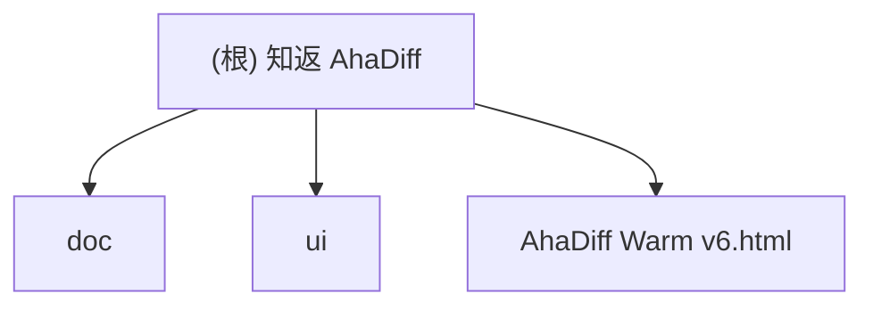

# 知返 AhaDiff

> AI 写完，Diff 教回。 / Ship with AI. Learn it back.

## 项目愿景

知返 AhaDiff 是一个 **local-first 的 verified diff learning layer**。它把 Claude / Codex / Cursor 等 AI 工具写出的 git diff，变成带代码证据链的学习笔记、概念图谱、主动回忆测验、SRS 复习卡和质量棘轮记录。

核心差异定位：Code Wiki 解释仓库，知返解释这次改动；而且每句话都能回到代码证据。

**当前阶段**：产品设计与 UI 原型迭代阶段（尚未进入工程开发）。

## 架构总览

本仓库目前是 **设计文档仓库**，包含产品架构设计、改名方案、前端视觉手册和 HTML 原型。尚无可执行的后端或前端工程代码。

### 计划技术栈

- **后端 CLI**：Python 3.11+, typer, rich, pydantic, jinja2, httpx, pyyaml
- **前端 Viewer**（首版）：Jinja2 模板 + `ahadiff serve`（Starlette + Uvicorn 轻量本地服务器，支持 Quiz/SRS 交互写回）；同时保留 `file://` 静态模式（只读，显示 CLI 命令提示）。不使用 Next.js/React
- **评估系统**：LLM-as-judge + 8 维自研 rubric（accuracy/evidence/diff_coverage/learnability/quiz_transfer/spec_alignment/conciseness/safety_privacy = 100 分）+ git ratchet 棘轮
- **不使用**：LiteLLM（供应链风险）、LangChain、Node 构建链

### 八层架构（计划）

```
0. Schema & Contract     -- 核心契约冻结（ClaimStatus/RunSource/EvalBundle/EventLog）
1. Diff Capture Layer    -- git diff / PR patch / staged changes / --compare
2. Context Layer
   2a. Context Assembly  -- repo files, graphify enrichment, specs
   2b. Safety Gate       -- secret scan → redact → 才能 log/cache/model/render
   2c. Budget & Degrade  -- token budget, large diff skip/clip/summarize, capability_level
3. Lesson Generation     -- prompts/*.md, claim extraction
4. Verification Layer    -- claims.jsonl, deterministic + LLM judge
5. Ratchet Layer         -- evaluation bundle (immutable), review.sqlite (唯一真相源)
6. Learning Layer        -- quiz, SRS review, section helpfulness, concepts.jsonl
7. Wiki + UI Layer       -- index.md, concept graph, dashboard
   7a. Static Snapshot   -- file:// 兼容，一次性 data_bundle.json
   7b. Live Serve        -- ahadiff serve（Starlette），实时读 SQLite + REST API
```

编排逻辑由 `core/orchestrator.py` 统一管理 learn/improve/verify 三条主链路，cli.py 仅做参数解析和输出格式化。results.tsv 降级为 review.sqlite 的人类可读导出视图。

## 模块结构图



## 模块索引

| 模块 | 路径 | 语言 | 职责 |
|------|------|------|------|
| doc | `doc/` | Markdown | 产品设计文档：架构方案、改名方案、前端视觉手册、评估报告 |
| ui | `ui/` | HTML/CSS/JS | UI 原型：Warm 风格 v1-v6 迭代版本 |
| team-plan | `.claude/team-plan/` | Markdown | 团队计划：v0.1 kickoff + 修订方案 + CLI 接入扩展 |
| 根级原型 | `AhaDiff Warm v6.html` | HTML | 最新 UI 原型（v6 副本，便于快速预览） |

## 运行与开发

### 查看 UI 原型

```bash
# 用浏览器打开最新原型
open "AhaDiff Warm v6.html"

# 或使用本地服务器
python3 -m http.server 8765
```

### 项目当前无需安装依赖

本仓库为纯文档/原型仓库，无 package.json、pyproject.toml 等依赖管理文件。

## 测试策略

当前阶段无自动化测试。UI 原型通过 Playwright MCP 进行浏览器预览验证（见 `.playwright-mcp/` 缓存）。

计划测试策略（工程阶段）：
- 单元测试：pytest + VCR.py（录制 LLM 调用）
- 集成测试：10 份 pinned diff 端到端验证
- Eval 测试：20 份 benchmark diff + LLM-as-judge 稳定性验证
- 覆盖率目标：核心路径 >= 85%
- VCR 双层版本：run 级用 `prompt_version`（prompts/ 目录 tree hash）判断整体是否变更；cassette 级用 `prompt_fingerprint + model_id + rubric_version + output_lang` 四元组 hash 精确匹配单个 LLM 调用
- CI 分档：PR 触发 unit tests（无 LLM），nightly 触发 eval tests（有 LLM）
- Benchmark 分层：Python 主套件（7份）+ Non-Python 降级套件（3份），独立出 recall/precision

## 编码规范

### 设计文档规范
- 中文为主，技术术语保留英文
- Markdown 格式，代码块使用语法高亮
- 品牌写法统一为「知返 AhaDiff」，CLI 名 `ahadiff`

### 计划工程规范（未来开发阶段）
- Python：ruff + pyright strict + pre-commit
- 线宽 100，ruff 规则 `F,E,W,I,UP,B,C4,SIM,RET,PTH,TC,FA`
- 所有 LLM 调用走 `llm/provider.py`，禁止直接 import anthropic/openai
- prompt 写成独立 `.md` 文件，禁止 f-string 拼接长 prompt

## AI 使用指引

### 硬性要求
- **所有文档更新必须基于真实代码 + 真实测试结果 + 当前文档状态**。如文档间存在漂移，以代码和测试为准，修正文档使其一致。**严禁虚构函数、虚构测试结果、虚构库名或编造不存在的设计决策。**
- 中英文对照文档（如 README.md / README.en.md）修改时必须同步更新，保持口径一致。

### 关键设计决策（读取文档前必知）
1. **N-文件契约**（受 autoresearch 三文件启发的变体）：`program.md`（自然语言状态机）+ **evaluation bundle**（`evaluator.py` + `rubric.py` + `rubric.yaml` + `gates.py` + `deterministic.py` 共 5 文件，整体 immutable，变更需更新 `rubric_version` 并触发 VCR cassette 失效）+ `prompts/*.md`（可变 prompt 集合，improve loop 的唯一可写面）。原版 autoresearch 三文件：`program.md`（约束）+ `prepare.py`（不可改评估基座）+ `train.py`（唯一可改文件）。AhaDiff 核心创新：(1) 可变面从单一 Python 文件扩展为 prompt 目录；(2) agent 只改 Markdown prompt，不改用户代码；(3) immutable 边界从单文件扩展到 evaluation bundle
2. **Claim Verifier 是核心护城河**：每句解释必须绑定 file:line 证据，claim 有五种状态（verified / weak / not_proven / contradicted / rejected），其中 rejected 表示 claim 引用了 patch 外的文件或不存在的证据（附 reason_code），与 contradicted（证据直接反驳）语义不同
3. **棘轮机制**：improve loop 和 Phase 2.5 均在 `git worktree` 临时工作区执行，不触碰用户主分支。改进则 cherry-pick 回主分支，退步则删除 worktree。连续 2 个优化目标在首轮即无增益时触发 Phase 2.5 探索性重写（darwin-skill 原文："连续2个skill都在round1就break"，AhaDiff 沿用此阈值。autoresearch 无此机制）。Phase 2.5 最多触发 1 次/session，防止无限重写循环
4. **跨模型评估**：生成用大模型（Sonnet），评估用小模型（Haiku），绝不同模型自评
5. **SQLite 即唯一真相源**：`review.sqlite` 的 `result_events` 表是所有评估数据的唯一真相源。`results.tsv` 降级为人类可读的导出视图（先写 SQLite 有事务保护，成功后 append TSV；TSV 写入失败仅 warn 不阻塞；`ahadiff export-results` 可从 SQLite 重建 TSV）。前端只是 viewer，删除前端不丢功能
6. **安全脱敏顺序**：raw input → secret scan → redact → 才能 log/cache/model/render。任何 artifact 在完成 redaction 之前不得写入日志、进缓存或发送到模型
7. **隐私三档**（统一 snake_case）：`strict_local`（仅本地模型，默认）/ `redacted_remote`（脱敏后发远端）/ `explicit_remote`（用户显式授权发原文）。CLI 参数、config.toml、audit 日志和 CI 行为必须使用统一的 snake_case 命名
8. **i18n 全链路国际化**：手动切换（cookie `ahadiff_lang`）→ 浏览器检测 `navigator.language` → CLI `--lang` → `config.toml` → 系统 `LANG` → 降级 `en`。支持 `en` 和 `zh-CN`。Layer 3 Prompt 用单 prompt + `OUTPUT_LANGUAGE` 指令前缀（不分语言文件）。Jinja2 模板用 `_()` 函数 + JSON catalog（`messages/en.json` + `messages/zh-CN.json`）。Static 模式语言在生成时烘焙，Serve 模式动态切换。SRS 卡片保留创建时语言不重翻译。概念图谱用英文规范术语 + `display_name` 本地化。审计日志始终英文。VCR cassette key 包含 `output_lang`
9. **UNTRUSTED_DIFF 扩展边界**：不可信输入面不仅包括 diff 正文，还包括文件名、commit message、Graphify label、模型输出、VCR cassette 内容。所有外部文本和路径元数据均视为 untrusted，统一经 `redaction_pipeline()` 处理

### 灵感项目
- Karpathy/autoresearch：三文件契约（AhaDiff 扩展为 N-文件变体：可变面从单一 train.py 扩展为 prompts/ 目录） + 单指标 val_bpb + git ratchet + 简洁性准则。**无 Phase 2.5 或 stuck 检测**，keep/discard 全在自然语言中
- SKILL0 (ZJU-REAL)：学习撤架 + skill file-level helpfulness（非 section 级，AhaDiff 自行扩展到 section 粒度）。budget 为线性递减公式 M(s)=ceil(N*(N_S-s)/(N_S-1))，N_S=3 时实际表现为 [6,3,0] 阶段跳变
- darwin-skill：8 维 rubric（结构 60 + 效果 40 = 100 分） + Phase 2.5 重写（连续 2 个 skill 在 round 1 就 break 时触发） + 子 agent 对照评测。**核心逻辑全在 SKILL.md 自然语言指令中**（scripts/ 仅有一个辅助截图脚本 `screenshot.mjs`，另有 `templates/*.html` 成果卡片模板和 `docs/` 说明页面）
- SkillCompass (Evol-ai)：PASS/CAUTION/FAIL + weakest-dimension-first（原版 6 维且评估 skill 文件质量，AhaDiff 自研 8 维体系评估学习笔记质量，阈值从 70/50 调高为 80/60）
- Graphify：repo-level map（AhaDiff 做 commit-level learning overlay）。cache.py 使用 SHA256 内容寻址（二态 fresh/stale）。AhaDiff 自研扩展为 7 态新鲜度状态机 + 4 值对外投影（受 Graphify 二态缓存启发，非 Graphify 原有设计）
- Karpathy LLM Wiki gist：persistent compounding wiki 思想，AhaDiff 落地为 `index.md`（diff-aware merge）+ `concepts.jsonl`（append-only 概念累积），与 Graphify 互补（Graphify = repo map，LLM Wiki = diff learning overlay）

## 多模型协作策略（全局方案）

本项目采用多模型协作开发模式，各模型职责明确分工：

### 角色分配

| 模型 | 角色 | 职责范围 |
|------|------|---------|
| **Claude** | 编排者 + 前端实现者 | 任务编排、前端代码实现、文档维护、集成协调 |
| **Codex** | 后端实现者 | Python CLI 代码实现、测试编写、包发布 |
| **Gemini** | 前端评审者 | UI/UX 设计评审、交互改进方案、视觉规范把关（**不写代码**） |

### 工作流规则

1. **前端工作流**：
   - Gemini（`gemini-3.1-pro-preview`）负责设计评审和改进方案 → Claude 负责代码实现
   - 完成后由 Claude + Codex + Gemini 交叉 review 测试
   - **Gemini 429 时用 Claude 兜底**，不降级模型

2. **后端工作流**：
   - Claude 负责编排和任务拆分 → Codex 负责代码实现
   - 完成后由 Claude + Codex 交叉 review 测试

3. **模型约束**：
   - Gemini 只能使用 `gemini-3.1-pro-preview`，禁止降级模型
   - Codex 用于后端权威判断
   - Claude 是默认编排者和前端实现者

### 文件所有权

| 文件范围 | 写入权限 | 审查权限 |
|---------|---------|---------|
| `src/ahadiff/**/*.py` | Codex 实现 | Claude + Codex review |
| `prompts/*.md` | Claude 编写 | Claude + Codex review |
| `viewer/templates/**` | Claude 实现 | Claude + Gemini review |
| `viewer/assets/*.css` | Claude 实现 | Gemini review |
| `tests/**` | Codex 实现 | Claude + Codex review |
| `doc/**` | Claude 维护 | 无需 review |
| `CLAUDE.md` | Claude 维护 | 无需 review |

## 变更记录 (Changelog)

| 时间 | 变更 |
|------|------|
| 2026-04-19 21:26:58 | 初始化 CLAUDE.md 文档体系，完成全仓扫描 |
| 2026-04-19 ~23:00 | 修正 3 处灵感项目引用不准确：Phase 2.5 阈值(2非3)、SkillCompass 维度(6非8)、SKILL0 helpfulness 粒度(file级非section级) |
| 2026-04-19 ~23:00 | 添加多模型协作策略：Claude 编排+前端实现、Codex 后端实现、Gemini 前端评审(gemini-3.1-pro-preview) |
| 2026-04-19 ~23:00 | 技术栈修正：首版用 Jinja2 静态 HTML 而非 Next.js/React，不用 LiteLLM |
| 2026-04-19 ~24:00 | 基于源码实测应用 12 项修订（3 P0 + 5 P1 + 4 P2），修正 Phase 2.5 触发条件/归因、三文件契约描述、SkillCompass 维度归因等 |
| 2026-04-19 ~24:00 | CLI 接入扩展：新增 Gemini CLI (GEMINI.md) / OpenCode (AGENTS.md+.opencode/agents/) / Git hooks / GitHub Action 支持 |
| 2026-04-19 ~24:00 | results.tsv 自定义 11 列方案（含 base_sha），status 枚举化，查询走 review.sqlite |
| 2026-04-20 ~22:00 | 三模型交叉审查修订：Claim 5态枚举冻结、rubric 权重统一、Task 5/6 并行修正、Viewer 只读边界、results.tsv 11列+base_sha、improve 分支隔离 |
| 2026-04-20 ~13:30 | 第二轮三模型+Explorer 审查修订(5模型)：N-文件契约改述、evaluation bundle 整体锁定、SQLite 唯一真相源、Layer 2 拆分为 2a/2b/2c、安全脱敏顺序工程化、隐私三档、Schema Freeze Gate 前置、统一错误类型、并发 PID lockfile、large diff 前移 capture stage、UNTRUSTED_DIFF 边界协议、secret detection 扩展覆盖 |
| 2026-04-20 ~14:00 | 第二轮修复后交叉验证：修复术语漂移（head_sha→source_ref、隐私模式统一 snake_case、git reset→worktree、三文件→N-文件）、补 non_ratcheted 到 RunStatus 枚举、event_type/status 区分明确化、evaluation bundle 5 文件（含 rubric.py）、Phase 2.5 最多 1 次/session、PID lockfile 含 liveness check、migration 事务包裹、degraded run ratchet 标记 |
| 2026-04-20 ~15:00 | 4 个 corner case 解决（Claude+Codex+网上研究）：(1) Quiz staleness 惰性检测（Anki 无此能力，AhaDiff 创新点）；(2) concepts.jsonl branch-aware 方案提前到 v0.1（repo 级 append-only + git ancestry 过滤）；(3) VCR cassette 双层版本（run 级 tree hash + cassette 级 per-prompt fingerprint）；(4) TSV 降级为导出视图，取消无损 repair 承诺，改用 SQLite backup API 作为恢复路径 |
| 2026-04-20 ~21:00 | 三轮三模型全面评估（Claude+Codex+Gemini）：取消静态 viewer 冻结，v0.1 引入 `ahadiff serve`（Starlette+Uvicorn）；Layer 7 拆分为 7a Static + 7b Serve 双适配器；三层锁模型（repo_write/db_write/serve_write）；Graphify 7 态新鲜度状态机 + 4 值对外投影；四 Lane 历史模型（L3_git_ratchet/L3_degraded/L2/L1）；serve 安全模型（write token + Origin 校验 + read-only 默认）；note 字段改为 note_json；Layer 5/6/7 显式服务契约 + query DTO 冻结 |
| 2026-04-20 ~21:30 | 四轮三模型评估+改进（Claude+Codex+Gemini+3 Web Agent）：(1) i18n 全链路设计（浏览器检测→手动切换→CLI→config→系统→en 降级，Layer 3 单 prompt+OUTPUT_LANGUAGE 前缀，Jinja2 _()函数+JSON catalog，VCR key 加 output_lang，10 个 i18n corner case 全闭合）；(2) 灵感项目 6 个源码 web 验证（31 条归因 28✅4⚠️0❌）修正 SKILL0 budget 为线性递减公式、darwin-skill 补 templates/、Graphify 7 态标注自研；(3) UNTRUSTED_DIFF 边界扩展到全外部文本；(4) Task 13/14 补 Task 12 显式依赖 |
| 2026-04-21 ~00:00 | 五轮改进（Claude+Codex，Gemini 429 Claude 兜底）：(1) 11 个新 CC 全部闭合（Codex 8 + Claude 3）：locale BCP47 归一化、混合语言检测+重试、evidence anchor file_id 分离、idempotency_key 幂等、概念 term_key 去重、archive bomb 限制、SSR/API cookie 同步、static 按钮降级、超长路径 CSS、窄屏 Unified 回退、z-index 层级表；(2) 文档不一致修复 5 处：知返设计坐标.md 标 archived、前端设计手册标注 v0.1=Jinja2/v1.0=React、revision.md 术语统一 source_ref/base_ref/note_json；(3) 前端字体栈补充中文回退（PingFang/Noto/YaHei/Sarasa）|
| 2026-04-21 ~02:00 | 六轮深度修订（Claude+Codex+Gemini 三模型交叉 review+fact-check）：(1) Task 0 扩展至 13 步（新增 orchestrator 契约、serve_app 契约、三层锁矩阵 repo_write→db_write→serve_write）；(2) Task 5 degraded_flags 完整触发规则（4 种 flag 各有设置点/传播点/UI 行为）；(3) Task 10 ReviewCard anchor 统一为 file_id+display_path（废弃 path 字段）；(4) Task 12 non_ratcheted 第 9 态判定条件（has_git_ancestry==false）；(5) Task 13 新增 6 步（print CSS/ratchet 图表迁移/XSS bleach/static 按钮/焦点陷阱/i18n 过滤器）+验收标准 3 项（WCAG AA/打印/XSS）；(6) 新增 Task 14.5 Serve Backend 完整定义（7 步实施+3 项验收）；(7) DAG 并行分组重写修正依赖关系；(8) HTML Blueprint 6 项 fact-check 修复（RunStatus 9 态/serve 契约/锁描述/状态标签）；(9) HTML Competitors 3 项措辞中性化；(10) 3 份早期文档标 ARCHIVED；(11) 前端手册加技术栈分版说明 |
