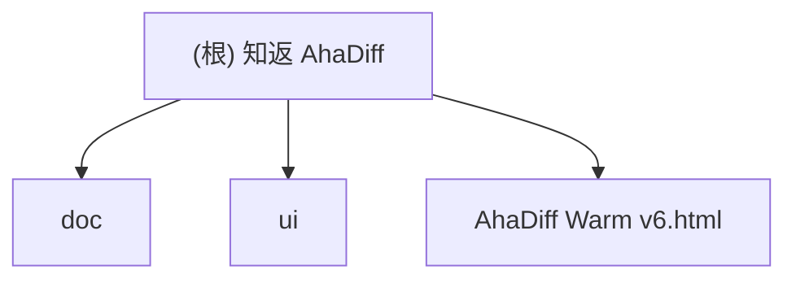

# 知返 AhaDiff

> AI 写完，Diff 教回。 / Ship with AI. Learn it back.

## 项目愿景

知返 AhaDiff 是一个 **local-first 的 verified diff learning layer**。它把 AI 工具写出的 git diff，变成带代码证据链的学习笔记、概念图谱、主动回忆测验、SRS 复习卡和质量棘轮记录。核心差异定位：Code Wiki 解释仓库，知返解释这次改动；而且每句话都能回到代码证据。

**当前阶段**：v0.2 Gate 0-6 底座 + v1.0 后端增量（helpfulness/transfer、misconception cards、Graphify 全栈、learn orchestrator + `POST /api/learn`、watcher core）。Phase 0G 合同边界已收口（2026-04-29）。symbol extraction 顺序 `python_ast -> tree_sitter -> regex -> section_header`。**最新 gate（2026-05-02）**：后端 `1736 passed`、coverage `87.33%`、ruff/pyright/lock 通过；前端 unit `87 passed`（12 files）、Playwright `1320 passed`、i18n `456/456`；44 concrete `/api/*` routes + 1 catchall；benchmark suite digest `99feae11...ef1f1`、Graphify perf gate `ok`。仍未完成：5E 跨页 freshness polish、large-repo signoff、Team。

## 架构总览

后端 CLI 主链路（learn/improve/verify/serve/install/benchmark）已跑通：8-provider LLM + diff capture + claims + lesson/quiz/concepts + 8 维 eval + review.sqlite FSRS-6 + serve API（44 routes + catchall）+ 13 install targets + improve loop + i18n-0。前端 `viewer/` React 19 SPA：12 页面、21 TSX 组件、21 CSS 文件。核心安全 helper 集中在 `core/json_util.py` / `sqlite_util.py`；serve 拒绝 proxy trace headers，token bootstrap 做同源检查。

### 计划技术栈

- **后端 CLI**：Python 3.11+, typer, rich, pydantic, httpx, pyyaml, fsrs (FSRS-6)
- **前端 Viewer**：React 19 + Vite + vanilla CSS（`AhaDiff Warm v6.html` 设计参考）。`ahadiff serve` 启动 Starlette + Uvicorn + Vite dev/build，`--no-browser` 禁用自动打开。不使用 Next.js 等 SSR 框架
- **评估系统**：LLM-as-judge + 8 维 rubric（accuracy/evidence/diff_coverage/learnability/quiz_transfer/spec_alignment/conciseness/safety_privacy = 100 分）+ git ratchet
- **LLM Provider**：8 种 API 格式（OpenAI Chat / Responses / Gemini / Anthropic / Azure OpenAI / New API / CherryIN / Ollama）。BYOK：model_name + base_url + api_key → 自动探测 temperature/TPM/RPM/context_length
- **不使用**：LiteLLM（供应链风险）、LangChain、Jinja2 渲染前端、Next.js

### 八层架构（计划）

```
0. Schema & Contract     -- 核心契约冻结（ClaimStatus/RunSource/EvalBundle/EventLog）
1. Diff Capture Layer    -- git diff / patch / --compare / --compare-dir / --patch-url
2. Context Layer         -- 2a Assembly / 2b Safety Gate (redact) / 2c Budget & Degrade
3. Lesson Generation     -- prompts/*.md, claim extraction
4. Verification Layer    -- claims.jsonl, deterministic + LLM judge
5. Ratchet Layer         -- evaluation bundle (immutable), review.sqlite, Graphify freshness
6. Learning Layer        -- quiz, SRS review, section helpfulness, concepts.jsonl
7. Wiki + UI Layer       -- React SPA via `ahadiff serve`
```

编排 contract 冻结在 `src/ahadiff/contracts/orchestrator.py`；运行时 learn 主链在 `src/ahadiff/core/orchestrator.py`。results.tsv 降级为 review.sqlite 的导出视图。

### 数据范围架构

> 核心原则：**per-repo truth + global derived governance**

CLI 全局安装（`pip install ahadiff`），per-repo 运用（每个 repo 独立 `.ahadiff/`）。

```
global_config_dir()                   ← Global（派生/索引/偏好，非真相源）
  Linux: ~/.config/ahadiff/  macOS: ~/Library/Application Support/ahadiff/  Windows: %APPDATA%/ahadiff/
├── config.toml / registry.json / usage.sqlite / security/allowlist.yaml

<repo>/.ahadiff/                      ← Per-repo（唯一真相源）
├── config.toml / review.sqlite / concepts.jsonl / ahadiff.lock
├── runs/<run_id>/  graphify/  audit.jsonl  audit.private.jsonl
```

**Config 优先级链**（高到低）：`ENV(AHADIFF_*) → CLI flag → per-repo config.toml → global config.toml → defaults`。凭证类：`env secret → per-repo env_var_name → global env_var_name → none`。

**不可全局化的真相源**：review.sqlite / audit.jsonl / concepts.jsonl / prompts/ / VCR cassettes / Graphify cache。任何 global 数据不参与 ratchet 判定。

## 模块结构图



## 模块索引

| 模块 | 路径 | 职责 |
|------|------|------|
| contracts | `src/ahadiff/contracts/` | 枚举、DTO、契约 helper、错误类型；公开 ID 拒绝空字符串 |
| core | `src/ahadiff/core/` | CLI 配置、路径（含 WSL2）、ID、json_util/sqlite_util 安全 helper、registry、task_runner（600s timeout + draining + shutdown）、watcher（debounce + dead/hung observer） |
| safety | `src/ahadiff/safety/` | ignore / redaction / injection / gates / audit |
| llm | `src/ahadiff/llm/` | provider（streaming byte cap + cache + usage.sqlite + DNS IP pinning TOCTOU 闭合）、probe、cache、cost、adapters、usage |
| claims | `src/ahadiff/claims/` | claim 解析、runtime、negative scan、deterministic verifier |
| lesson | `src/ahadiff/lesson/` | learnability gate、三档 lesson 生成、section helpfulness、learning transfer |
| quiz | `src/ahadiff/quiz/` | quiz/cards/misconception_cards JSONL、review_card_id 回填 |
| wiki | `src/ahadiff/wiki/` | concepts.jsonl 累积、streaming reader（FIFO 拒绝）、ancestry cache（v7 derived index）、DB/JSONL cursor 分页、Graphify linking |
| graphify | `src/ahadiff/graphify/` | models/parser/matcher/linker/slicer/search/freshness（7 态 + 4 值投影）；parser：50 MiB 上限 + 50k edge cap + dedup + dangling removal + sanitization + graph_sha256 provenance |
| eval | `src/ahadiff/eval/` | 8 维评分、hard gates、ratchet、result_events、results.tsv 导出 |
| review | `src/ahadiff/review/` | review.sqlite schema v1→v7 migration + FTS5（concepts/result_events/cards/graph_nodes）+ FSRS-6（NaN/Inf 拒绝）+ search + optimizer（cold/warm/hot） |
| serve | `src/ahadiff/serve/` | 44 routes + catchall；auth（token + 同源 bootstrap）/ CORS / CSP / proxy-trace 拒绝；learn/tasks/graph/config/search/usage/audit 端点；lifespan shutdown hook |
| install | `src/ahadiff/install/` | 13 安装目标、Jinja2 模板、InstallManifest、hook leaf no-follow 校验 |
| improve | `src/ahadiff/improve/` | improve session、worktree replay、prompt 白名单、Phase 2.5、cherry-pick |
| i18n | `src/ahadiff/i18n/` | locale resolver、Accept-Language / cookie / config / LANG fallback |
| benchmarks | `benchmarks/` | 7+3 fixtures（含 500/5000-node + graph-present）、manifest、scripts runner |
| viewer | `viewer/` | React 19 + Vite + Zustand + HashRouter；12 页面 + 21 组件 + 66 design tokens；Settings 8-tab；learn task UI（LearnTaskBanner + learn-store）；i18n 456/456；Playwright 1320；unit 87 |
| tests | `tests/unit/eval/integration/live/` | 1736 passed、coverage 87.33%；含跨平台 static guard + live LLM judge（opt-in） |
| doc | `doc/` | 产品设计文档 |
| ui | `ui/` | UI 原型 Warm v1-v6 |
| team-plan | `.claude/team-plan/` | v0.1 kickoff + 修订方案 |

## 运行与开发

### 验证命令

```bash
uv run pytest tests/unit
uv run ruff check src tests
uv run pyright
uv build --wheel
uv run python -m ahadiff --version
uv run ahadiff init / doctor / config show --resolved
```

LLM judge smoke（opt-in）：

```bash
AHADIFF_LIVE_LLM_JUDGE=1 \
AHADIFF_LIVE_LLM_API_KEY="$AHADIFF_LIVE_LLM_API_KEY" \
AHADIFF_LIVE_LLM_BASE_URL="$AHADIFF_LIVE_LLM_BASE_URL" \
AHADIFF_LIVE_LLM_MODELS="gpt-5.3-codex-spark,gpt-5.4-mini" \
pytest tests/live/test_llm_judge_live.py -q
```

### 依赖状态

`pyproject.toml` + `uv.lock`（后端 Python）；`viewer/package.json` + pnpm（前端 React 19 + Vite + Vitest + Playwright）。

## 测试策略

- 单元/集成/eval 测试覆盖 Stage 0-6 + v0.2 Gate 0-6 + v1.0 增量
- VCR 双层版本：run 级 `prompt_version` + cassette 级 `prompt_fingerprint + model_id + api_family_version + eval_bundle_version + output_lang` 五元组 hash
- CI 分档：PR unit+pinned（`ubuntu py311/py312 + macOS py312`）+ Windows runtime guard；nightly eval；release 全量 + coverage ≥85% + doctor + wheel smoke
- Benchmark：Python 主套件（7份）+ Non-Python 降级套件（3份），独立 recall/precision

## 编码规范

- 中文为主，技术术语保留英文。品牌「知返 AhaDiff」，CLI `ahadiff`
- Python：ruff + pyright strict + pre-commit；线宽 100，ruff 规则 `F,E,W,I,UP,B,C4,SIM,RET,PTH,TC,FA`
- 所有 LLM 调用走 `llm/provider.py`，禁止直接 import anthropic/openai
- prompt 写独立 `.md`，禁止 f-string 拼长 prompt

## AI 使用指引

### 硬性要求
- **所有文档更新必须基于真实代码 + 真实测试结果 + 当前文档状态**。如文档间漂移，以代码和测试为准。**严禁虚构函数、虚构测试结果、虚构库名或编造不存在的设计决策。**
- 中英文对照文档修改时必须同步更新。
- committed docs 不得写入真实 API key、本地 endpoint 或带用户名的绝对路径。

### 关键设计决策（读取文档前必知）
1. **N-文件契约**（受 autoresearch 启发）：`program.md` + **evaluation bundle**（eval/ 下 5 文件，整体 immutable，变更触发 `eval_bundle_version` 更新 + VCR 失效）+ prompt 集合。**可写 prompt 白名单** 仅限 `lesson_generate.md`、`lesson_hint.md`、`lesson_compact.md`、`quiz_generate.md`、`claim_extract.md`；`prompts/improve_program.md` 是 immutable state machine
2. **Claim Verifier 是核心护城河**：每句解释绑定 file:line 证据，claim 五种状态（verified/weak/not_proven/contradicted/rejected），rejected = 引用 patch 外文件或不存在的证据（附 reason_code）
3. **棘轮机制**：improve/Phase 2.5 在 `git worktree` 执行，不碰主分支。连续 2 个优化目标 round1 无增益触发 Phase 2.5（最多 1 次/session）
4. **跨模型评估**：生产要求生成≠评估模型。开发阶段统一 gpt-5.4-mini
5. **SQLite 唯一真相源**：`review.sqlite` result_events 表。TSV 为导出视图（写入失败仅 warn）。前端只是 viewer
6. **安全脱敏顺序**：raw → secret scan → redact → 才能 log/cache/model/render
7. **隐私三档**（统一 snake_case）：`strict_local`（默认）/ `redacted_remote` / `explicit_remote`
8. **i18n 全链路**：cookie `ahadiff_lang` → Accept-Language → AHADIFF_LANG → CLI `--lang` → config.toml → LANG → en。支持 en/zh-CN。SRS 卡片保留创建时语言不重翻译。审计日志始终英文
9. **UNTRUSTED_DIFF 扩展边界**：diff/文件名/commit message/branch 名/Graphify label/模型输出/VCR cassette 均视为 untrusted，统一经 `redaction_pipeline()` 处理
10. **SQLite 运行时版本门禁**：WAL + busy_timeout + trusted_schema=OFF + quick_check
11. **架构权威源**：`contract-freeze.md` 是唯一架构权威源
12. **Graphify v0.1 可选增强**：存在则导入 + sanitization，不存在则降级。7 态内部、4 值对外投影。v0.1 权威路径是 `ahadiff serve` + React Viewer

### 灵感项目
- **autoresearch**（Karpathy）：三文件契约 + git ratchet → N-文件变体
- **SKILL0**（ZJU-REAL）：学习撤架 → section 粒度 helpfulness
- **darwin-skill**：8 维 rubric + Phase 2.5
- **SkillCompass**（Evol-ai）：weakest-dimension-first → 8 维体系阈值 80/60
- **Graphify** → 7 态新鲜度 + 4 值投影
- **LLM Wiki**（Karpathy）→ concepts.jsonl append-only

## 多模型协作策略

| 模型 | 角色 | 职责 |
|------|------|------|
| **Claude** | 编排 + 前端实现 | 任务编排、前端实现、文档、集成 |
| **Codex** | 后端实现 | Python CLI、测试、包发布 |
| **Gemini** | 前端评审 | UI/UX 评审（不写代码），仅用 `gemini-3.1-pro-preview`，429 时 Claude 兜底 |

### 文件所有权

| 范围 | 写入 | 审查 |
|-----|------|------|
| `src/ahadiff/**/*.py` / `tests/**` | Codex | Claude + Codex |
| `viewer/src/**/*.tsx` / `*.css` | Claude | Claude + Gemini |
| `prompts/*.md` / `doc/**` / `CLAUDE.md` | Claude | — |

### 阶段门禁（Stage Gate）

每 Stage 完成后必须跨模型交叉审查（Codex 代码正确性 + Claude 架构/安全 + Gemini 前端 UX）。

- **GO**：0 Critical + 0 High → 进入下一 Stage
- **CONDITIONAL GO**：0 Critical + ≤3 High → 修复后验证
- **NO GO**：≥1 Critical 或 >3 High → 全量重审

审查清单：功能正确性、CC 覆盖、文档同步、`pyright` 零错误、`ruff` 通过、安全扫描、跨平台兼容、集成点验证。

Stage 0-7 对应 Task 0→20 + i18n signoff，详见 `doc/` 设计文档。

## 变更记录 (Changelog)

> 设计阶段（04-19~21）10 轮三模型审查完成架构冻结。详见 `git log`。

| 日期 | 里程碑 | Tests |
|------|--------|-------|
| 04-22~24 | Stage 0-5: contracts → CLI → safety → capture → provider → claims → lesson → quiz → eval → ratchet → review.sqlite → improve | 61→406 |
| 04-24~25 | Stage 6-7 + Viewer A-E + R1-R5 审查（51 findings closed） | 478→559 |
| 04-26~27 | v0.2 Gate 0-5 + Frontend Phase 1-4 | 576→808 |
| 04-28 | Phase 0 follow-up + v0.2 Gate 6（FTS5 + optimizer） | 845→993 |
| 04-29 | v1.0 Phase 0G/1A-D/3A-E/6B 收口 + backend medium slice | 1191→1266 |
| 04-30 | 文档同步 + 对抗式审查（Codex+Claude 8轨）+ auth/FSRS/watcher closure | 1479→1526 |
| 05-01 | Phase 4D Settings + 5B concept linking + 5C FTS graph + 6B tasks API + 7B 安全加固 + learn UI + DNS pinning 闭合 | 1526→1689 |
| 05-02 | Graphify graph-present fixture + 完整 gate 重跑（coverage 87.33%） | 1736 |

> 每条门禁的详细实现笔记见 `git log` 对应 commit message。
