# AhaDiff (知返)

> **Ship with AI. Learn it back.**
>
> Every AI-written git diff becomes a verified Aha lesson, with code-linked evidence, active-recall quizzes, spaced review, and a self-improving quality ratchet.

[中文](./README.zh.md) · [Landing page](https://agi-is-going-to-arrive.github.io/ahadiff/) · [User Guide](./docs/USER_GUIDE.en.html) · [English tutorial video (subtitled)](./docs/video/output/ahadiff-tutorial.en.burned-subtitles.mp4) · [Chinese tutorial video (Bilibili)](https://www.bilibili.com/video/BV1b57k6yEWm)

> Install with `pip install ahadiff`. The English video shows this step; the Chinese Bilibili cut is being refreshed to match.

---

## What it is

**AhaDiff** is a **local-first learning layer for AI coding**.

It is not a PR summary or a repo wiki. It reads a single git diff and turns that change into:

- A **lesson** that teaches what changed and why
- A **claims ledger** where conclusions trace back to `file:line` evidence
- A **quiz and review loop** so the knowledge comes back later
- A **quality history** that makes runs comparable over time

All repo-local state lives in `.ahadiff/`: run artifacts under `runs/`, and SRS / result history in `review.sqlite`.

> Code Wiki explains a repo. AhaDiff teaches you what changed, and verifies every claim against the diff.

## Why

AI writes code faster, but developers can understand less of what actually changed. AhaDiff exists to close that loop:

1. **AI ships, understanding returns to humans**: a commit message is not enough.
2. **Every claim needs evidence**: no hallucinated functions, no fabricated causality.
3. **Knowledge should compound**: repeated concepts should build history and backlinks.
4. **Quality should be comparable**: replace "looks fine" with a stable score and ratchet.

## Prerequisites

- Python 3.11+ with Python's `sqlite3` runtime at SQLite 3.51.3+; patched backport branches 3.50.4+ and 3.44.6+ are also accepted. Run `ahadiff doctor` to check the runtime Python actually uses.
- git (on PATH)
- [uv](https://docs.astral.sh/uv/): install with `curl -LsSf https://astral.sh/uv/install.sh | sh` or `brew install uv`
- An LLM provider: remote (OpenAI / Anthropic / Gemini / Azure / any OpenAI-compatible) with API key, or local (LM Studio / Ollama, no key needed)

## Install

```bash
pip install ahadiff
ahadiff --version   # should print ahadiff 1.1.1
```
This ships a working WebUI out of the box, and all default features work with no extras.

`pip install 'ahadiff[optimizer]'` is only needed for FSRS parameter auto-optimization, which pulls in a heavy torch dependency. Base review and scheduling work without it.

### From source (contributors)

```bash
git clone https://github.com/AGI-is-going-to-arrive/ahadiff.git
cd ahadiff
uv tool install --editable .
cd viewer && pnpm install && pnpm build   # builds the dev WebUI
```

## Configure a provider

AhaDiff needs an LLM to generate lessons. Set up once per repo:
```bash
ahadiff init

# Register and test a provider (OpenAI-compatible example)
export OPENAI_API_KEY="<your-provider-api-key>"
export AHADIFF_PROVIDER_BASE_URL="<provider-base-url>"
ahadiff provider test \
  --name default \
  --provider-class openai \
  --base-url "$AHADIFF_PROVIDER_BASE_URL" \
  --api-key-env OPENAI_API_KEY
```
`provider test` sends a small probe request. If it succeeds, the provider is saved to `.ahadiff/config.toml`. When the provider exposes model limits, AhaDiff records split input / output limits; otherwise auto capture falls back to the bundled model registry or conservative defaults.

`api_key_env` is the environment variable name, not the secret. Repo config accepts `AHADIFF_*` names and the common provider names (`OPENAI_API_KEY`, `ANTHROPIC_API_KEY`, `GEMINI_API_KEY`, `AZURE_OPENAI_API_KEY`). Identifier-shaped values are treated as environment-variable names and fail closed when unset, so a missing variable is not sent as a literal bearer token.

Supported provider classes: `openai`, `openai_responses`, `gemini`, `anthropic`, `azure`, `newapi`, `lmstudio`, `ollama`. Advanced OpenAI-compatible or local setups can use `providers.<name>.capability_overrides` for known boolean capabilities such as native JSON schema support; invalid keys or non-boolean values are rejected. NewAPI disables `supports_native_json_schema` by default; if your NewAPI gateway backend actually supports native JSON schema, you can add `capability_overrides = { supports_native_json_schema = true }` in the provider config. See [User Guide](./docs/USER_GUIDE.en.html) for details.

The Settings provider card can also preview model limits before you save, using only the draft provider class, model, and optional limits profile. It does not call the remote provider or read the API key for that preview. Leaving `max_output_tokens` empty means Auto; when a known trusted output max is exceeded, save-time config clamps it and returns a warning. Unknown, low-confidence, route-specific, or local-runtime limits are shown as warnings instead of being presented as hard facts.

For GPT-5.5 specifically, the bundled registry keeps two profiles: ordinary `openai` access budgets 400k context, while `openai_responses` / API access budgets 1.05M. A live probe can still override the registry when the endpoint reports a trustworthy total context.

> AhaDiff defaults to strict_local privacy: nothing leaves your machine unless you explicitly configure a remote provider.

## Your first lesson

```bash
# Learn from your latest commit
ahadiff learn --last

# Open the local web UI to read your lesson
ahadiff serve
```
`ahadiff serve` opens http://127.0.0.1:8765 automatically. Pass `--no-browser` to stay in the terminal. You'll see the Dashboard with your first run, then click through to Lesson, Diff, and Quiz.

Two more things to try:
```bash
ahadiff quiz <run_id>    # test yourself on what you just learned
ahadiff review           # spaced-repetition review of past cards
```
See the [User Guide](./docs/USER_GUIDE.en.html) for all 10 diff capture sources, export options, concept graphs, and advanced commands.

## Features

- **Learn**: `ahadiff learn` supports 10 diff capture sources: working tree (`--staged --unstaged --include-untracked`), unstaged (`--unstaged`), staged (`--staged`), last commit (`--last`, or omit a capture-source flag), revision/range (`REVISION`), time-window (`--since`; optional `--author` focuses on one author and expects a single matching commit, otherwise it stops with a clear error), patch file/stdin (`--patch FILE|-`), patch URL (`--patch-url`), file compare (`--compare`), and directory compare (`--compare-dir`, macOS/Linux only). Recursive directory compare requires the secure directory file descriptor available on macOS/Linux. Patch files are resolved inside the repo root; use stdin for external generated patches. Patch file/stdin and patch URL runs do not have a repository symbol index; when only hunk evidence is available, AhaDiff can still generate a lesson from weak diff-anchored claims instead of claiming symbol-level proof.
- **Evidence-linked claims**: every lesson conclusion is tied to `file:line` evidence, with verification states such as verified, weak, not proven, contradicted, and rejected.
- **Structured LLM output**: generation uses schema-aware JSON contracts where supported, defaults to JSON object mode with one bounded validation retry, and keeps the existing parser, repair, and degraded fallback paths. Truncated or malformed fallback JSON is retried instead of being accepted.
- **Adaptive capture limits**: fresh configs default to auto capture sizing; existing customized capture settings stay manual. Auto mode uses provider probes, the bundled model registry, output reserves, safety reserves, and CJK diff density, while runtime patch intake remains capped at 50 MiB. Settings previews provider limits from the current draft provider class, model, and optional limits profile before saving, without remote probing on every edit.
- **Quiz and review**: `ahadiff quiz` tests the run you just learned; source evidence stays locked until you answer. `ahadiff review` brings back older cards with spaced repetition. Quiz count is fixed by default (3 questions, configurable from 1 to 30) and can adapt to diff size when enabled (default range 3-12).
- **Scoring**: each run gets an 8-dimension deterministic score, with an optional advisory LLM judge when configured. No-spec `spec_alignment` is shown as N/A / `0/0` and excluded from the overall score; judge results never override `score.json.verdict`. Diff Coverage is based on visible `line_map.json` files and line-weighted hunks, and hard-gate details show the adaptive claim-anchor threshold used for that run. If the optional judge fails, the deterministic score is still kept and the failure is saved as a redacted `judge_failure.json`.
- **WebUI**: `ahadiff serve` opens Welcome, Dashboard, Lesson, Diff, Quiz, Review, Concepts, Run Detail, Settings, and Guide. The viewer uses a light, editorial paper-style theme, with fonts bundled locally so nothing loads from a CDN. Run Detail shows Score, Judge, Artifacts, and a sanitized judge-failure panel when the optional LLM judge could not complete. The Welcome Before/After demo keeps long raw diffs collapsed with a line count and a Show all / Collapse control; short or empty diffs stay simple.
- **New Run dialog**: Dashboard can start quick learn runs for working tree, unstaged, staged, or last commit changes, with advanced cards for `--since`, revision/range, patch URL, pasted patch text, file compare, and directory compare.
- **Export**: from the CLI, `ahadiff export-results` writes `results.tsv` and `ahadiff export preview` writes a local static preview bundle. The WebUI (and the `serve` API) also export TSV / JSON and Anki `.apkg`; `.apkg` export uses the bundled `genanki`, available by default.
- **Concept graph**: AhaDiff extracts cross-diff concepts and shows them in a Canvas graph with health checks.
- **AI tool integration**: project-level guidance for 15 CLI / IDE / CI targets. Settings groups the targets, shows localized usage hints and a provider-free local demo, and keeps write/remove behind confirmation. Guide shows commands plus read-only cards that explain usage and preview the files AhaDiff would write. Supported targets include Claude, Codex, Gemini, Antigravity IDE, Antigravity CLI, Copilot, OpenCode, Cursor, Cline, Continue, Roo, Windsurf, Aider, GitHub Actions, and Git hooks.
- **Auto-iteration**: `ahadiff improve` optimizes prompts in an isolated worktree and keeps only better results.
- **Privacy**: three tiers: strict_local, redacted_remote, explicit_remote. The default is strict_local.
- **i18n**: English and Chinese for the WebUI and prompt output language. CLI help and most CLI diagnostics are in English.
- **Cross-platform**: macOS and Linux are the primary tested platforms; Windows is supported for the core CLI and serve flows. `--compare-dir` and the `hooks` install target are macOS/Linux only. Installer writes and rollbacks use atomic replacement; POSIX restores file mode before replace, while Windows uses a best-effort mode restore after replace.
- **Validation scope**: the latest local release audit covered backend unit/integration/eval tests, ruff/pyright, wheel build, viewer Vitest/typecheck/build, real-serve smoke, Guide browser checks, i18n parity, and live learn runs for the documented capture sources. A clean full Playwright matrix, remote CI, and a real Windows runner remain separate release gates.
- **Security**: URL secret redaction, provider URL validation, provider API-key environment validation, input validation, prompt injection detection, safety hard gates, and redacted judge-failure reporting.

## Screenshots

<p align="center">
  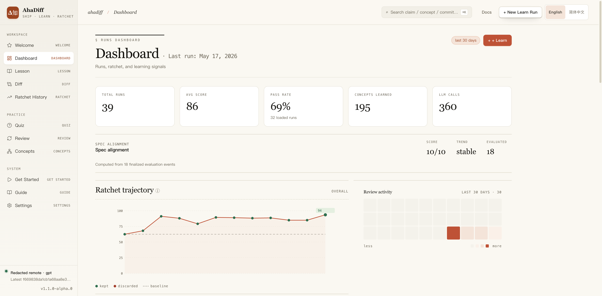
</p>

<details>
<summary>Welcome: first-run entry point</summary>
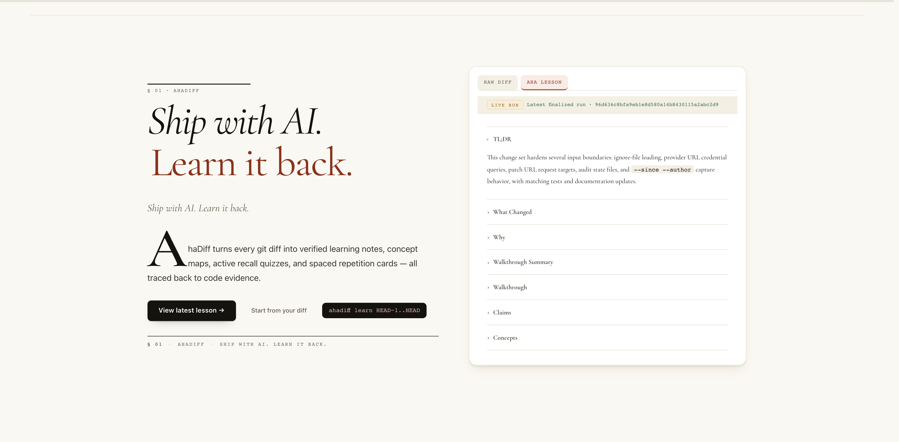
</details>

<details>
<summary>Lesson: AI-generated lesson from your diff</summary>
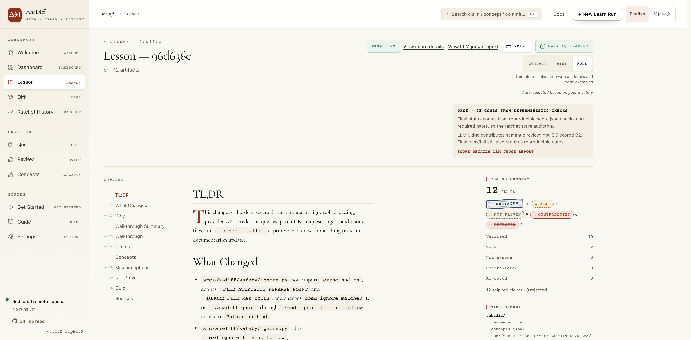
</details>

<details>
<summary>Diff Viewer: claim-linked code evidence</summary>
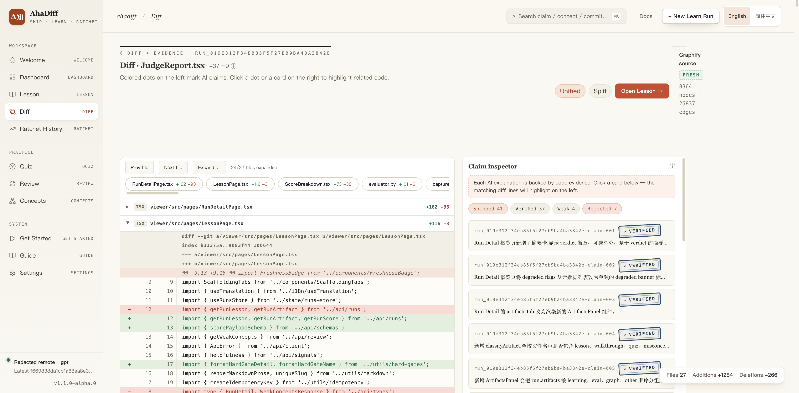
</details>

<details>
<summary>Quiz: active recall from the lesson</summary>
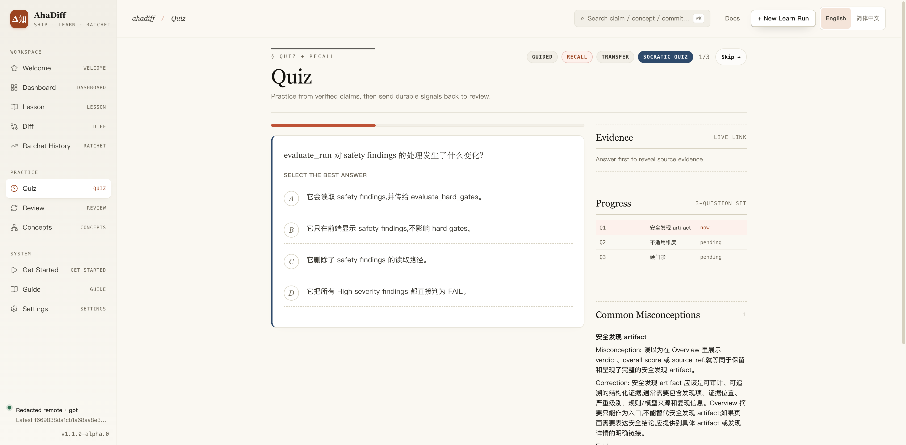
</details>

<details>
<summary>Review: spaced repetition cards</summary>
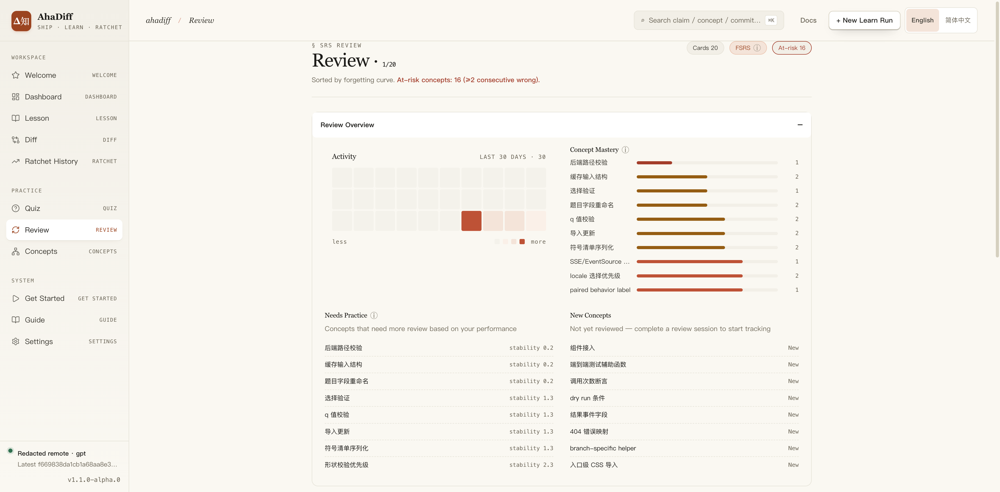
</details>

<details>
<summary>Concept Graph: cross-diff knowledge map</summary>
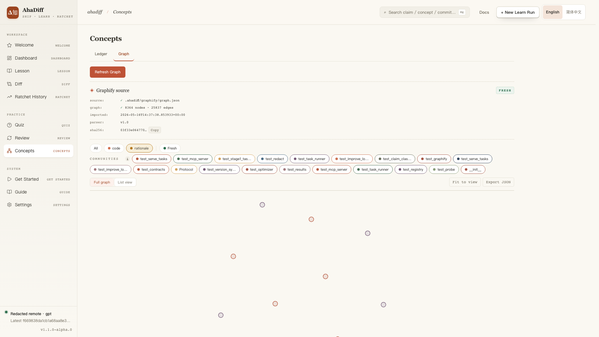
</details>

<details>
<summary>Concepts Ledger: learned concepts table</summary>
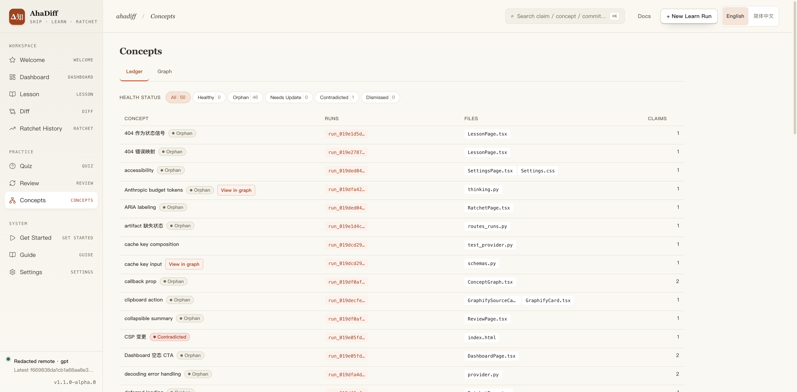
</details>

<details>
<summary>Run Detail: scores and evaluation breakdown</summary>
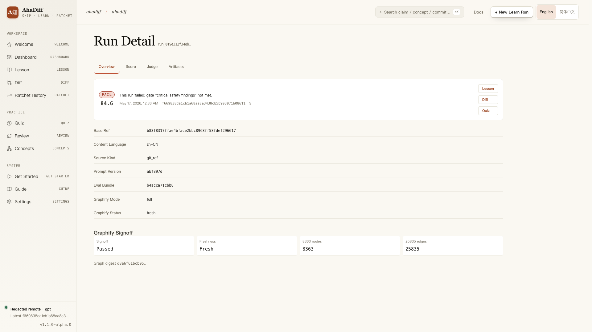
</details>

<details>
<summary>Run Detail Score: 8-dimension score breakdown</summary>
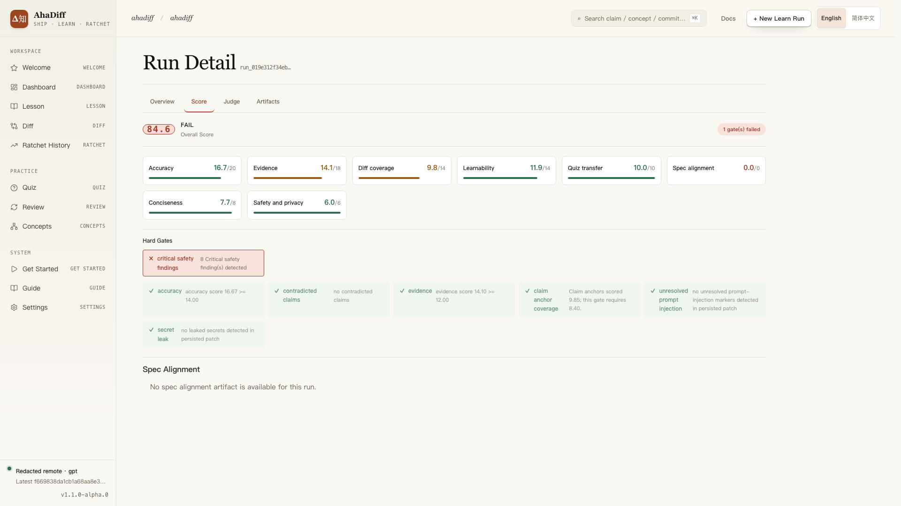
</details>

<details>
<summary>Settings: provider, preferences, and AI tool guidance</summary>
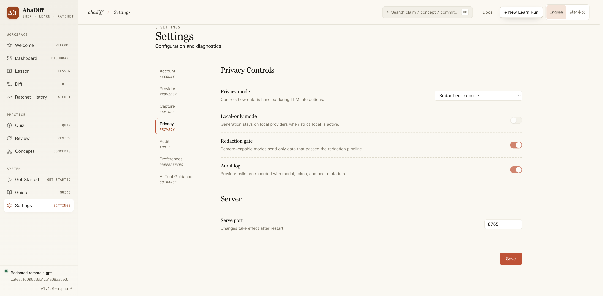
</details>

## AI tool integration

AhaDiff writes repo-local guidance files for the current project; it does not install the AhaDiff CLI again or write global user directories:
```bash
ahadiff install --detect        # auto-detect your tools
ahadiff install claude          # also: cursor, copilot, codex, gemini, antigravity, antigravity-cli, aider, windsurf, cline, roo, continue, ...
```
15 targets supported. Run `ahadiff install --help` for the full list, or configure in the WebUI under Settings → AI Tool Guidance.

Settings groups targets into CLI / IDE / CI, shows quick-start steps, example prompts, expected behavior, platform notes, and a provider-free local demo. Guide uses the same usage hints inside default-collapsed tool cards and shows what files would be written before you apply changes; actual write/remove stays in Settings.

Guide and the New Run dialog keep cards, note markers, and footer actions readable in Windows high-contrast / forced-colors mode; usage hints use the same tokenized type scale as the rest of the viewer.

Some targets write tool-native generated files. Examples include `.claude/skills/ahadiff/SKILL.md`, `.agents/skills/ahadiff/SKILL.md`, `.gemini/skills/ahadiff/SKILL.md`, `.agents/skills/ahadiff-antigravity/SKILL.md`, `.agents/skills/ahadiff-antigravity-cli/SKILL.md`, `.agents/rules/ahadiff.md`, `.github/instructions/ahadiff.instructions.md`, `.opencode/agents/ahadiff.md`, `.clinerules/ahadiff.md`, `.continue/rules/ahadiff.md`, `.cursor/rules/ahadiff.mdc`, `.roo/rules/ahadiff.md`, and `.windsurf/rules/ahadiff.md`. Repo guidance sections stay in user-managed files such as `CLAUDE.md`, `AGENTS.md`, `GEMINI.md`, and `.github/copilot-instructions.md`. Uninstall only removes AhaDiff-generated files and AhaDiff marked sections.

This repository ignores generated `.agents/` installs, so repo-local Codex / Antigravity skill output remains local unless a user explicitly tracks it.

## 8-Dimension Rubric

| # | Dimension | Weight | Hard gate |
|---|-----------|--------|-----------|
| 1 | Accuracy | 20 | Base gate: < 14 → FAIL. Runtime policy may lower this threshold for very large visible diffs, but unsafe rejected-claim ratios and safety gates still block PASS. |
| 2 | Evidence | 18 | Base gate: < 12 → FAIL. Runtime policy may lower this threshold for very large visible diffs, but invalid or missing evidence still counts against the run. |
| 3 | Diff Coverage | 14 | Adaptive claim-anchor gate. Normal diffs fail below 7.70; large broad diffs use a lower threshold, while one/two-file many-hunk diffs use a stricter one. The exact ratio, regime, and visible basis are written into hard gate details. |
| 4 | Learnability | 14 | None |
| 5 | Quiz Transfer | 10 | None |
| 6 | Spec Alignment | 10 | None |
| 7 | Conciseness | 8 | None |
| 8 | Safety & Privacy | 6 | Unmitigated Critical → FAIL |

Three verdicts: **PASS** ≥ 80 / **CAUTION** 60–80 / **FAIL** < 60. Hard gates can still force **FAIL** even when the overall score is high; contradicted claims require zero tolerance, and unmitigated Critical safety findings fail the run.

## Repository Layout

```text
ahadiff/
├─ src/ahadiff/         # Python source
├─ viewer/              # React 19 frontend
├─ tests/               # Test suite
├─ prompts/             # LLM prompt templates
├─ benchmarks/          # Eval benchmark fixtures
├─ docs/                # Landing page, user guides, tutorial videos
├─ .github/workflows/   # CI/CD
├─ pyproject.toml       # Python package config
└─ LICENSE              # MIT
```

## Core Philosophy (N-File Contract)

AhaDiff extends the Karpathy / autoresearch three-file contract into an N-file variant:

| File | Who edits | Role |
|------|-----------|------|
| `program.md` | Human | Natural-language state machine for the improve loop |
| evaluation bundle | **Immutable** | `evaluator.py` + `rubric.py` + `rubric.yaml` + `gates.py` + `deterministic.py`, locked as a unit |
| `prompts/*.md` | Agent | The improve loop edits only allowlisted generation prompts; `eval_judge.md` is a judge prompt resource, not part of that writable set |

Loop: edit → commit → evaluate → keep if better, reset if worse → record the result for review and future runs.

## Inspirations, Design Axioms, and License

### Inspirations

- **karpathy/autoresearch**: N-file contract and git ratchet
- **alchaincyf/darwin-skill**: 8-dimension rubric and Phase 2.5 rewrite
- **Evol-ai/SkillCompass**: PASS / CAUTION / FAIL and weakest-dimension-first
- **ZJU-REAL/SkillZero**: helpfulness-driven retention and compact context
- **safishamsi/graphify**: repo-level graph overlay
- **karpathy/llm-wiki** gist: persistent compounding wiki

### Design Axioms

1. **Evidence first**: every claim must trace back to `file:line`
2. **Learning over summary**: quizzes and review beat pretty summaries
3. **Local-first trust**: privacy tiers are explicit, and local stays local by default
4. **Paper-like seriousness**: academic feel, not a loud SaaS landing page
5. **One accent per style**: warm paper background plus a single accent color

### Acknowledgements

Thanks to the [linux.do](https://linux.do/) community for feedback and support.

### License

[MIT](./LICENSE)

---

> AhaDiff / 知返: Δ知 ↺
