# 知返 AhaDiff

> **AI 写完，Diff 教回。**
>
> 把 AI 写出的每一个 git diff，变成带证据、能出题、会复习、还能推动质量变好的学习课程。

[English](./README.md) · [介绍页](https://agi-is-going-to-arrive.github.io/ahadiff/) · [使用指南](./docs/USER_GUIDE.zh.html) · [英文视频教程（带字幕）](./docs/video/output/ahadiff-tutorial.en.burned-subtitles.mp4) · [中文视频教程（带字幕）](./docs/video/output/ahadiff-tutorial.zh.burned-subtitles.mp4)

---

## 这是什么

**知返 AhaDiff** 是一个 **local-first 的 AI Coding 学习层**。

它不是 PR 摘要，也不是 repo wiki。它读取一次 git diff，把这次改动变成：

- 一篇讲清楚“改了什么、为什么改”的 **Lesson**
- 一份每条结论都能回到 `file:line` 的 **Claims 清单**
- 一套 **测验和复习流程**，让知识之后还能被召回
- 一条可比较的 **质量历史**，帮助你看到每次运行的变化

每个 repo 的本地状态都存在 `.ahadiff/` 里：run 产物在 `runs/` 下，SRS 和结果历史在 `review.sqlite` 里。

> Code Wiki 解释一个仓库；知返 AhaDiff 解释这一次改动，而且每句话都要经得起 diff 证据校验。

## 为什么要做

AI 写代码越来越快，但人对“到底改了什么”的理解很容易掉队。知返要补上这个回路：

1. **AI 写完，理解要回到人身上**：commit message 远远不够。
2. **每个解释都要有证据**：不接受幻觉函数，也不接受虚构因果。
3. **知识应该累积**：同一个概念被多次修改时，应该留下历史和 backlinks。
4. **质量应该可比较**：用稳定评分和 ratchet 取代“看起来还行”。

## 前置条件

- Python 3.11+，且 Python `sqlite3` 运行时需为 SQLite 3.51.3+；补丁回移分支 3.50.4+ / 3.44.6+ 也可接受。可用 `ahadiff doctor` 检查 Python 实际加载的运行时。
- git（需要在 PATH 中）
- [uv](https://docs.astral.sh/uv/)：可用 `curl -LsSf https://astral.sh/uv/install.sh | sh` 或 `brew install uv` 安装
- 一个 LLM provider：可以是带 API key 的远端服务（OpenAI / Anthropic / Gemini / Azure / 任意 OpenAI-compatible），也可以是本地服务（LM Studio / Ollama，不需要 key）

## 安装

AhaDiff 还没有发布到 PyPI。请从源码安装：
```bash
git clone https://github.com/AGI-is-going-to-arrive/ahadiff.git
cd ahadiff
uv tool install --editable .
ahadiff --version   # 应输出 ahadiff 1.1.0a0
```

## 配置 Provider

AhaDiff 需要 LLM 来生成课程。每个 repo 配置一次即可：
```bash
ahadiff init

# 注册并测试一个 provider（以 OpenAI-compatible 为例）
export OPENAI_API_KEY="<your-provider-api-key>"
export AHADIFF_PROVIDER_BASE_URL="<provider-base-url>"
ahadiff provider test \
  --name default \
  --provider-class openai \
  --base-url "$AHADIFF_PROVIDER_BASE_URL" \
  --api-key-env OPENAI_API_KEY
```
`provider test` 会发送一个小探测请求。成功后，provider 配置自动写入 `.ahadiff/config.toml`。如果 provider 暴露模型上限，AhaDiff 会记录拆分后的 input / output token limit；否则自动捕获会回退到内置模型表或保守默认值。

`api_key_env` 是环境变量名，不是 key 本身。Repo config 只接受 `AHADIFF_*` 名称和常见 provider 变量名（`OPENAI_API_KEY`、`ANTHROPIC_API_KEY`、`GEMINI_API_KEY`、`AZURE_OPENAI_API_KEY`）。identifier 形态的值都会按环境变量名处理；未设置时关闭失败，不会把变量名当成 bearer token 外发。

支持的 provider class：`openai`、`openai_responses`、`gemini`、`anthropic`、`azure`、`newapi`、`lmstudio`、`ollama`。进阶的 OpenAI-compatible 或本地 provider 可以用 `providers.<name>.capability_overrides` 覆盖已知布尔能力，例如是否支持 native JSON schema；未知 key 或非布尔值会被拒绝。NewAPI 默认关闭 `supports_native_json_schema`；如果你的 NewAPI 网关后端真的支持 native JSON schema，可在 provider config 加 `capability_overrides = { supports_native_json_schema = true }`。更多细节见 [使用指南](./docs/USER_GUIDE.zh.html)。

Settings 的 provider 卡片也能在保存前预览模型上限，只使用当前草稿 provider class、model 和可选 limits profile，不会为了预览去调用远端 provider，也不会读取 API key。`max_output_tokens` 留空就是 Auto；如果用户填写的值超过可信的已知输出上限，保存时会自动收紧并返回 warning。未知、低置信度、route-specific 或 local-runtime 上限只会显示 warning，不会伪装成确定硬上限。

GPT-5.5 有两种内置口径：普通 `openai` 接入按 40 万上下文预算，`openai_responses` / API 接入按 105 万上下文预算。endpoint 如果通过 live probe 上报可信 total context，仍会优先使用 probe 结果。

> AhaDiff 默认使用 strict_local 隐私模式：除非你明确配置远端 provider，否则内容不会离开本机。

## 你的第一节课

```bash
# 学习最近一次 commit
ahadiff learn --last

# 打开本地 WebUI 阅读课程
ahadiff serve
```
`ahadiff serve` 会自动打开 http://127.0.0.1:8765。想留在终端可加 `--no-browser`。你会看到 Dashboard 里的第一次 run，然后继续进入 Lesson、Diff 和 Quiz。

还可以马上试试：
```bash
ahadiff quiz <run_id>    # 测测自己有没有看懂刚才的改动
ahadiff review           # 复习过去生成的卡片
```
10 种 diff 捕获来源、导出、概念图谱和进阶命令都在 [使用指南](./docs/USER_GUIDE.zh.html) 里。

## 功能

- **学习**：`ahadiff learn` 支持 10 种 diff 捕获来源：工作区（`--staged --unstaged --include-untracked`）、未暂存（`--unstaged`）、已暂存（`--staged`）、最近一次提交（`--last`，或不带任何捕获参数）、提交/范围（`REVISION`）、时间窗口（`--since`；只有 author 过滤后命中单个 commit 时才加 `--author`）、patch 文件/stdin（`--patch FILE|-`）、patch URL（`--patch-url`）、文件对比（`--compare`）、目录对比（`--compare-dir`，仅 macOS/Linux）。递归目录对比依赖仅 macOS/Linux 提供的安全目录文件描述符。Patch 文件会在 repo root 内解析；外部生成的 patch 请走 stdin。Patch 文件/stdin 和 patch URL 运行没有仓库 symbol index；只有 hunk 证据时，AhaDiff 仍可基于 weak diff-anchored claims 生成 lesson，但不会伪装成 symbol 级证明。
- **证据化 Claims**：每条 lesson 结论都绑定 `file:line` 证据，并区分 verified、weak、not proven、contradicted、rejected 等状态。
- **结构化 LLM 输出**：生成链路会在支持时按 schema 约束 JSON 输出；默认使用 JSON object mode，并带 1 次有界 validation retry；原有 parser、repair 和 degraded 回退仍保留。截断或格式不完整的 fallback JSON 会触发重试，不会被直接接受。
- **自适应捕获上限**：新配置默认使用自动捕获；已经自定义过捕获数字的旧配置保持手动模式。自动模式会结合 provider probe、内置模型表、输出预留、安全预留和 CJK diff 密度来计算上限，同时运行时 patch 读取仍封顶 50 MiB。Settings 会按当前草稿 provider class、model 和可选 limits profile 预览保存后的模型上限，不会在每次编辑时远程探测。
- **测验与复习**：`ahadiff quiz` 用来测试刚学过的 run，源码证据会在作答后再展示；`ahadiff review` 用间隔重复带回旧卡片。题量默认固定为 3 题，可配置为 1 到 30；开启自适应后会按 diff 大小调整，默认范围是 3-12。
- **评分**：每次 run 都会得到 8 维确定性评分；配置后也可以启用 advisory LLM judge。没有 spec 的 `spec_alignment` 会显示为 N/A / `0/0`，并从总分里排除；judge 结果不会覆盖 `score.json.verdict`。Diff Coverage 只看可见 `line_map.json` 里的文件和按行数加权的 hunk；hard gate 详情会写明本次 run 使用的自适应 claim-anchor 阈值。如果可选 LLM judge 失败，确定性评分仍会保留，失败信息会以脱敏后的 `judge_failure.json` 保存。
- **WebUI**：`ahadiff serve` 打开 Welcome、Dashboard、Lesson、Diff、Quiz、Review、Concepts、Run Detail、Settings 和 Guide。viewer 使用浅色报纸编辑风格，字体本地打包，不依赖 CDN。Run Detail 会展示 Score、Judge、Artifacts；可选 LLM judge 失败时，会显示脱敏后的失败面板。Welcome 的 Before/After demo 会把过长的原始 diff 折叠起来，显示行数和展开/收起按钮；短 diff 或空 diff 不会多出无用控件。
- **新建学习对话框**：Dashboard 可直接从工作区、未暂存、已暂存或最近一次提交开始学习；高级卡片覆盖 `--since`、提交/范围、patch URL、粘贴补丁、文件对比和目录对比。
- **导出**：命令行里，`ahadiff export-results` 生成 `results.tsv`，`ahadiff export preview` 生成本地静态预览包。WebUI（以及 `serve` API）还能导出 TSV / JSON 和 Anki `.apkg`；`.apkg` 导出需要在同一个 AhaDiff 运行环境安装 `anki` extra（源码 checkout 用 `uv tool install --reinstall --editable '.[anki]'`）。
- **概念图谱**：自动提取跨 diff 的概念关系，并用 Canvas 图谱和健康检查展示。
- **AI 工具集成**：为 15 个 CLI / IDE / CI 目标写入项目级指引。Settings 会按目标分组，展示本地化使用提示和不调用 provider 的本地演示，并继续用确认流程保护写入/移除。Guide 只读展示命令，用折叠卡片说明使用方式，并预览 AhaDiff 会写入哪些文件。支持目标包括 Claude、Codex、Gemini、Antigravity IDE、Antigravity CLI、Copilot、OpenCode、Cursor、Cline、Continue、Roo、Windsurf、Aider、GitHub Actions 和 Git hooks。
- **自动迭代**：`ahadiff improve` 在隔离 worktree 中优化 prompt，只保留更好的结果。
- **隐私**：三档模式：strict_local、redacted_remote、explicit_remote；默认 strict_local。
- **i18n**：WebUI 与 prompt 输出语言支持中英文；CLI help 与多数 CLI 诊断仍为英文。
- **跨平台**：macOS 与 Linux 为主要测试与支持平台；Windows 支持核心 CLI 与 serve 流程。`--compare-dir` 与 `hooks` 安装目标仅支持 macOS/Linux。安装写入和回滚使用 atomic replace；POSIX 会在 replace 前恢复文件 mode，Windows 使用 replace 后的 best-effort mode 恢复。
- **验证范围**：最近一次本机发布前审计覆盖了后端 unit / integration / eval、ruff / pyright、wheel 构建、viewer Vitest / typecheck / build、real-serve smoke、Guide 浏览器检查、i18n parity，以及文档所列捕获来源的 live learn。一次 0 failed 的完整 Playwright matrix、远端 CI 和真实 Windows runner 仍是独立发布门禁。
- **安全**：URL secret 脱敏、provider URL 校验、provider API-key 环境变量校验、输入校验、prompt 注入检测、安全门禁和脱敏后的 judge 失败报告。

## 界面截图

<p align="center">
  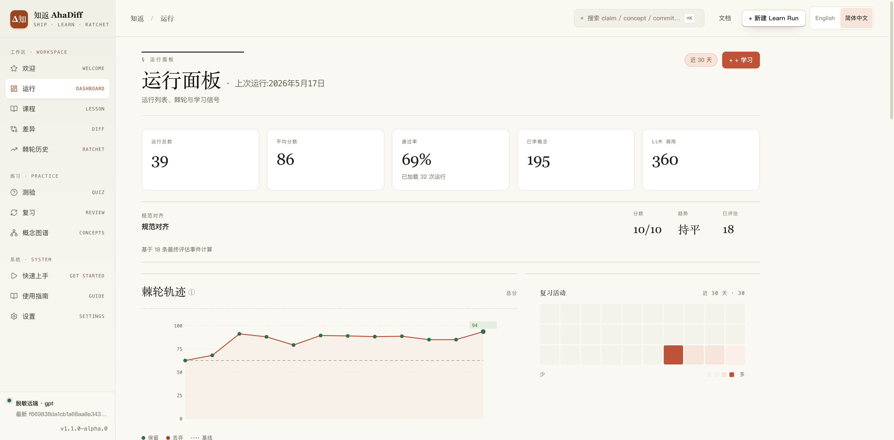
</p>

<details>
<summary>欢迎页：首次运行入口</summary>
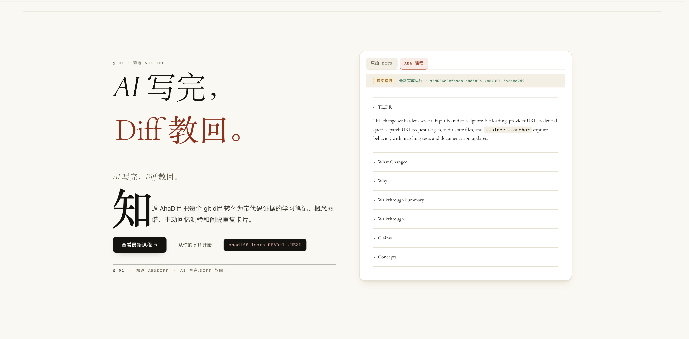
</details>

<details>
<summary>课程：AI 根据 diff 生成的教学课程</summary>
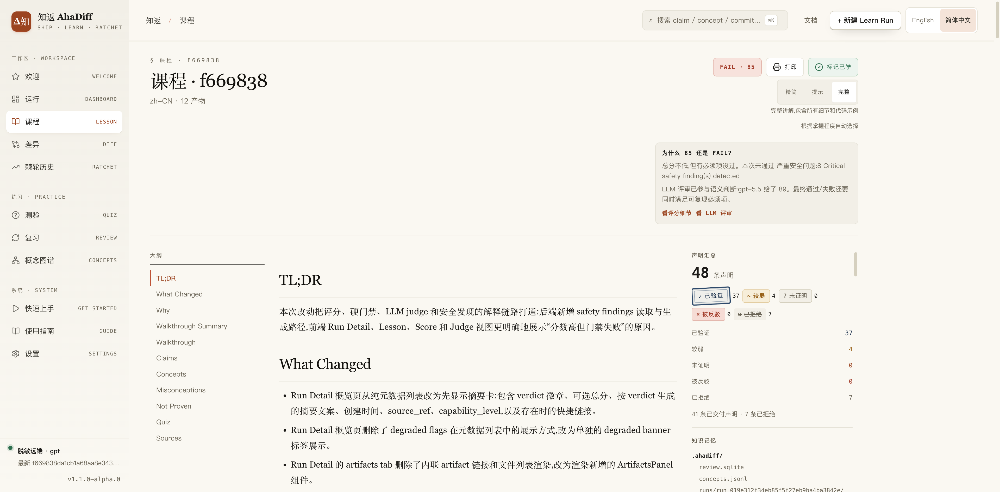
</details>

<details>
<summary>差异查看器：带 claim 关联的代码证据</summary>
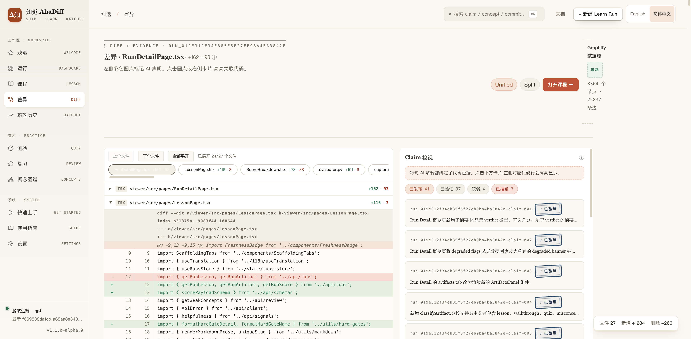
</details>

<details>
<summary>测验：基于课程的主动回忆测试</summary>
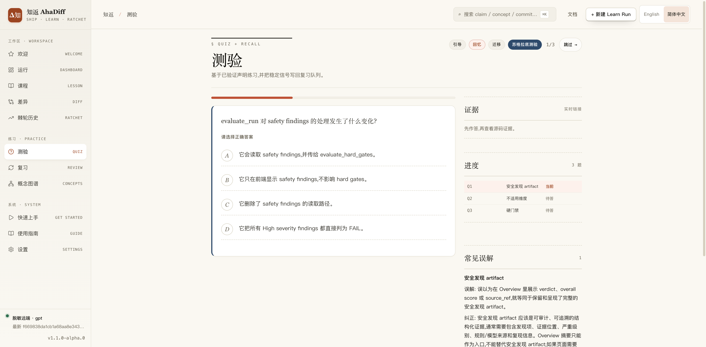
</details>

<details>
<summary>复习：间隔重复卡片</summary>
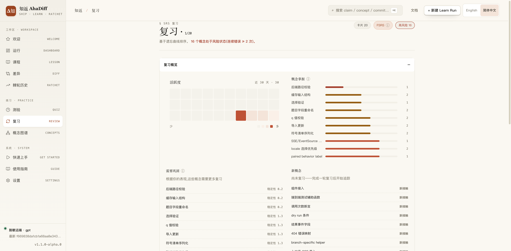
</details>

<details>
<summary>概念图谱：跨 diff 的知识图谱</summary>
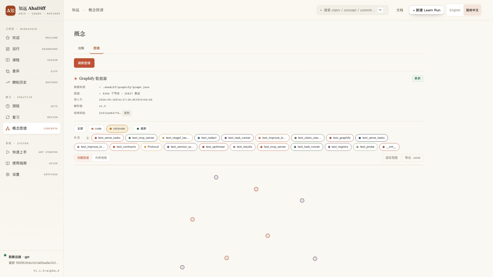
</details>

<details>
<summary>概念账本：可排序的已学概念表</summary>
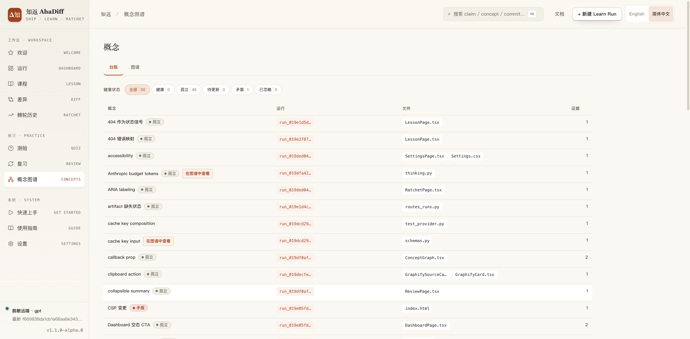
</details>

<details>
<summary>运行详情：分数与评估细节</summary>
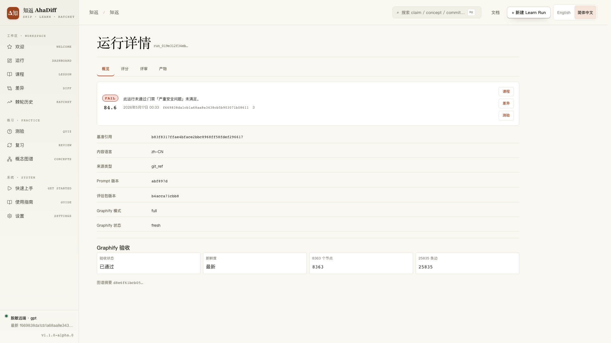
</details>

<details>
<summary>运行详情评分：8 维评分明细</summary>
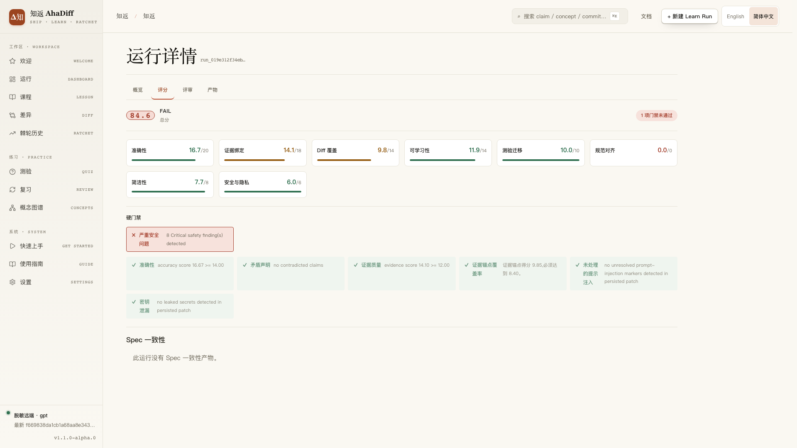
</details>

<details>
<summary>设置：Provider、偏好和 AI 工具指引</summary>
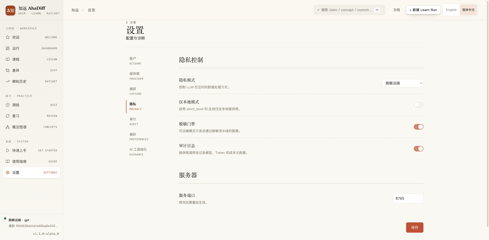
</details>

## AI 工具集成

AhaDiff 会在当前仓库写入项目级 AI 工具指引文件；不会重新安装 AhaDiff CLI，也不会写入全局用户目录：
```bash
ahadiff install --detect        # 自动检测可用工具
ahadiff install claude          # 也支持: cursor, copilot, codex, gemini, antigravity, antigravity-cli, aider, windsurf, cline, roo, continue, ...
```
当前支持 15 个目标。完整列表可运行 `ahadiff install --help`，也可以在 WebUI 的设置 → AI 工具指引中配置。

Settings 会按 CLI / IDE / CI 分组展示这些目标，并显示快速开始步骤、示例提示词、预期输出、平台说明和不调用 provider 的本地演示。Guide 使用同一套使用提示，并在折叠卡片展开后展示实际会写入哪些文件；真正写入和移除仍在 Settings 中完成。

Guide 和新建学习对话框在 Windows 高对比 / forced-colors 模式下也会保持卡片、note marker 和底部操作可辨；使用提示沿用 viewer 的 token 化字号体系。

部分目标会写入工具原生的生成文件，例如 `.claude/skills/ahadiff/SKILL.md`、`.agents/skills/ahadiff/SKILL.md`、`.gemini/skills/ahadiff/SKILL.md`、`.agents/skills/ahadiff-antigravity/SKILL.md`、`.agents/skills/ahadiff-antigravity-cli/SKILL.md`、`.agents/rules/ahadiff.md`、`.github/instructions/ahadiff.instructions.md`、`.opencode/agents/ahadiff.md`、`.clinerules/ahadiff.md`、`.continue/rules/ahadiff.md`、`.cursor/rules/ahadiff.mdc`、`.roo/rules/ahadiff.md` 和 `.windsurf/rules/ahadiff.md`。repo 指引标记段仍写在 `CLAUDE.md`、`AGENTS.md`、`GEMINI.md`、`.github/copilot-instructions.md` 等用户管理文件中。卸载时只移除 AhaDiff 生成的文件和 AhaDiff 标记段。

本仓库会忽略生成出来的 `.agents/` 安装产物，所以 repo-local Codex / Antigravity skill 默认只留在本机，除非用户明确把它们纳入 Git。

## 8 维评分 Rubric

| # | 维度 | 权重 | 硬门禁 |
|---|------|------|--------|
| 1 | Accuracy | 20 | 基准门禁：< 14 → FAIL。运行时策略可对很大的可见 diff 降低阈值，但 rejected claim 比例过高和安全门禁仍会阻止 PASS。 |
| 2 | Evidence | 18 | 基准门禁：< 12 → FAIL。运行时策略可对很大的可见 diff 降低阈值，但无效或缺失证据仍会拉低本次 run。 |
| 3 | Diff Coverage | 14 | 自适应 claim-anchor 门禁。普通 diff 低于 7.70 会 FAIL；大而分散的 diff 阈值会降低，单/双文件但 hunk 很多的 diff 阈值会更严格。具体 ratio、regime 和 visible basis 会写进 hard gate detail。 |
| 4 | Learnability | 14 | 无 |
| 5 | Quiz Transfer | 10 | 无 |
| 6 | Spec Alignment | 10 | 无 |
| 7 | Conciseness | 8 | 无 |
| 8 | Safety & Privacy | 6 | 未缓解 Critical → FAIL |

三档 verdict：**PASS** ≥ 80 / **CAUTION** 60–80 / **FAIL** < 60。即使总分很高，hard gate 也可以直接让 run 变成 **FAIL**；contradicted claims 是 0 容忍，未缓解 Critical safety finding 也会 FAIL。

## 项目结构

```text
ahadiff/
├─ src/ahadiff/         # Python 源码
├─ viewer/              # React 19 前端
├─ tests/               # 测试套件
├─ prompts/             # LLM prompt 模板
├─ benchmarks/          # Eval benchmark fixtures
├─ docs/                # Landing page、使用指南、教程视频
├─ .github/workflows/   # CI/CD
├─ pyproject.toml       # Python 包配置
└─ LICENSE              # MIT
```

## 核心理念（N-文件契约）

AhaDiff 受 Karpathy / autoresearch 三文件契约启发，扩展成 N-文件变体：

| 文件 | 谁来改 | 作用 |
|------|--------|------|
| `program.md` | 人类 | 用自然语言描述 improve loop 的状态机 |
| evaluation bundle | **不可变** | `evaluator.py` + `rubric.py` + `rubric.yaml` + `gates.py` + `deterministic.py`，作为整体锁定 |
| `prompts/*.md` | Agent | improve loop 只允许改白名单里的生成 prompt；`eval_judge.md` 是评判 prompt 资源，不在可写集合里 |

循环：编辑 → commit → 评估 → 更好就保留，更差就回退 → 把结果记录下来，供之后复习和比较。

## 灵感来源、设计公理与 License

### 灵感来源

- **karpathy/autoresearch**：N-文件契约和 git ratchet
- **alchaincyf/darwin-skill**：8 维 rubric 和 Phase 2.5 rewrite
- **Evol-ai/SkillCompass**：PASS / CAUTION / FAIL 与 weakest-dimension-first
- **ZJU-REAL/SkillZero**：helpfulness-driven retention 和 compact context
- **safishamsi/graphify**：repo 级图谱 overlay
- **karpathy/llm-wiki** gist：持续积累的 wiki

### 设计公理

1. **Evidence first**：每条 claim 都必须能回到 `file:line`
2. **Learning over summary**：出题和复习比漂亮总结更重要
3. **Local-first trust**：隐私层级必须明确，本地优先是默认值
4. **Paper-like seriousness**：像认真论文，不像喧闹的 SaaS landing page
5. **One accent per style**：暖白纸感，加一个明确的 accent 色

### License

[MIT](./LICENSE)

---

> 知返 / AhaDiff：Δ知 ↺
